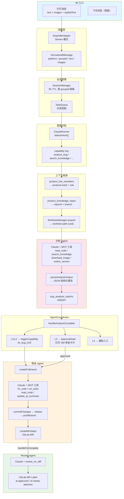
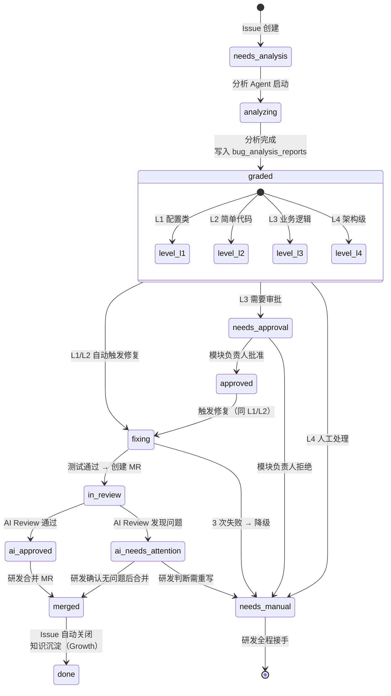

# 核心流程设计

## 1. 数据流图



---

## 2. 事件流转（GitLab Issue Label 状态机）



### Label 含义速查

| Label | 含义 | 触发者 |
|-------|------|--------|
| `needs-analysis` | 等待 AI 分析 | 手动 / Webhook |
| `analyzing` | AI 分析中 | 分析 Agent |
| `graded` | 已分级 | 分析 Agent |
| `level-l1/l2/l3/l4` | Bug 等级 | 分析 Agent |
| `needs-approval` | L3 等待审批 | Coordinator |
| `approved` | L3 审批通过 | 模块负责人 |
| `fixing` | AI 修复中 | 修复 Agent |
| `in-review` | AI Review 中 | 修复 Agent |
| `ai-approved` | AI Review 通过 | Review Agent |
| `ai-needs-attention` | AI Review 发现问题 | Review Agent |
| `ai-generated` | MR 由 AI 生成 | 修复 Agent |
| `needs-manual` | 需人工接手 | 降级/拒绝 |
| `merged` | MR 已合并 | GitLab |
| `done` | 已关闭 | 自动 |

---

## 3. 打回重修场景

### 场景 A：AI Review 标记 ai-needs-attention

```
修复 Agent 创建 MR
  → AI Review 发现问题 → label: ai-needs-attention
  → 研发查看 Review 评论
  ├─ 问题不大 → 研发直接合并
  └─ 问题严重 → 研发关闭 MR → 手动修改 → 重新提 MR
      （当前：AI 不会自动重修。人工接手 fix 分支继续改）
```

**待实现：** AI Review 标记 needs-attention 后，能否让修复 Agent 基于 Review 评论自动重修？

### 场景 B：人工 Review 驳回 MR

```
AI Review 通过 → ai-approved
  → 研发 Review
  ├─ Approve → 合并
  └─ 驳回（Close MR 或 Request Changes）
      → 当前：需要研发手动修改
      → 未来：可以让 AI 读 Review 评论 → 重新修复 → 重新提 MR
```

**待实现：** 监听 MR Close/Request Changes 事件 → 触发修复 Agent 重修。

### 场景 C：修复 3 次失败降级后，研发修改后想让 AI 继续

```
修复 Agent 失败 3 次 → label: needs-manual → fix 分支保留
  → 研发接手 fix 分支 → 修了一半 → 想让 AI 继续完成
  → 当前：无此机制
  → 未来：研发在 Issue 评论 @机器人 "继续修复" → 触发新一轮修复（基于当前 fix 分支状态）
```

**待实现：** Issue 评论触发修复（不仅 label 变化触发）。

### 场景 D：分析报告不准，研发补充信息后重新分析

```
分析 Agent 输出报告 → 置信度 low
  → 研发看了觉得分析方向错了
  → 在钉钉追问补充信息
  → 当前：走 Session Resume 多轮对话，但不会重新出结构化报告
  → 未来：研发在 Issue 评论补充信息 → 触发重新分析 → 更新报告
```

**待实现：** Issue 评论触发重新分析，supersede 旧报告。

### 场景 E：代码冲突

```
Issue #42 fix 分支合并了
  → Issue #43 fix 分支和 #42 改了同一个文件
  → MR 显示冲突
  → 当前：研发手动 rebase 解决
  → 未来：修复 Agent 创建 MR 前先 rebase，冲突则通知
```

**待实现：** MR 创建前 rebase 检测 + 冲突时通知。

---

## 4. 待办汇总

| # | 事项 | 优先级 | 阶段 | 状态 |
|---|------|:------:|:----:|:----:|
| 1 | 画正式数据流图（Mermaid） | P2 | 文档 | ✅ 已完成 |
| 2 | Label 状态机图（Mermaid） | P2 | 文档 | ✅ 已完成 |
| 3 | AI Review 驳回 → 自动重修 | P3 | Growth | 待开发 |
| 4 | 人工 Review 驳回 → AI 重修 | P3 | Growth | 待开发 |
| 5 | 降级后研发请求 AI 继续修复 | P3 | Growth | 待开发 |
| 6 | 分析报告不准 → 补充信息重新分析 | P3 | Growth | 待开发 |
| 7 | MR 创建前 rebase 检测 + 冲突通知 | P2 | MVP | ✅ 已完成 |
| 8 | Issue 评论触发分析/修复（不仅 label） | P3 | Growth | 待开发 |
| 9 | 借鉴 OpenHands：Docker 沙箱隔离（跑测试时防副作用） | P3 | Growth | 待评估 |
| 10 | 借鉴 OpenHands：修复重试改为"观察→思考→行动"循环，而非简单重跑 | P2 | M2 | 待开发 |
| 11 | 借鉴 OpenHands：建内部 Benchmark，用历史已修复 Bug 量化 AI 修复成功率 | P2 | M3 | 待开发 |
| 12 | 借鉴 Aider：AI 摘要自动化生成（Repo Map 思路），减少人工维护 | P2 | M1 | 待开发 |
| 13 | 借鉴 SWE-agent：打磨 MCP 工具输出格式（ACI 思路），让 AI 更容易理解代码结构 | P2 | M1 | 待开发 |
| 14 | 通知内容模板配置：DM 通知和审批消息支持管理后台可配置模板 | P2 | Growth | 待开发 |
| 15 | MR 打回自动重试：AI 生成的 MR 被 close 后自动触发重新分析/修复（GitLab Webhook） | P2 | Growth | 待开发 |
| 16 | 知识库健康度检查：分析前评估项目文档充足度，不足时提示补充 | P2 | Growth | 待开发 |
| 17 | 执行记录增强：流程实例完整视图、关联 Issue/MR 链接、手动重试 | P2 | Growth | 待开发 |
