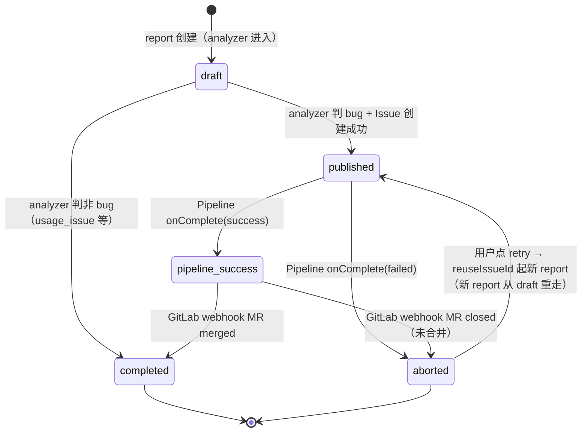

# Pipeline 全链路编排 — 产品评审遗留修复工单

> **For agentic workers:** 本文是 Pipeline 全链路编排 MVP 上线后产品评审（2026-04-19）发现的改进项汇总。每张 Task 卡片都包含问题、现状、期望、代码位置、验收标准，**可直接按序执行**。
>
> **上下文文档**：
> - 原计划：[docs/superpowers/plans/2026-04-17-pipeline-full-orchestration.md](2026-04-17-pipeline-full-orchestration.md)
> - 原 spec：[docs/superpowers/specs/2026-04-17-pipeline-full-orchestration-design.md](../specs/2026-04-17-pipeline-full-orchestration-design.md)
> - E2E 验收报告：原计划文末 "E2E 验收完成报告" 章节
>
> **项目**：ChatOps（Vitest + Fastify + PostgreSQL + React 18 + Ant Design 5）
> **分支**：`dev/ai-assistant`（在此分支上追加 commit）
> **硬约束**：不改严益昌原创文件（[原计划 "零改动文件" 章节](2026-04-17-pipeline-full-orchestration.md#零改动文件严益昌原创硬约束)）

---

## 修复范围

本工单覆盖 **8 个任务**（A–H），分 3 个优先级：

| Task | 主题 | 类型 | 优先级 | 预估 |
|---|---|---|---|---|
| [A](#task-a多-project-部分失败策略仅文档) | 多 project 部分失败策略 | 仅文档 | P3 | 15 min |
| [B](#task-bl4-通知加入-owner-已完成--2026-04-19) | L4 通知加入 owner | 代码 | ✅ 已完成 | — |
| [C](#task-creuseissueid-的-issue-body-banner) | reuseIssueId 的 Issue body banner | 代码 | P2 | 2–3 h |
| [D](#task-d通知矩阵文档化) | 通知矩阵文档化 | 文档 | P2 | 1–2 h |
| [E](#task-epipeline-状态机文档化) | Pipeline 状态机文档化 | 文档 | P2 | 1 h |
| [F](#task-fcreateevent-失败必须-throw) | createEvent 失败必须 throw | 代码 | **P1** | 1–2 h |
| [G](#task-g审批-timeout-统一为-stage-单一来源) | 审批 timeout 统一为 stage 单一来源 | 代码 | P2 | 2–3 h |
| [H](#task-h多-project-并发限制) | 多 project 并发限制 | 代码 | P2 | 1 h |

**不在本工单范围**（用户另外处理或保持现状）：
- ❌ #1 失败场景 DM 策略（用户另外处理）
- ❌ #2 reanalyze 硬上限（逻辑复杂不做）
- ❌ #5 从仓库 owner 审批权（保持现状：主 owner 独裁 by design）
- ❌ #6 非 bug 分类回退入口（保持现状）
- ❌ #8 retry 粒度（保持现状：重试从 analyze 重跑）

---

## 建议实施顺序

1. **先做 Task F**（P1，代码，风险最高）—— createEvent 的容错 bug 会在生产静默吃数据，优先修
2. **再做文档组**（Task A / D / E）—— 低风险，并行可做，为后续 AI/人类阅读代码提供上下文
3. **最后做代码组**（Task C / G / H）—— 互相独立，可顺序可并行（Task B 已完成，见对应章节）
4. 全部完成后 `pnpm test`（vitest）+ `pnpm test:e2e`（Playwright）全绿

每个 Task 都要：**先写失败测试 → 改代码 → 测试通过 → commit**（TDD 节奏）。

---

## Task A｜多 project 部分失败策略【仅文档】

### 问题
L3 涉及 3 个 project 时，fix_attempt A 成功、B 成功、C 失败 → Pipeline 因 `onFailure: 'stop'` 整条终止 → A/B 已生成的修复代码**被丢弃**（worktree 清理，不 push，不建 MR）。此行为在 spec 中未显式说明，后人阅读代码时可能误以为是 bug。

### 决策
**保持现状（全丢）**。理由：C 失败通常意味着 "AI 不会修" 或 "结构跑不起来"，部分 MR 合入风险高于收益；MVP 阶段不为"保留幽灵分支"引入复杂度。

### 改动
**仅改文档，不改代码**：

- [ ] 在 [spec 文档](../specs/2026-04-17-pipeline-full-orchestration-design.md) 的 "多 project 修复" 章节新增 **"部分失败处理（Partial Failure Policy）"** 小节，写明：

  > **策略**：任一 project 的 `fix_attempt` 失败即终止整个 Pipeline，已成功的 project 的修复代码和 worktree **一并丢弃**。
  >
  > **设计前提**：MVP 阶段 partial-success 的运维价值不抵维护成本（幽灵分支难清理、MR 合入顺序复杂、用户心智负担大）。
  >
  > **用户恢复路径**：从 Bug 实例页点"重试"按钮 → `reuseIssueId` 模式起新 report，重跑整条 Pipeline（不从失败 stage 续跑）。
  >
  > **未来演进方向**（Growth Backlog）：若 partial-success 场景增多，可考虑 `onFailure: 'continue'` + 给成功 project 建 MR 并打 `partial-success` label；但需先解决 "MR 合入顺序协调" 的产品设计。

### 验收
- spec 中 grep "部分失败" 能找到此章节
- 章节内容与上述语义一致

---

## Task B｜L4 通知加入 owner 【已完成 — 2026-04-19】

### 状态

✅ 完成于 commits `e5ae49c`（文档对齐）+ `e090042`（代码 + 测试）。

### 最终决策（和原 Task B 期望的差异）

原 Task B 要求"**触发人 DM（必发）+ Owner DM**"两类。实施时发现触发人 DM 部分和 PRD 冲突，按 PRD 规则（[prd.md 通知策略](../../../_bmad-output/planning-artifacts/prd.md#L495)）只保留 **Owner DM**：

| 项 | 原 Task B | 最终落地 | 原因 |
|---|---|---|---|
| Owner DM（各涉及 project owner 去重） | ✅ 发 | ✅ 发 | 符合 PRD FR39 "按模块负责人路由" |
| 触发人 DM | ✅ 必发 | ❌ **不发** | PRD 全局规则：任何场景都不发触发人 DM（触发人看前端页面） |

### 实际改动

**代码**：
- [src/agent/notify/notify-handler.ts](../../../src/agent/notify/notify-handler.ts)：
  - `shouldNotifyOwners('l4_created')` 从 `false` → `true`
  - `buildMessage('l4_created')` 新增模板（🛑 L4 架构级 Bug — 需人工接手 / 无法自动修复 / Issue 链接 / 根因摘要）
  - JSDoc 更新，明确 l4_created 和失败类场景的区别

**测试**：
- [src/__tests__/e2e/bug-l4-flow.spec.ts](../../../src/__tests__/e2e/bug-l4-flow.spec.ts)（新增）— L4 全链路 e2e
- [src/__tests__/unit/notify-handler.test.ts](../../../src/__tests__/unit/notify-handler.test.ts) — 原 "l4_created: no DM sent" 用例反转，断言 2 个 owner 收 DM + 文案 + 2 条 notify 事件
- [src/__tests__/e2e/bug-l4-multi-project.spec.ts](../../../src/__tests__/e2e/bug-l2-multi-project.spec.ts) 重命名为 bug-l2-multi-project（该文件实际测 L2，原名误导）

**文档**：
- [prd.md](../../../_bmad-output/planning-artifacts/prd.md#L495)：新增 "通知策略" 小节，明确 L1-L4 全部场景的通知对象矩阵
- [原计划 line 19-26](2026-04-17-pipeline-full-orchestration.md#L19-L26)：修订说明从 "取消触发人 DM 功能" 改为 "对齐 PRD 通知策略 — 移除 spec 里误加的触发人 DM 设计"
- [spec L588/L873/L1059](../specs/2026-04-17-pipeline-full-orchestration-design.md)：三处 L4 通知相关描述对齐
- [schema-v11.sql L157](../../../src/db/schema-v11.sql#L157) + [base.sql L119](../../../src/__tests__/e2e/fixtures/base.sql#L119) L4 pipeline description 字符串同步

### 绿灯验证

- `pnpm test`：319 pass + 4 skipped（L4 单测原地修改，数字不变）
- `pnpm test:e2e`：25 pass（新增 1 个 L4 专项 spec）
- `npx tsc --noEmit`：零错
- `cd web && pnpm build`：零错

---

## Task C｜reuseIssueId 的 Issue body banner

### 问题
每次 reanalyze 只往 Issue **comment** 追加一条 `🔄 第 N 次分析`。Issue 的 **description**（body）始终停留在第一次分析的结果 → owner 打开 Issue 看到的是过时的初始分析，不往下翻评论就看不到最新。

### 现状
`analyzer.ts` 的 `reuseIssueId` 分支（原计划 [line 923-940](2026-04-17-pipeline-full-orchestration.md#L923)）：
```typescript
if (reuseIssueId) {
  const existing = await gitlabPostIssueNote({
    projectPath: filterResult.primaryProjectPath,
    issueIid: reuseIssueId,
    body: `🔄 第 N 次分析\n\n${merged.markdownFull}`,
  })
  issueIid = reuseIssueId
  issueUrl = existing.issueUrl
}
```

只调 `gitlabPostIssueNote`（comment API），不碰 Issue body。

### 期望（方案 B）
每次 reanalyze 时**同时更新 Issue body**，在顶部加一个可识别的 banner 指引到最新 comment，原有内容全部保留：

**Banner 格式**（必须幂等——用 HTML 注释包裹，便于下次识别并替换，而非累积）：

```markdown
<!-- reanalyze-banner:start -->
> ⚠️ 本 Issue 已经历 **{N}** 次重新分析。最新分析结果见 [comment #{commentId}]({commentUrl})
>
> 原始分析保留如下 ⬇️
<!-- reanalyze-banner:end -->

<原 description 全文，不删除>
```

### 实现要点

1. **先 POST comment**（现有行为，保留）→ 拿到 comment 的 `id` 和 `url`
2. **GET Issue** 当前 description
3. **识别 banner**：
   - 用正则 `/<!-- reanalyze-banner:start -->[\s\S]*?<!-- reanalyze-banner:end -->\n*/` 匹配
   - 若匹配到：替换为新 banner（计数 +1、URL 指向新 comment）
   - 若未匹配到（首次 reanalyze）：在 description 最前插入新 banner
4. **PUT Issue** 更新 description
5. **错误处理**：GET/PUT 失败不阻塞主流程（write event 正常进行，记录 warning log 即可）。因为 comment 已经发出去了，body banner 缺失是降级体验不是数据问题。

### 文件
- **代码**：
  - [src/agent/analysis/analyzer.ts](../../../src/agent/analysis/analyzer.ts) — `handleAnalyzeBug` 的 `reuseIssueId` 分支改造（约 line 923-940 附近，以实际代码为准）
  - analyzer.ts 的 axios 封装块（约 line 65-88）新增两个函数：
    - `gitlabGetIssue(projectPath, iid) → { description: string }`
    - `gitlabUpdateIssue(projectPath, iid, { description }) → void`
  - 如对应 axios 封装已经由其他模块提供，直接 import 复用

### 验收
在 [src/__tests__/unit/analyzer.test.ts](../../../src/__tests__/unit/analyzer.test.ts) 新增：

- [ ] `reuseIssueId 首次: Issue body 顶部插入 banner，原内容完整保留`
- [ ] `reuseIssueId 第 N 次: banner 内容被替换（计数递增，URL 更新），不重复累积`
- [ ] `reuseIssueId: gitlabUpdateIssue 失败不阻塞主流程，正常返回 reportId`
- [ ] `reuseIssueId: 不影响首次分析（非 reuseIssueId 场景）的 Issue 创建`

Mock 层断言：`gitlabPostIssueNote` → `gitlabGetIssue` → `gitlabUpdateIssue` 调用顺序正确。

---

## Task D｜通知矩阵文档化

### 问题
通知逻辑散落在多处代码，无全局视图：
- [src/agent/approval/approve-l3-handler.ts](../../../src/agent/approval/approve-l3-handler.ts) — L3 审批 + FYI
- [src/agent/notify/notify-handler.ts](../../../src/agent/notify/notify-handler.ts) — Pipeline 终态通知
- [src/agent/coordinator.ts](../../../src/agent/coordinator.ts) — 部分回调里可能也有

改一条通知规则要 grep 多个文件，且产品/后端/前端对 "哪个场景谁收通知" 认知不一定一致。

### 期望
在 [spec 文档](../specs/2026-04-17-pipeline-full-orchestration-design.md) 新增 **"通知矩阵（Notification Matrix）"** 章节，以表格形式落定所有通知规则。

**PRD 全局规则**（[prd.md 通知策略](../../../_bmad-output/planning-artifacts/prd.md#L495)）：所有场景**均不发触发人 DM**（触发人通过 Bug 修复实例页面查看状态和事件时间线）。下表"触发人 DM"列因此全部为 —；真正的变量是 owner 怎么发。

**表格结构**（Markdown）：

| # | 场景 Key (messageKind) | Pipeline 阶段 | 触发人 DM | Owner DM | 文案骨架 | 发起位置 |
|---|---|---|---|---|---|---|
| 1 | `l4_created` | Pipeline 未启动（非 bug） / L4 only | — | ✅ 每 project owner 去重 | "🛑 L4 架构级 Bug — 需人工接手 / 无法自动修复 / Issue: .../ 根因摘要: ..." | `notify-handler` |
| 2 | `l3_approval_request` | L3 `approve_l3` stage | — | ✅ 主 owner | "L3 修复方案审批..." | `approve-l3-handler` |
| 3 | `l3_approval_fyi` | L3 `approve_l3` stage | — | ✅ 从 owner 去重 | "ℹ️ L3 知情..." | `approve-l3-handler` |
| 4 | `fix_success` | `notify_bug` stage | — | ✅ 每 project owner 去重 | "✅ 你负责的服务已自动修复，MR 等待合并..." | `notify-handler` |
| 5 | `fix_success_review_concerns` | `notify_bug` stage | — | ✅ | "⚠️ AI Review 发现问题..." | `notify-handler` |
| 6 | `fix_failed` | `notify_bug` stage | — | — | 不发 DM（前端 status=aborted + 重试按钮） | `notify-handler` |
| 7 | `approval_rejected` | `notify_bug` stage | — | — | 不发 DM（主 owner 刚拒，已知情；前端展示） | `notify-handler` |
| 8 | `approval_timeout` | `notify_bug` stage | — | — | 不发 DM（前端 status=aborted + 重试按钮） | `notify-handler` |
| 9 | `approval_retry_analysis` | `notify_bug` stage | — | — | 不发 DM（系统自动起新一轮分析，新轮成功后再按对应 messageKind 通知） | `notify-handler` |

**要求**：
- 每一行的 "文案骨架" 字段必须和实际代码里的消息模板一致（一眼可对得上关键词）
- "发起位置" 字段必须能 grep 到对应代码的注册点
- 如未来 PRD 调整"失败场景是否发 owner DM"的决策，回填 6-8 行的 Owner DM 列即可

### 文件
- [spec 文档](../specs/2026-04-17-pipeline-full-orchestration-design.md) 新增章节 "通知矩阵"
- [CLAUDE.md](../../../CLAUDE.md) 的 Architecture 章节引用此矩阵（或引用 PRD 通知策略节）

### 验收
- spec 中能 grep 到 "通知矩阵"
- 每个 messageKind 都在表里有独立行
- 文案骨架字段能与 `buildMessage` / `buildFyiMessage` / `buildApprovalDescription` 等函数的返回值对上关键字

---

## Task E｜Pipeline 状态机文档化

### 问题
`bug_analysis_reports.status` 有 5 个取值 `draft / published / pipeline_success / completed / aborted`，转换条件分散在 [analyzer.ts](../../../src/agent/analysis/analyzer.ts) / [coordinator.ts](../../../src/agent/coordinator.ts) / [issue-handler.ts](../../../src/adapters/gitlab/issue-handler.ts)。

E2E 跑出的 backlog G2（BugRunsPage 无 status 筛选）+ G4（无分析报告弹窗）暗示**前端团队也没完全搞清楚状态语义** → 筛选/样式/重试按钮的可见性就做不准。

### 期望
在 [spec 文档](../specs/2026-04-17-pipeline-full-orchestration-design.md) 新增 **"Bug 修复生命周期状态机"** 章节，三部分：

### 1. 状态图（Mermaid）



### 2. 每态语义表

| 状态 | 触发 | 含义 | 前端 UI 建议 | 可操作 |
|---|---|---|---|---|
| `draft` | analyzer 开始 | 分析进行中 | 灰色 Tag "分析中" | 无 |
| `published` | analyzer 判 bug + Issue 建完 | 已确认 bug，Pipeline 运行中 | 蓝色 Tag "修复中" | 看 Pipeline 实时进度 |
| `pipeline_success` | Pipeline onComplete(success) | Pipeline 已完成，MR 等待合并 | 绿色 Tag "MR 待合并" | 看 MR 链接 |
| `completed` | 非 bug 直接 / MR merged webhook | 生命周期闭环 | 深绿 Tag "已完成" | 只读 |
| `aborted` | Pipeline 失败 / MR close webhook | 失败或放弃 | 红色 Tag "已终止" | **重试按钮** |

### 3. 状态转换 trigger 对照表

| From | To | Trigger | 代码位置 |
|---|---|---|---|
| `draft` | `published` | `analyzer.handleAnalyzeBug` classification='bug' 分支 + Issue 创建成功 | [analyzer.ts](../../../src/agent/analysis/analyzer.ts) `updateStatus(reportId, 'published')` |
| `draft` | `completed` | `analyzer.handleAnalyzeBug` classification!='bug' 分支 | [analyzer.ts](../../../src/agent/analysis/analyzer.ts) `updateStatus(reportId, 'completed')` |
| `published` | `pipeline_success` | `coordinator.onComplete({status:'success'})` | [coordinator.ts](../../../src/agent/coordinator.ts) `handleAnalysisComplete` 内部 `onComplete` 回调 |
| `published` | `aborted` | `coordinator.onComplete({status:'failed'})` | [coordinator.ts](../../../src/agent/coordinator.ts) 同上 |
| `pipeline_success` | `completed` | GitLab webhook `merge_request` action='merge' | [issue-handler.ts](../../../src/adapters/gitlab/issue-handler.ts) MR merged 分支 |
| `pipeline_success` | `aborted` | GitLab webhook `merge_request` action='close'（且未 merged） | [issue-handler.ts](../../../src/adapters/gitlab/issue-handler.ts) MR closed 分支 |
| `aborted` | （新 report 从 `draft` 开始） | 用户点重试 → `POST /admin/bug-reports/:id/retry` | [src/admin/routes/bug-analysis-reports.ts](../../../src/admin/routes/bug-analysis-reports.ts) |

### 文件
- [spec 文档](../specs/2026-04-17-pipeline-full-orchestration-design.md) 新增章节
- [CLAUDE.md](../../../CLAUDE.md) 的 Architecture 章节引用此图

### 验收
- spec 中能 grep 到 "生命周期状态机"
- Mermaid 图渲染正常（GitLab / VSCode markdown preview 能显示）
- 转换表中每条边的 "代码位置" 能 grep 到对应函数调用

---

## Task F｜createEvent 失败必须 throw 【P1】

### 问题
各 handler 写入 `bug_fix_events` 时如果 DB 瞬断/约束冲突，事件写入失败。**下游 handler 靠查事件推进**（如 `create_mr` 查 `fix_attempt`、`notify_bug` 查所有事件决策场景），查不到就判 "这 project 没做" → **状态不一致，修复代码丢失，用户无感**。

### 最典型失败链
1. `fix_bug_l2` 实际成功（worktree 里代码改好了、测试通过了）
2. 紧接着的 `createEvent({ code: 'fix_attempt', status: 'success', ... })` DB 连接瞬断
3. 如果代码吞异常 → stage 仍返回 success → Pipeline 继续
4. 下一个 stage `create_mr` 查 `findLatest(reportId, projectPath, 'fix_attempt')` 查不到
5. 误判 "该 project 未修复成功"，跳过
6. 用户拿不到 MR，代码永远丢失

### 现状（需逐文件检查）
`createEvent` 调用站点（来自 grep）：

| 文件 | 行号（grep 结果） | 当前是否有 try/catch 吞异常 |
|---|---|---|
| [src/agent/analysis/analyzer.ts](../../../src/agent/analysis/analyzer.ts) | 313, 348, 360 | 待查 |
| [src/agent/fix/fix-runner.ts](../../../src/agent/fix/fix-runner.ts) | 95, 117 | 待查 |
| [src/agent/review/reviewer.ts](../../../src/agent/review/reviewer.ts) | 71, 82 | 待查 |
| [src/agent/approval/approve-l3-handler.ts](../../../src/agent/approval/approve-l3-handler.ts) | 93 | 待查 |
| [src/agent/mr/mr-handler.ts](../../../src/agent/mr/mr-handler.ts) | 99, 110 | 待查 |
| [src/agent/notify/notify-handler.ts](../../../src/agent/notify/notify-handler.ts) | 375, 391 | 待查 |

### 期望行为

**原则**：`createEvent` 失败必须 throw，让 stage 整个 fail（Pipeline 会按 stage 配置的 `retryCount` 重试，或终止并把 `report.status` 设为 `aborted`）。**宁可整条 stage 失败，也不能吞掉失败导致状态不一致**。

**具体规则**：
1. **主事件**（业务操作成功后记录的事件）：失败必须 throw
   - 例：`fix_attempt` / `create_mr` / `ai_review` / `approval` / `create_issue` / `scope_identified` / `analysis`
2. **通知事件**（`notify` code）可宽松处理：
   - DM 发送失败 → 记录 `notify` 事件 `status='failed'`（这是设计中的错误记录）
   - 但记录失败本身（`createEvent` 调用本身抛错）→ 仍要 throw，不能吞
3. **禁止模式**：
   ```typescript
   // ❌ 禁止
   try { await createEvent({...}) } catch (e) { console.error(e) }
   try { await createEvent({...}) } catch {}
   ```
4. **允许模式**：
   ```typescript
   // ✅ 允许，让异常传播
   await createEvent({...})

   // ✅ 允许，包装后重抛（带更清晰的错误信息）
   try {
     await createEvent({...})
   } catch (err) {
     throw new Error(`bug_fix_events 写入失败 (reportId=${reportId}, code=fix_attempt): ${err.message}`)
   }
   ```

### 改动步骤

1. **先逐文件 grep**：
   ```bash
   grep -nB2 -A5 "createEvent" src/agent/**/*.ts | less
   ```
   找出所有 `try { await createEvent } catch { ... }` 模式。

2. **写失败测试**（每个 handler 至少一个）：
   ```typescript
   // 示例：src/__tests__/unit/fix-runner.test.ts 新增
   it('createEvent 写入失败: stage 抛错，不吞异常', async () => {
     vi.mocked(createEvent).mockRejectedValueOnce(new Error('DB connection lost'))
     await expect(runFixForProject(...)).rejects.toThrow(/bug_fix_events|DB connection/)
   })
   ```

3. **移除 catch/swallow**；若需保留 try/catch，确保 catch 块里 `throw`。

4. **确认 stage-level 重试机制**：因为 `createEvent` 失败会传播到 stage 失败，stage 配置的 `retryCount`（如 `create_mr` 的 `retryCount: 1`）会自动重试，体验上等于隐藏瞬时抖动。

### 验收

对每个 handler 文件，都在对应的单测中新增一条 `createEvent 失败 → 整体 throw` 的测试：

- [ ] [src/__tests__/unit/analyzer.test.ts](../../../src/__tests__/unit/analyzer.test.ts)
- [ ] [src/__tests__/unit/fix-runner.test.ts](../../../src/__tests__/unit/fix-runner.test.ts)
- [ ] [src/__tests__/unit/reviewer.test.ts](../../../src/__tests__/unit/reviewer.test.ts)
- [ ] [src/__tests__/unit/approve-l3-handler.test.ts](../../../src/__tests__/unit/approve-l3-handler.test.ts)
- [ ] [src/__tests__/unit/create-mr-handler.test.ts](../../../src/__tests__/unit/create-mr-handler.test.ts)
- [ ] [src/__tests__/unit/notify-handler.test.ts](../../../src/__tests__/unit/notify-handler.test.ts)

全部跑通：
```bash
pnpm test
```

E2E 集成回归：
```bash
pnpm test:e2e
```

---

## Task G｜审批 timeout 统一为 stage 单一来源

### 问题
[E2E 报告的 G1](2026-04-17-pipeline-full-orchestration.md#产品-backlog-e2e-跑出的-gap-用户后续决策)：`approve_l3` 的 timeout 有**两套独立机制**：

1. **Stage 级**：Pipeline 配置里的 `timeoutSeconds: 3600`（由 executor 通过 AbortSignal 控制）
2. **Handler 内部**：[src/agent/approval/approve-l3-handler.ts:85](../../../src/agent/approval/approve-l3-handler.ts#L85) 读取 `opts.extraParams.approvalTimeoutMs ?? 3600_000`

**风险**：
- Stage config 与 handler 默认值不一致时会有神秘 bug（如 stage 3600s，handler 3600000ms=3600s，看着一样但可能漂移）
- Stage timeout 先触发时，executor 发 AbortSignal，但 handler **不监听 signal** → `mgr.requestApproval` 继续等，事件不会写，状态悬挂
- 配置 `approvalTimeoutMs` 的入口（capabilityParams）目前 Pipeline stage 定义里**没有透传** —— handler 永远走默认值，stage 配置形同虚设

### 现状
- [approve-l3-handler.ts:85-91](../../../src/agent/approval/approve-l3-handler.ts#L85-L91)：读 `extraParams.approvalTimeoutMs`，但没从 stage config 传入
- [原计划 Task 1 L3 Pipeline 定义 line 218-222](2026-04-17-pipeline-full-orchestration.md#L218-L222)：
  ```json
  {
    "name": "方案审批",
    "stageType": "capability",
    "capabilityKey": "approve_l3",
    "timeoutSeconds": 3600,
    "capabilityParams": {"reportId": "{{triggerParams.reportId}}"}
  }
  ```
  → **没有** `approvalTimeoutMs` 透传
- handler 没用 `opts.signal`

### 期望

**单一来源**：`timeoutSeconds` 由 stage config 定义，handler 通过两种方式得知：
1. Executor 通过 `capabilityParams.approvalTimeoutMs` 把 `timeoutSeconds * 1000` 注入 handler 的 extraParams
2. Executor 同时传 `opts.signal`（AbortSignal），handler 监听该 signal 做优雅退出

**改动清单**：

**1. 修改 L3 Pipeline stage 配置**

- [ ] [src/db/schema-v11.sql](../../../src/db/schema-v11.sql) 和 [src/db/seed.sql](../../../src/db/seed.sql) 中 L3 Pipeline 的 `approve_l3` stage `capabilityParams` 追加：
  ```json
  "capabilityParams": {
    "reportId": "{{triggerParams.reportId}}",
    "approvalTimeoutMs": "{{stage.timeoutSeconds * 1000}}"
  }
  ```

  **注意**：如果 executor 的变量插值不支持表达式（`stage.timeoutSeconds * 1000`），则改为手动填 `3600000`，并在 stage 注释里写明 "此值必须与 timeoutSeconds 保持同步"。

  或者更好：由 executor 自动把 `stage.timeoutSeconds * 1000` 注入 capability handler 的 extraParams（这需要改 executor，但 executor 属于严益昌原创不能动 ⚠️）。

  **推荐方案**：在 handler 内部读取时做兜底 —— 如果 `extraParams.approvalTimeoutMs` 未设，就报错 fail-fast（而不是静默走默认值 3600000），强制配置方显式设置。

**2. Handler 监听 AbortSignal**

- [ ] [approve-l3-handler.ts](../../../src/agent/approval/approve-l3-handler.ts) 修改 `handleApproveL3`：

  ```typescript
  // 从 stage 拿超时（去掉默认值，fail-fast）
  const timeoutMs = Number(opts.extraParams?.approvalTimeoutMs)
  if (!Number.isFinite(timeoutMs) || timeoutMs <= 0) {
    return { success: false, error: 'invalid_timeout', output: 'approvalTimeoutMs 未配置或非法' }
  }

  // 监听 stage 级 AbortSignal（executor 会在 stage timeout 时触发）
  const signal = opts.signal as AbortSignal | undefined
  const decision = await Promise.race([
    mgr.requestApproval([primaryOwnerId], description, timeoutMs, String(report.issueId)),
    // 如果 signal 先触发，立即返回 'timeout'
    new Promise<'timeout'>((resolve) => {
      signal?.addEventListener('abort', () => resolve('timeout'), { once: true })
    }),
  ])

  // 如果是 abort 路径触发，把 pending 从 approval-manager 里清掉（避免内存泄漏）
  if (signal?.aborted) {
    mgr.cancelPending(String(report.issueId)).catch(() => {}) // 幂等清理
  }
  ```

  **前置检查**：确认 coordinator/executor 是否已把 `AbortSignal` 传给 capability handler。如果未传，本 Task 需要扩大改动——但此部分不能动 executor。**备选方案**：放弃 AbortSignal 路径，只做 "fail-fast if extraParams 未配" + "stage 和 handler timeout 必须写同值" 的约定式解决。

**3. PipelineApprovalManager 补 `cancelPending` 方法**

- [ ] [src/pipeline/approval-manager.ts](../../../src/pipeline/approval-manager.ts) 是严益昌原创代码 —— **不能改**。
- 替代方案：在 handler 里本地维护一个 cleanup Set；或接受 "stage timeout + handler timeout 双保险，约定同值" 的现状。

**最终建议方案**（考虑硬约束）：
1. ✅ 做 fail-fast：`approvalTimeoutMs` 必须由 stage 显式配置，handler 不再有默认值
2. ✅ 在 schema-v11.sql / seed.sql 的 L3 Pipeline 配置中写死 `approvalTimeoutMs: 3600000`，注释 "必须与 timeoutSeconds 保持同步"
3. ⚠️ AbortSignal 集成如果需要改 executor/approval-manager → 跳过，作为 Growth Backlog 项，等原创代码下次迭代时一起做

### 文件
- [src/agent/approval/approve-l3-handler.ts](../../../src/agent/approval/approve-l3-handler.ts) — 移除默认值，fail-fast
- [src/db/schema-v11.sql](../../../src/db/schema-v11.sql) — L3 Pipeline stage 配置加 `approvalTimeoutMs`
- [src/db/seed.sql](../../../src/db/seed.sql) — 同步
- [src/__tests__/unit/approve-l3-handler.test.ts](../../../src/__tests__/unit/approve-l3-handler.test.ts) — 测试更新

### 验收
- [ ] 新增测试 `approve_l3: approvalTimeoutMs 未配 → 返回 error=invalid_timeout`
- [ ] 新增测试 `approve_l3: approvalTimeoutMs=60000 → requestApproval 收到 60000`（不再走 3600000 默认值）
- [ ] schema-v11.sql 的 L3 stage 含 `approvalTimeoutMs`
- [ ] 原有 `approve_l3` 相关测试全部通过（extraParams 里要加 `approvalTimeoutMs`）

```bash
npx vitest run src/__tests__/unit/approve-l3-handler.test.ts
pnpm test:e2e --grep "bug-l3"
```

---

## Task H｜多 project 并发限制

### 问题
[analyzer.ts:227](../../../src/agent/analysis/analyzer.ts#L227) 用 `Promise.all` 并行对所有涉及的 project 跑详细分析：
```typescript
const detailRuns = await Promise.all(
  filterResult.involvedProjects.map(p => runClaudeDetailedAnalysis(p.projectPath, message))
)
```

**风险**：
- 一个 Bug 涉及 5+ 个 project 时，同时起 N 个 Claude CLI 进程
- 本机 CPU 爆 / 内存爆（每个 Claude CLI + worktree 都占资源）
- Anthropic API rate limit 爆（`claude_code_oauth` token 有并发上限）
- 钱包爆（同时烧 N 份 token）

`fix-runner` 同样有多 project 循环（详见原计划 Task 10），也需要检查。

### 期望
引入并发池，限制同时跑的分析/修复数量（默认 3，可通过环境变量调整）。

### 实现

**1. 安装依赖**
```bash
pnpm add p-limit
```

`p-limit` 是轻量级（几 KB）并发池库，社区标配。

**2. 改造 analyzer.ts**

```typescript
import pLimit from 'p-limit'

const ANALYSIS_CONCURRENCY = Number(process.env.ANALYSIS_CONCURRENCY ?? 3)
const limit = pLimit(ANALYSIS_CONCURRENCY)

// 替换原 Promise.all
const detailRuns = await Promise.all(
  filterResult.involvedProjects.map(p =>
    limit(() => runClaudeDetailedAnalysis(p.projectPath, message))
  )
)
```

**3. 改造 fix-runner.ts**

grep 找到对应并行点（`fix-runner.ts` 里 "按 project 循环" 的位置），同样包 `limit()`：

```bash
grep -n "Promise\.all\|forEach\|for.*of.*projects" src/agent/fix/fix-runner.ts
```

用同一个 `limit` 或新建一个 `fixLimit`（推荐分开，fix 比分析更重，可用更低并发如 2）：

```typescript
const FIX_CONCURRENCY = Number(process.env.FIX_CONCURRENCY ?? 2)
const fixLimit = pLimit(FIX_CONCURRENCY)
```

**4. 环境变量文档**

- [ ] 在 [CLAUDE.md](../../../CLAUDE.md) 的 Config 章节补充：
  - `ANALYSIS_CONCURRENCY`（默认 3）—— analyzer 并行 project 数
  - `FIX_CONCURRENCY`（默认 2）—— fix-runner 并行 project 数

### 文件
- [src/agent/analysis/analyzer.ts](../../../src/agent/analysis/analyzer.ts) — line 227 附近
- [src/agent/fix/fix-runner.ts](../../../src/agent/fix/fix-runner.ts) — grep 后定位
- [package.json](../../../package.json) — 新增 `p-limit` 依赖
- [CLAUDE.md](../../../CLAUDE.md) — 新增环境变量说明
- [src/config.ts](../../../src/config.ts) — 如使用 Zod 校验 env，补 `ANALYSIS_CONCURRENCY` / `FIX_CONCURRENCY`（optional int）

### 验收

- [ ] [src/__tests__/unit/analyzer.test.ts](../../../src/__tests__/unit/analyzer.test.ts) 新增：`多 project 并发限制为 3`
  ```typescript
  it('并发最多 3 个 project 同时分析', async () => {
    // Mock runClaudeDetailedAnalysis 记录 "同时在跑" 的数量
    let running = 0
    let peak = 0
    vi.mocked(runClaudeDetailedAnalysis).mockImplementation(async () => {
      running++; peak = Math.max(peak, running)
      await new Promise(r => setTimeout(r, 10))
      running--
      return { /* ... */ }
    })

    // 触发分析，涉及 7 个 project
    await handleAnalyzeBug({/* projects: 7 个 */})

    expect(peak).toBeLessThanOrEqual(3)
  })
  ```

- [ ] 类似测试加到 [src/__tests__/unit/fix-runner.test.ts](../../../src/__tests__/unit/fix-runner.test.ts)

- [ ] `pnpm test` 全绿
- [ ] `pnpm test:e2e` 验证 L3 多 project 场景没有倒退

---

## 总验收清单

全部 Task 完成后，一次性确认：

- [ ] 所有新增/修改的单测都绿：`pnpm test`
- [ ] 所有 E2E spec 都绿：`pnpm test:e2e`（需要 `export PATH=/opt/homebrew/opt/node@22/bin:$PATH` 且 Postgres 已起）
- [ ] TypeScript 无报错：`npx tsc --noEmit`
- [ ] 前端构建通过：`cd web && pnpm build`
- [ ] **硬约束文件零改动**：
  ```bash
  git diff --name-only master... | grep -E 'src/(pipeline/(executor|types|approval-manager|webhook-waiter)\.ts|db/repositories/(test-runs|test-pipelines)\.ts)$'
  ```
  Expected: 无输出
- [ ] 文档更新：
  - [ ] [spec](../specs/2026-04-17-pipeline-full-orchestration-design.md) 新增 "部分失败处理" / "通知矩阵" / "生命周期状态机" 三小节
  - [ ] [原计划 line 19-26](2026-04-17-pipeline-full-orchestration.md#L19-L26) 顶部修订说明：`l4_created` 改为发 owner + initiator
  - [ ] [CLAUDE.md](../../../CLAUDE.md) 引用状态机图 + 新增 `ANALYSIS_CONCURRENCY` / `FIX_CONCURRENCY` 环境变量

---

## Commit 规范建议

每个 Task 独立 commit，便于 review 和回滚：

```
Task A:  docs(spec): 明确多 project 部分失败为 by-design 全丢策略
Task B:  ✅ 已完成 — 参见 commits e5ae49c（文档对齐）+ e090042（代码 + 测试）
Task C:  feat(analyzer): reuseIssueId 同步更新 Issue body banner
Task D:  docs(spec): 新增通知矩阵章节
Task E:  docs(spec): 新增 Pipeline 生命周期状态机
Task F:  fix(handlers): createEvent 失败必须 throw，禁止吞异常
Task G:  fix(approval): approvalTimeoutMs 由 stage 单一来源 + fail-fast
Task H:  perf(agent): analyzer/fix-runner 引入 p-limit 并发控制
```

---

## 参考背景

- **MVP 原计划**：[2026-04-17-pipeline-full-orchestration.md](2026-04-17-pipeline-full-orchestration.md)
- **E2E 报告**：原计划文末 "E2E 验收完成报告（2026-04-19 追加）" 章节（Phase 拆分、23 spec 全绿、产品 Backlog G1-G6）
- **Spec 文档**：[2026-04-17-pipeline-full-orchestration-design.md](../specs/2026-04-17-pipeline-full-orchestration-design.md)
- **产品评审会议**：2026-04-19（用户与 Claude 对话）
  - 本工单汇总了评审中决定要做的 8 项（A–H）
  - 决定不做或另外处理的项见文档开头 "不在本工单范围"

---

**文档版本**：v1.0（2026-04-19 创建）
**作者**：TEA Agent（Claude）+ hanff
