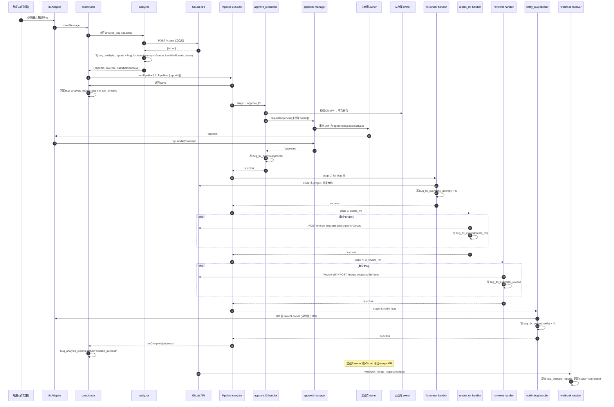

# Pipeline 全链路动态编排 — 设计文档

## 背景

当前 Bug 修复只有"修复代码"走了 Pipeline，分析、创建 Issue、创建 MR、AI Review 都硬编码在各自的 handler 里。任何环节失败都无法追踪和重试。同时 Bug 修复实例页面只展示分析报告，看不到修复过程的关键数据（Issue、MR、Review 结论）。

## 目标

1. 把创建 Issue、修复、创建 MR、AI Review 拆成独立的 Pipeline 阶段，可追踪可重试
2. 新建 bug_fix_events 表记录修复过程数据，同时作为阶段间数据传递和前端展示的数据源
3. AI Review 评审意见写到 GitLab MR 评论里
4. 完成后 DM 通知模块负责人（触发人 DM 本次不做，前端通过 Bug 修复实例页面的状态和事件时间线自行查看）
5. 回滚本次会话中对执行记录页面的改动（摘要列、触发人传递、hasReport 等），业务数据展示统一放到 Bug 修复实例页面

## 架构定位（MVP 优先）

本版**定位为 MVP**——把 Bug 修复主流程（分析 → 修复 → MR → Review → 通知 → 合并闭环）跑通即上线，不追求一次性做到可扩展的完美。

**本次做的**（Scope）：
- Pipeline 全链路 capability 化（approve_l3 / fix_bug_lN / create_mr / ai_review_mr / notify_bug）
- `bug_fix_events` 事件流表
- 多 project 修复支持
- Bug 修复实例生命周期闭环（含 MR merge webhook 同步）
- 失败重试（Bug 修复实例页面按钮）
- L3 审批：主仓库或签 + 从仓库知情 DM

**本次不做**（Growth Backlog，列入 [docs/product/growth-backlog-*](../../docs/product/)）：
- 审批状态持久化（`PipelineApprovalManager.pending` 重启丢失，靠"手动重试 Pipeline"绕过）
- 审批并签支持（复杂业务诉求，本次只做或签）
- 审批超时挂起等待人工处理（本次超时直接失败）
- DM 通知模板配置化（本次硬编码）
- 自定义审批路由规则（本次只按"主仓库 owner"路由）
- bug_fix_events 归档/分区（百万级数据之前用不到）
- Pipeline 断点恢复（失败只能整体重跑）
- 前端针对多轮分析历史的虚拟滚动（3-5 轮以内用不到）

**架构抽象粒度原则**：
- 新增的 handler 按现有 `src/agent/tools/*.ts` 的 `AgentTool` 接口 + `registerTool()` 模式落地，**不为未来场景提前抽象**
- `bug_fix_events.data` 用 JSONB 而不是专用字段，便于后续字段扩展但**不预留未使用字段**
- 前端改动直接在现有页面组件里叠加，不提前拆公共组件

## 数据规模与量级

### 业务量级预估

| 维度 | 典型值 | 峰值 | 说明 |
|------|--------|------|------|
| Bug 提交量 | 20-30 次/天 | 50+ 次/天 | 上线/迭代期峰值翻倍 |
| 单 Bug 影响 project 数 | 2-3 个 | 5+ 个 | 多服务联动 |
| 重试率 | 5% | — | 审批超时后触发人手动重试 |
| Pipeline 并发 | < 10 | — | 复用 `platform.max_concurrency` 配置（默认 10） |

### 数据增长估算

**bug_fix_events 表增长**：

单 Bug 事件数 ≈ `analysis(1) + scope_identified(2.5) + create_issue(1) + fix_attempt(2.5×attempts) + create_mr(2.5) + ai_review(2.5) + approval(0-1) + notify(1)` ≈ **13~15 行/Bug**

- 日增量：25 Bug × 14 events × 1.05（重试系数） ≈ **370 行/天**
- 年增量：~135K 行
- 三年累计：~400K 行

**bug_analysis_reports 表增长**：

- 日增量：25 × 1.05 ≈ **26 行/天**
- 年增量：~10K 行
- 三年累计：~30K 行

### 容量结论

- 数据量在 Postgres 舒适区，**不需要分页/归档/分表**
- 已设计的索引（`idx_bug_fix_events_report(report_id, created_at)` + `idx_bug_fix_events_project(report_id, project_path, code)`）足够
- 前端按 `issue_id` 聚合展示时，单 Issue 最多几十个 events，无需虚拟滚动
- 单 Issue 的多轮分析（重试）通常不超过 3-5 轮，历史折叠展示即可

### Pipeline 并发策略

- 不新增并发控制逻辑，复用现有 `platform.max_concurrency`（默认 10，[src/agent/concurrency.ts](src/agent/concurrency.ts)）
- Pipeline 执行时长预估：L1/L2 约 2-3 分钟、L3 含审批可能数分钟到数小时（审批阶段是 `setTimeout + Promise`，不阻塞 worker slot）
- 预期稳态并发 < 3，峰值 < 10，当前配置充足

### 外部依赖吞吐

- **GitLab API**：每次 Bug 修复约 4-6 次 API 调用（创建 Issue + 创建 MR + Note + Label），日调用量 ~200 次，远低于自建 GitLab 的限流阈值
- **Claude CLI**：分析单次约 10-30s、消耗 ~5k token；日成本约 `25 × 5k = 125k token`
- **钉钉 DM**：日发送 ~100 条，无限流压力

## 整体流程

```
钉钉提问 → 意图识别 → 独立执行 analyze_bug
  ↓
分析结果: { reportId, level, classification }
  ↓
classification != bug → 直接回复分析结果，结束
classification == bug → 根据 level 创建对应 Pipeline:

L1-配置类:        L2-代码缺陷:       L3-业务逻辑:       L4-复杂问题:
  L1 修复           L2 修复(重试2次)   审批                通知
  创建 MR           创建 MR            L3 修复(重试2次)   ← 结束
  AI Review         AI Review          创建 MR
  通知              通知               AI Review
                                       通知

（分析和创建 Issue 在 Pipeline 外完成，由 analyze_bug capability 一起处理）
（"通知"是每条 Pipeline 的最后一个 stage，capability=notify_bug；L4 只有一个 notify_bug stage）

L3 审批三种决策:
  同意 → 继续执行
  拒绝 → Pipeline 终止
  重新分析 → Pipeline 终止 + 自动触发新一轮分析 → 新分析 → 新 Pipeline
```

### 时序图（L3 多 project 场景完整链路）



## 现有数据结构与改造点（重要前置说明）

动手前必读，避免误解做重复设计。

### 已有表（不用新建）

- **`projects` 表（schema-v2.sql，N:1 关联 product_lines）**
  - 字段：`id`、`product_line_id`、`name`、`display_name`、`gitlab_path`、`harbor_project`、`owner_id`、`owner_name`、`docker_container_name`、`k8s_project_name`、`compose_path`、`description`
  - 含义：产品线下的每个**代码仓库/模块**。UI "产品线详情 → 模块列表" Tab 就是这张表
  - 本设计里"多 project 支持"全部基于此表，**不新建 `projects` 表**
  - 本设计里所有 `project_path` 字段指的就是 `projects.gitlab_path`

- **`module_owners` 表（schema-v8.sql）**
  - 字段：`product_line_id`、`module_pattern`、`owner_user_id`、`backup_owner_user_id`
  - 含义：按代码模块路径匹配负责人（比 `projects.owner_id` 粒度更细）
  - 本设计的 DM 通知沿用现有 `findOwner(productLineId, modulePath)` 逻辑；"主仓库 owner" 默认取 `projects.owner_id`，若为空则 fallback `module_owners`

- **`product_knowledge_repos` 表（schema-v8.sql，1:1 关联 product_lines）**
  - 字段：`code_repo_url`、`code_default_branch`、`knowledge_repo_url`、`ai_summary_path`
  - 含义：产品线的 AI 知识库配置（存 AI 总结文档的仓库）+ 主代码仓库（兼容字段）
  - 当前 analyzer 读的是 `code_repo_url`（单仓库）— **这是本次要改的点**

### 需要改造的地方

| 位置 | 现状 | 目标 |
|------|------|------|
| `analyzer.ts` | clone `product_knowledge_repos.code_repo_url` 单仓库 | 按分析策略处理多个 `projects.gitlab_path` |
| `fix-runner.ts` | 读 `product_knowledge_repos.code_repo_url` 做 worktree | 从 `bug_fix_events(code='scope_identified')` 查各 project，分别 clone（仓库地址基于 `projects.gitlab_path` 拼 `GITLAB_URL`） |
| `create_mr` handler | 不存在（`createMrViaApi` 内嵌在 fix-runner） | 独立 handler，按 project 循环创建 MR |
| `ai_review_mr` | 单 MR 输入 | 查多个 `bug_fix_events(code='create_mr')` 循环 review |
| `worktree/manager.ts` | key 只按 `(product_line_id, branch)` 区分 | 扩为 `(product_line_id, project_path, branch)`，避免多 project 并行修复时冲突（见下方示例） |

**worktree 冲突示例**：

Bug #123 涉及 2 个仓库 `PAM/pas-6.0` 和 `PAM/pas-api`，Pipeline 并行修复时两边都用 `fix/bug-123` 分支。现有 key = `(PAM, fix/bug-123)` → 同一个目录：

```
/data/worktrees/PAM-fix-bug-123/  ← pas-6.0 clone 到这
                                   ← pas-api 也 clone 到这（冲突！）
```

新 key = `(PAM, pas-6.0, fix/bug-123)` / `(PAM, pas-api, fix/bug-123)` → 分别独立目录：

```
/data/worktrees/PAM-pas-6.0-fix-bug-123/
/data/worktrees/PAM-pas-api-fix-bug-123/
```

`worktree/manager.ts` 是 hanff 新建的文件，改它无顾虑。

### 术语表

#### 领域术语

- **project**：`projects` 表的一行，即 GitLab 上的一个代码仓库/模块
- **主仓库（primary project）**：Claude 分析判断出"影响面最大"的 project，用于创建主 Issue 和 L3 审批归属
- **从仓库**：同一 Bug 涉及的其他 project
- **project_path**：`projects.gitlab_path`（如 `PAM/pas-6.0`），`bug_fix_events.project_path` 与此一致
- **report / reportId**：`bug_analysis_reports` 表的一行及其主键。一次 Bug 分析产生一个 report；同一个 Issue 多次重试会产生多个 report
- **Issue / Iid**：GitLab Issue 的 Internal ID（在 project 下的编号，如 `#123`），不是 GitLab 全局 ID

#### 系统组件

- **capability**：Agent 可执行的一种能力，如 `analyze_bug` / `fix_bug_l1` / `approve_l3` / `create_mr` / `ai_review_mr` / `notify_bug`。配置存于 `capabilities` 表（含 systemPrompt 等）
- **handler**：实现某个 capability 的具体函数（通常一个 `src/agent/*/xxx-handler.ts` 文件一个）
- **coordinator**（[src/agent/coordinator.ts](src/agent/coordinator.ts)）：协调层。分析完成后根据 level 查 Pipeline、调 `runPipeline` 启动 Pipeline、接收 onComplete 回调更新 Bug 状态
- **Pipeline**：`test_pipelines` 表中的一条，定义了一组按序执行的 stages
- **Pipeline run / test_run**：`test_runs` 表的一行，Pipeline 的一次执行实例。一个 Bug report 最多关联一个 Pipeline run（重试会产生新 run + 新 report）
- **stage**：Pipeline 的一个执行阶段。有 `script` / `approval` / `capability` / `wait_webhook` 四种类型；本设计全部 stage 都是 `capability` 类型
- **triggerParams**：调 runPipeline 时传入的运行时业务参数 map，本设计约定只传 `{reportId}`，管理员不可见

#### 关键字段

- `bug_analysis_reports.status` - `draft` / `published` / `pipeline_success` / `completed` / `aborted`
- `bug_fix_events.code` - `analysis` / `scope_identified` / `create_issue` / `fix_attempt` / `create_mr` / `ai_review` / `approval` / `notify` / `lifecycle_sync`
- `bug_analysis_reports.classification` - `bug` / `config_issue` / `usage_issue`
- `bug_analysis_reports.level` - `l1` / `l2` / `l3` / `l4`
- `bug_fix_events.status` - `success` / `failed`

## Bug 修复实例生命周期

`bug_analysis_reports.status` 是 Bug 层面的状态字段，前端 Bug 修复实例页面、重试按钮都以此为准。

### 状态机

```
              ┌─ analyzer 分析中
              ↓
       ┌─── [draft] ────┐
       │                │ 非 bug 分类
       │                ↓
       │          [completed] ──── 流程结束
       │
       │ classification=bug
       ↓
   [published] ←─── Pipeline 启动 / 跑着
       │
       ├─────────────────────────────────────┐
       │                                     │
       │ Pipeline onComplete 成功            │ Pipeline 失败 / 审批拒绝 / 审批超时
       ↓                                     ↓
 [pipeline_success]                    [aborted] ← 前端显示"重试"按钮
       │
       │ webhook: MR merged → Issue closed
       ↓
   [completed] ── 闭环，Bug 真正修完
```

### 状态含义与触发方

| status | 含义 | 写入方 |
|--------|------|-------|
| `draft` | 分析中 | analyzer 开始时 |
| `published` | 分析完成，Pipeline 已启动 | analyzer 分析完成且 classification=bug 时 |
| `pipeline_success` | Pipeline 全部 stage 成功（MR 已创建，通知已发），等人工合并 MR | coordinator onComplete 回调（Pipeline.status=success 时）|
| `completed` | 终态：MR 已合并 Issue 已关闭（bug 类）；或非 bug 分析直接结束（非 bug 类）| issue-handler 收到 MR merged webhook 时 / analyzer 分析结果非 bug 时 |
| `aborted` | 终态：Pipeline 失败、审批拒绝、审批超时、MR 被人工关闭未合并 | coordinator onComplete 回调（Pipeline.status=failed 时）/ issue-handler 收到 MR closed 事件时 |

### 前端展示（Bug 修复实例页面）

| 当前 status | UI 显示 | 重试按钮 |
|------------|---------|---------|
| `draft` | 🔄 分析中 | 无 |
| `published` | 🔄 修复中 | 无 |
| `pipeline_success` | ⏳ 等待合并 | 无 |
| `completed` | ✅ 已完成 | 无 |
| `aborted` | ❌ 已取消 / 已失败 | ✅ 显示"重试" |

**说明**：
- `published` 和 `pipeline_success` 两个中间态便于前端展示进度
- `aborted` 是所有"业务失败"（拒绝/超时/关闭/Pipeline失败）的统一终态，**不细分**——因为前端展示和重试逻辑都一样
- `completed` 和 `aborted` 是终态，不可再变


## 阶段间数据传递：bug_fix_events 表

### 设计思路

**不改 Pipeline 引擎**。阶段间数据传递通过 `bug_fix_events` 表实现：每个 handler 执行完后往表里插一条记录（code + data JSONB），下一个 handler 需要数据时从这张表按 report_id + code 查询。

这张表同时服务于两个用途：
1. **阶段间数据传递** — handler 查前序环节产生的业务数据（issueIid、branch、mrIid 等）
2. **前端展示** — Bug 修复实例页面按 report_id 查询所有事件，渲染时间线

### 表结构

```sql
CREATE TABLE bug_fix_events (
  id SERIAL PRIMARY KEY,
  report_id INTEGER NOT NULL REFERENCES bug_analysis_reports(id),
  project_path VARCHAR(200),         -- project 级事件必填，Bug 级事件（analysis/approval/notify）为 NULL
  code VARCHAR(50) NOT NULL,
  status VARCHAR(20) NOT NULL DEFAULT 'success',  -- success / failed
  duration_ms INTEGER,
  data JSONB DEFAULT '{}',
  created_at TIMESTAMPTZ NOT NULL DEFAULT NOW()
);
CREATE INDEX idx_bug_fix_events_report ON bug_fix_events(report_id, created_at);
CREATE INDEX idx_bug_fix_events_project ON bug_fix_events(report_id, project_path, code);
```

**事件排序语义：**
- 不引入 `step_no` 字段。事件按 `created_at` 自然排序足够（业务阶段顺序由 `code` 枚举隐含）
- 同一 `code` 可能存在多条（如 `fix_attempt` 重试多次），前端按 `code` 分组后按 `created_at` 展示
- 并发多 project 同阶段的记录天然无顺序冲突（每条独立 row）

### Handler 幂等检查约定

每个 handler 执行前必须先查 `bug_fix_events` 判断该 project 是否已完成本阶段，避免 Pipeline stage 重试（retryCount > 0）时重复执行业务动作（如重复建 Issue / 建 MR）：

| Handler | 幂等检查 | 存在则 |
|---------|---------|--------|
| `create_issue`（在 analyzer 内部） | `SELECT ... WHERE report_id=? AND code='create_issue'` 已有记录 | 跳过 GitLab 调用，直接读原事件里的 `issueIid` 返回 |
| `fix_bug_lN` | 对每个 project 分别检查 `code='fix_attempt' AND status='success'` | 跳过这个 project 的修复 |
| `create_mr` | 对每个 project 检查 `code='create_mr'` | 跳过该 project 的 MR 创建 |
| `ai_review_mr` | 对每个 MR 检查 `code='ai_review'` | 跳过该 MR 的 review |
| `notify_bug` | 不做幂等检查（通知允许重发，失败重试更有价值） | — |

原则：**业务动作可能产生 GitLab 侧的副作用（Issue/MR/comment）必须幂等**；纯内部动作（通知）不做幂等。

### 各环节写入的 code 和 project_path

| code | project_path | data |
|------|-------------|------|
| `analysis` | NULL | `{ durationMs, level, confidence, classification, rootCauseSummary, productLineId, projects: [{projectPath, sourceBranch, affectedModules}, ...] }` |
| `scope_identified` | 项目路径 | `{ sourceBranch, affectedModules }` — 每个涉及的 project 一条 |
| `create_issue` | 项目路径 | `{ issueIid, issueUrl }` |
| `fix_attempt` | 项目路径 | `{ branch, targetBranch, testResult, attempt, error }` |
| `create_mr` | 项目路径 | `{ mrIid, mrUrl, branch }` |
| `ai_review` | 项目路径 | `{ label, mrIid, reviewSummary }` |
| `approval` | NULL | `{ decision, approverName }` |
| `notify` | NULL | `{ userId, role, messageKind, mrIids, error? }` |
| `lifecycle_sync` | 项目路径 | `{ mrIid, mrAction: 'merge' \| 'close', targetStatus: 'completed' \| 'aborted' }` — 来自 webhook 同步 |

### 当前状态查询方式

不维护单独的 scopes 表，handler 直接从 events 推断当前状态：

- **所有涉及的 project**: `SELECT DISTINCT project_path FROM bug_fix_events WHERE report_id=? AND project_path IS NOT NULL`
- **某 project 最新 fix 分支**: `WHERE report_id=? AND project_path=? AND code='fix_attempt' ORDER BY id DESC LIMIT 1`
- **某 project 的 MR**: `WHERE report_id=? AND project_path=? AND code='create_mr' ORDER BY id DESC LIMIT 1`
- **某 project 的 Issue**: `WHERE report_id=? AND project_path=? AND code='create_issue'`

### 数据流示例（L2，涉及 2 个 project）

```
前置：analyze_bug capability 独立执行完成（不在 Pipeline 内）:
  - Claude CLI 分析
  - 插入 bug_analysis_reports (reportId=5)
  - 写 bug_fix_events(code='analysis', project_path=NULL, data={level, classification, ...})
  - 对每个涉及的 project（PAM/pas-6.0、PAM/pas-api）：
    - 写 bug_fix_events(code='scope_identified', project_path=..., data={sourceBranch, affectedModules})
    - 调用 GitLab API 创建 Issue
    - 写 bug_fix_events(code='create_issue', project_path=..., data={issueIid, issueUrl})
  - 返回 { reportId: 5, level: 'l2', classification: 'bug' }

coordinator 根据 level=l2 创建 L2 Pipeline 实例，triggerParams={reportId:5}

阶段1 fix_bug_l2:
  查 DISTINCT project_path WHERE report_id=5 AND project_path IS NOT NULL → 得到 [PAM/pas-6.0, PAM/pas-api]
  对每个 project：
    先幂等检查 fix_attempt(status='success') → 有则跳过
    查最新 scope_identified 事件获取 sourceBranch 和 affectedModules
    修复代码
    写 bug_fix_events(code='fix_attempt', project_path=..., status='success'|'failed', data={branch, testResult, attempt})

阶段2 create_mr:
  查 DISTINCT project_path AND 最新 fix_attempt 成功的 project
  查主仓库 create_issue 事件获取 mainIssueIid
  对每个 project：
    先幂等检查 create_mr → 有则跳过
    查最新 fix_attempt 获取 branch
    主仓库 MR description: "Closes #<mainIssueIid>"
    从仓库 MR description: "Related to PAM/<主仓库>#<mainIssueIid>"
    创建 MR
    写 bug_fix_events(code='create_mr', project_path=..., data={mrIid, mrUrl, branch, isPrimary})

阶段3 ai_review_mr:
  查每个 project 的最新 create_mr 事件获取 mrIid
  对每个 MR：
    先幂等检查 ai_review → 有则跳过
    执行 Review → 写 MR Note
    写 bug_fix_events(code='ai_review', project_path=..., data={label, mrIid, reviewSummary})

阶段4 notify_bug:
  查所有 scope_identified → 得到各 project，join projects 表取 owner_id / module_owners fallback
  查各 project 最新 create_mr 和 ai_review 事件汇总信息
  去重各 project 的 owner → DM 发送修复结果 + 各自 project 的 MR 列表
  （本版不发触发人汇总通知）
  写 bug_fix_events(code='notify', project_path=NULL, data={recipients:[{userId, role, mrIids}]})
  stage 结果 success
```

### 写入时机

在每个 handler 内部写入，不在 executor 统一写。因为只有 handler 知道业务数据。executor 不感知 bug_fix_events 表。

### Pipeline 引擎改动

**零改动**。保留现有 `triggerParams` 机制（`{{triggerParams.xxx}}` 模板），业务上约定只传 `{ reportId }`——handler 只从 `ctx.triggerParams.reportId` 拿 reportId，其余业务数据从 `bug_fix_events` 按 reportId 查。

这样：
- 严益昌原创的 executor.ts、approval-manager.ts **一行都不改**
- Pipeline 引擎不感知具体业务字段（只传递、不解析），稀释架构耦合
- seed.sql 里 Pipeline `capabilityParams` 精简为 `{"reportId": "{{triggerParams.reportId}}"}`，不再有 issueId 等具体业务字段

**取消语义改动**（本轮已实现，非新设计）：runPipeline 的 `executeCapabilityStage` 改用 `AbortController`，stage 超时时通过 signal 通知 capability handler 取消子进程（详见 [claude-cli.ts](src/agent/claude-cli.ts) 的 `signal` 参数）。避免 Pipeline 超时后 Claude CLI 子进程变孤儿进程。

**approval-manager 不改**（见下一小节"审批持久化待办"）。

## Handler 拆分

### Handler 开发规范（所有 capability handler 统一遵守）

所有新/改的 capability handler 必须沿用现有 `CapabilityHandler` 模式（[coordinator.ts:23](src/agent/coordinator.ts#L23)）：

```typescript
// 统一签名
type CapabilityHandler = (opts: TriggerOptions) => Promise<TriggerResult>

interface TriggerOptions {
  capabilityKey: string              // 如 'approve_l3' / 'create_mr'
  context: TaskContext               // { taskId, groupId, platform, initiatorId, initiatorRole }
  extraParams?: Record<string, unknown>  // 来自 Pipeline 的参数（解析后的 capabilityParams）
  signal?: AbortSignal               // 超时/取消信号
}

interface TriggerResult {
  success: boolean
  output?: string  // 人类可读摘要（写入 test_runs.stage_results[].output）
  error?: string   // 失败错误码（见"错误码汇总"章节）
  data?: unknown   // 结构化数据（本次设计里基本不用，数据都落 bug_fix_events）
}
```

**reportId 读取方式**：

```typescript
const reportId = Number(opts.extraParams?.reportId)  // 来自 Pipeline 的 capabilityParams
if (!reportId) return { success: false, error: 'missing_reportId', output: '参数错误: 缺少 reportId' }
```

**注册方式**：在 handler 文件末尾或 `src/server.ts` 启动时调用 `registerCapabilityHandler('key', handleFunction)`（参照 [analyzer.ts:208](src/agent/analysis/analyzer.ts#L208) 的 `registerAnalysisBugHandler()` 写法）。

**参考模板**：`src/agent/analysis/analyzer.ts` 的 `handleAnalyzeBug(opts)` 就是标准 handler。所有新 handler（approve_l3 / create_mr / notify_bug）按同样的签名和模式写。

**IM adapter 获取方式**：沿用 approval-manager 现有模式——handler 通过全局注册的 adapter 数组取 `adapters[0]`（[approval-manager.ts:30](src/pipeline/approval-manager.ts#L30)）。当前生产仅启用钉钉，无多平台路由需求。

### analyze_bug 扩展（不再只做分析）

文件：`src/agent/analysis/analyzer.ts`

职责：两阶段分析（筛选 → 详细分析）+ 创建 Issue。分析报告全文只在 Issue description 中使用，不入 DB。

**两阶段分析策略**：
- **阶段 A（筛选）**：clone 产品线主仓库（`product_knowledge_repos.code_repo_url`），把 `projects` 表的所有候选 project 列表（name + gitlab_path + description）一起传给 Claude CLI，让它输出 `{涉及的 project 列表, 主仓库}`。目的是缩小第二阶段 clone 范围。
- **阶段 B（详细分析）**：对每个筛出的 project 独立 clone + 调 Claude CLI 做根因分析。多 project 并行执行。产物合并为一份统一的 Markdown 报告 + 结构化结构化结果（level/classification/solutions/affectedModules）。

**流程**：

1. 阶段 A 筛选：调用 Claude CLI 输入主仓库 + projects 列表 → 输出涉及的 projects + 主仓库判定
2. 阶段 B 详细分析：对每个涉及的 project 并行调 Claude CLI → 合并 Markdown 报告 + 结构化数据
3. 如果 classification == 'bug'（需要创建 Issue）：
   - 先在主仓库调 GitLab API 创建 **一个主 Issue**（description 用 Markdown 报告全文，列出所有涉及的 project）
   - Issue 创建失败 → 直接抛错返回，用户通过原入口重试（不落 DB，不浪费记录）
   - Issue 创建成功 → 继续下一步
4. 写入 `bug_analysis_reports`（结构化字段 + `primary_project_path` + `issue_id`，如 classification!=bug 则 `issue_id=NULL`）
5. 写 `bug_fix_events(code='analysis', project_path=NULL, data={level, classification, confidence, rootCauseSummary, productLineId, projects:[...]})`
6. 根据 classification 分支：
   - `classification != 'bug'`（config_issue / usage_issue）：更新 `bug_analysis_reports.status='completed'`，返回分析结果给用户，**不触发 Pipeline**
   - `classification == 'bug'`：
     - 更新 `bug_analysis_reports.status='published'`
     - 为每个涉及的 project 写 `bug_fix_events(code='scope_identified', project_path=..., data={sourceBranch, affectedModules, isPrimary})`
     - 写 `bug_fix_events(code='create_issue', project_path=<主仓库>, data={issueIid, issueUrl, isPrimary: true})`
     - 其他 project 不创建独立 Issue，仅在各自 MR 中引用主 Issue（详见 create_mr handler）
7. 返回 data: `{ reportId, level, classification }`

**失败重试（复用 Issue）模式**：
- 传入 `reuseIssueId` 参数时，跳过步骤 3（不再建 Issue），改为 `POST /issues/:iid/notes` 向原 Issue 加一条 comment（Markdown 报告全文 + `🔄 第 N 次分析` 标记）
- 步骤 4 的 `issue_id` 仍填原 Issue ID，`bug_fix_events(code='create_issue')` 仍写新记录（data 里 `isPrimary=true`，新增 `isReused=true` 便于前端识别）

### create_mr（新 capability handler）

文件：`src/agent/mr/mr-handler.ts`

- 查 DISTINCT project_path WHERE report_id 且有 fix_attempt 成功事件 → 得到待创建 MR 的 project 列表
- 查主仓库的 create_issue 事件获取 mainIssueIid（所有 MR 都引用这一个 Issue）
- 对每个 project：
  - 先查 `bug_fix_events(code='create_mr', project_path=当前)`，**若已存在则跳过**（幂等）
  - 查最新 fix_attempt 事件获取 branch、targetBranch
  - 调用 GitLab API 创建 MR，description 中写入关联语法：
    - **主仓库 MR**：`Closes #<主Issue IID>`（同仓库内自动关闭 Issue）
    - **从仓库 MR**：`Related to PAM/<主仓库>#<主Issue IID>`（仅关联，合并时不关 Issue）
    - 设计原因：**主 Issue 的关闭只应由主仓库 MR 合并触发**；从仓库 MR 合并不关 Issue，避免某个 MR 先合并就提前关闭主 Issue，导致其他 MR 的协同状态丢失
  - 如果涉及多 project（>1），在 description 顶部加提示："⚠️ 此修复涉及 N 个服务，请协调各 MR 的合并顺序。主仓库 MR: {主仓库 MR URL}"
  - 更新主 Issue 标签（fixing → in-review，仅第一个 MR 创建时）
  - 写 bug_fix_events(code='create_mr', project_path=..., data={mrIid, mrUrl, branch, isPrimary})

### fix-runner.ts 修改

- 删除内嵌的 createMrViaApi 调用
- 删除 handleFixComplete 调用
- L2/L3 不再调用 retryWithDowngrade（重试由 Pipeline retryCount 控制）
- 查 DISTINCT project_path WHERE report_id AND code='scope_identified' → 得到待修复的 project 列表
- 对每个 project：
  - **幂等检查**：查 `bug_fix_events(code='fix_attempt', project_path=当前, status='success')`，若已存在则跳过（重试时只跑失败的 project）
  - 查 scope_identified 事件获取 sourceBranch、affectedModules
  - 查 bug_analysis_reports 获取修复方案（rootCauseSummary、solutionsJson）
  - 修复代码
  - 写 bug_fix_events(code='fix_attempt', project_path=..., status='success'|'failed', data={branch, targetBranch, testResult, attempt, error})
- 返回 data: { reportId }

### ai_review_mr 修改

- 查 DISTINCT project_path WHERE report_id 且有 create_mr 事件 → 得到待 Review 的 MR 列表
- 如果涉及多 project（>1），在每个 MR 的 Review 评语开头加："⚠️ 此为跨服务修复的一部分，请确保所有 N 个 MR 都通过 Review 后再协调合并"
- 对每个 project：
  - 查最新 create_mr 事件获取 mrIid
  - 执行 Review
  - 新增：将 Review 评审意见作为 MR Note 写到 GitLab（POST /merge_requests/:iid/notes）
  - 写 bug_fix_events(code='ai_review', project_path=..., data={label, mrIid, reviewSummary})

### notify_bug（新 capability handler）

文件：`src/agent/notify/notify-handler.ts`

职责：在 Pipeline 的最后一个 stage 统一发 DM 通知。把 onComplete 里的通知逻辑整体搬进来，好处是通知失败前端可见、可重试、可在 Pipeline 编辑页调整。

流程：

1. 查 `bug_fix_events` 按 report_id 汇总：
   - 所有 `scope_identified` → 涉及的 project 列表
   - 各 project 最新 `create_mr` → mrIid / mrUrl
   - 各 project 最新 `ai_review` → label（ai-approved / ai-needs-attention）
   - 触发人 id：从 `test_runs.triggered_by` 读
2. 查 `bug_analysis_reports` 获取 level / classification / issueId / primary_project_path
3. 计算通知对象：
   - 各 project 负责人：对每个 `scope_identified.project_path`，先读 `projects.owner_id`，空则 fallback `module_owners`
   - 同一负责人多个 project 去重，合并一条消息（只列他负责的 project 的 MR）
   - 触发人：不发 DM（本版不做触发人 DM，由前端 Bug 修复实例页面展示状态/事件时间线）
4. 按场景发 DM（见下方"DM 通知策略"表格）
5. 每次 DM 发送后写 `bug_fix_events(code='notify', project_path=NULL, data={userId, role, messageKind, mrIids, error?})`
   - DM 成功 → `status='success'`
   - DM 失败 → `status='failed'`，data 里记 `error` 原因，**但 handler 本身仍继续发下一个**
6. 所有 owner 发送完：
   - 若 events 里**没有任何** `code='notify' AND status='failed'` → stage 返回 success
   - 若有失败 → stage 返回 failed（Pipeline retry 会整体重跑 notify_bug，handler 不做幂等，重跑时会再次尝试所有对象）
7. 失败/待决策类场景（`approval_rejected` / `approval_timeout` / `approval_retry_analysis` / `fix_failed`）：handler 直接返回 success，不发 DM 也不写 notify 事件（本版不做触发人 DM，前端通过 Bug 修复实例页面的 status 和事件时间线展示）

   **注意 L4 场景不同**：L4（`l4_created`）表示"Claude 无法自动修，Issue 已建好等人工接手"，属于**有明确待办**而非失败终态，因此必须给 project owner 发 DM（见下文"DM 通知策略"章节 L4 行）

**设计要点**：
- notify_bug 不做幂等（通知允许多次发）；Pipeline `retryCount` 控制最多重试几次，失败到顶 stage=failed + Pipeline=failed
- `bug_fix_events(code='notify')` 里每次 DM 都是独立一行；前端可追溯"谁/什么时候/成功还是失败"
- 通知模板本次硬编码（参见 [Growth Backlog](../../docs/product/growth-backlog-notification-template.md)）

### issue-handler.ts 瘦身 + MR 合并/关闭状态同步

**背景**：`src/adapters/gitlab/issue-handler.ts` 是之前没有 Pipeline 调度能力时的**事件驱动**旁路——Issue 加 `approved` 标签 → 触发 `fix_bug_l3`；MR 创建 → 触发 `ai_review_mr`。现在 Pipeline 驱动后，这套逻辑会和 Pipeline **双触发冲突**（同一个 MR 被 Review 两遍）。

**改造方案**：废弃 label/MR-created 的 capability dispatch，**保留**一个分支做 Bug 修复实例生命周期闭环。

| webhook 事件 | 之前的处理 | 新设计处理 |
|------------|-----------|-----------|
| Issue 加 `approved` 标签 | 触发 fix_bug_l3 capability | ❌ 删除（Pipeline 自己驱动） |
| MR 创建 (hook: merge_request action=open) | 触发 ai_review_mr capability | ❌ 删除（Pipeline 自己驱动） |
| **MR 合并 (action=merge)** | 无 | ✅ **新增**：按 MR description 里的 `Closes #<iid>` 或 MR 的 `merge_commit_sha` 反查 `bug_analysis_reports`，更新 `status='completed'` |
| **MR 关闭未合并 (action=close)** | 无 | ✅ **新增**：同上反查，更新 `status='aborted'`（说明人工放弃了修复） |
| 其他事件 | 无 | 保留日志接收，不分发业务动作 |

**为什么还保留 webhook**：
- Pipeline 跑完只代表"MR 创建成功 + 通知发出"，MR 还没被合并，Bug 没真正修完
- `bug_analysis_reports.status` 从 `published` 推进到 `completed` 必须等 MR merged 事件
- 没有 webhook 的话，Bug 修复实例永远卡在 `published`，前端无法显示"已完成"
- 未来加"MR merge → 自动 deploy"扩展也有接入点

**反查策略**：从 GitLab webhook 的 MR 对象反查 `bug_analysis_reports`。

**webhook payload 关键字段**（见 [issue-handler.ts:24](src/adapters/gitlab/issue-handler.ts#L24)）：

```typescript
interface GitLabMergeRequestEvent {
  object_kind: 'merge_request'
  object_attributes: {
    iid: number          // ← MR 在 project 内的编号，对应 data.mrIid
    action: string       // ← 本次我们关心 'merge' / 'close'
    title: string
    source_branch: string
    target_branch: string
  }
  project: {
    path_with_namespace: string  // ← 'PAM/pas-6.0' 格式，与 projects.gitlab_path 一致，对应 bug_fix_events.project_path
  }
}
```

**反查 SQL**：

```sql
SELECT report_id
FROM bug_fix_events
WHERE code = 'create_mr'
  AND project_path = $1                 -- event.project.path_with_namespace
  AND (data->>'mrIid')::int = $2        -- event.object_attributes.iid
ORDER BY id DESC LIMIT 1;
```

**处理流程**：

1. 解析 webhook payload，提取 `action`、`iid`、`path_with_namespace`
2. `action='merge'` 或 `'close'` 才进入反查分支；其他 action（'open'/'update'/'reopen'）直接忽略（仅记日志）
3. 按上面 SQL 查 `report_id`；查不到说明这个 MR 不是我们创建的，直接忽略
4. 读 `bug_analysis_reports.status`：
   - 已是 `completed` 或 `aborted`（终态） → 幂等跳过（GitLab 可能重发 webhook）
   - 其他 → 根据 action 更新为 `completed`（merge）或 `aborted`（close）
5. 写审计事件：`bug_fix_events(code='lifecycle_sync', project_path=<上面的 path>, data={mrIid, mrAction: 'merge'|'close', targetStatus: 'completed'|'aborted'})`

**在代码里加 TODO 注释**：
```ts
// TODO: 保留 webhook 接收做 Bug 修复实例生命周期闭环（MR merge/close → status 同步）
//       Label/MR-created 的 capability 分发已废除，改由 Pipeline 内部驱动
```

## coordinator 触发逻辑

analyzer 返回分析结果后，coordinator：
1. 检查 classification==bug，非 bug 直接返回（analyzer 内已设 status='completed'）
2. 根据 level 查找对应 Pipeline（L1/L2/L3/L4）
3. 调用 `runPipeline(pipelineId, ..., triggerParams={reportId}, onComplete)`
4. runPipeline 返回 runId 后，回写 `bug_analysis_reports.pipeline_run_id = runId`（用于双向索引和前端跳转）
5. Pipeline 不存在时走降级路径（直接 triggerCapability）

### onComplete 回调（关键：推动生命周期状态）

coordinator 调 runPipeline 时必须传入 onComplete 回调，用于在 Pipeline 终态时更新 `bug_analysis_reports.status`。伪代码：

```typescript
// src/agent/coordinator.ts 里 handleAnalysisComplete 函数
const onComplete = async (result: PipelineRunResult) => {
  try {
    if (result.status === 'success') {
      // Pipeline 全部成功 → MR 创建好、通知已发，等人工合并
      await updateBugAnalysisReportStatus(reportId, 'pipeline_success')
    } else {
      // Pipeline 失败（含审批拒绝、超时、修复失败、通知失败等所有业务/系统异常）
      await updateBugAnalysisReportStatus(reportId, 'aborted')
    }
  } catch (err) {
    console.error('[coordinator] onComplete status update failed:', err)
  }
}

const runId = await runPipeline(
  pipeline.id,
  {},                           // serverAssignment，本设计 Pipeline 不需要服务器
  'api',                        // triggerType
  triggeredBy,                  // initiatorId
  onComplete,                   // 上面的回调
  { reportId },                 // triggerParams 只传 reportId（不再传 issueId）
  `L${level} Bug 修复` ,        // summary，用于执行记录列表展示
)

// 立即回写 pipeline_run_id，便于前端"查看执行记录"跳转
await setPipelineRunId(reportId, runId)
```

**为什么 onComplete 只分 success/aborted 两态**：
- 设计里没有"部分成功"概念（notify 失败 = 整体失败）
- 失败原因由 test_runs.error_message 和 stage_results 记录，不需要在 bug_analysis_reports.status 再细分
- `completed` 和 `pipeline_success` 的区别：前者要等 MR merge webhook，后者仅 Pipeline 跑完

**bug_analysis_reports.status 转移路径**：

```
analyzer 写入 draft（开始） → published（classification=bug）
                               ↓
                    onComplete 回调
                         ├─ success → pipeline_success → webhook MR merged → completed
                         └─ failed  → aborted（终态）
                                      ↑ 或 webhook MR closed 未 merged

非 bug 分类：analyzer 直接写 completed（不经 Pipeline）
```

## L3 审批"重新分析"

审批阶段返回三种结果：approved / rejected / retry_analysis。

- approved: Pipeline 继续
- rejected: Pipeline 终止
- retry_analysis: Pipeline 终止 + coordinator 自动触发新一轮 analyze_bug → 新分析报告 → 新 Pipeline

执行记录会有多条（旧的标记终止，新的重新开始），通过 bug_fix_events 的 report_id 可以关联查看。

### 多 project 场景的审批人与 approve_l3 capability 化

**架构决策**：L3 审批**不用 Pipeline 原生 `stageType=approval`**，改成 `stageType=capability` 的 `approve_l3` handler。这样 executor 零改动，动态 approverIds 在 handler 内部决定。

**审批权独占于主仓库 owner**。非主仓库 owner 同时收到"知情 DM"，但没有审批能力。

- **主仓库 owner**（`scope_identified` 事件 `data.isPrimary=true` 对应 project 的 `projects.owner_id`）
  - 收到 L3 审批 DM，可回复 `approve #XX` / `reject #XX` / `reanalyze #XX`
  - `approverIds` 只填这一个人
- **从仓库 owner**（其他 `scope_identified` 事件对应 project 的 owner）
  - 收到 FYI 知情 DM，内容："Bug X 涉及你负责的 Y 服务，主负责人 Z 正在审批方案，预计 T 分钟决定。方案摘要：..."
  - **消息里不展示** approve/reject/reanalyze 命令提示
  - 即使回复审批命令也不生效（approverIds 里没有他们的 ID，`tryHandleCommand` 的人身匹配会失败）
- **同一人兼任多个 project 的 owner** → 去重，只收一条

### approve_l3 capability handler

**文件**：`src/agent/approval/approve-l3-handler.ts`（新建）

**入参**：`{ reportId }`（从 `ctx.triggerParams.reportId` 读）

**执行流程**：

1. 查 `bug_analysis_reports` 拿 `primary_project_path` 和 `issue_id`
2. 查 `projects` 表拿主仓库 `owner_id`，作为唯一审批人
3. 查所有 `scope_identified` 事件的 project_path，JOIN `projects` 得到从仓库 owner 列表（去重，排除主仓库 owner 自己）
4. 给从仓库 owner 发 FYI 知情 DM（直接调 IM adapter，**不走 approval-manager**）
5. 调 `PipelineApprovalManager.getInstance().requestApproval([primaryOwnerId], desc, timeoutMs, String(issueId))`（**approval-manager 零改动**）
6. 根据决策写 `bug_fix_events(code='approval', data={decision, approverName})`
7. 返回：
   - `approved` → `{ success: true }`，Pipeline 继续
   - `rejected` / `timeout` / `retry_analysis` → `{ success: false, error: <decision> }`，Pipeline 终止

**stage 配置示例**（seed.sql 里 L3 Pipeline 的第一个 stage）：

```json
{
  "name": "L3 方案审批",
  "type": "capability",
  "capabilityKey": "approve_l3",
  "capabilityParams": { "reportId": "{{triggerParams.reportId}}" },
  "timeoutSeconds": 3600,
  "retryCount": 0,
  "onFailure": "stop"
}
```

**为什么不用 stageType=approval**：

- executor.ts 的 `executeApprovalStage` 从静态 `stage.approverIds` 读审批人，无法传入"主仓库 owner"这种每个 Bug 不同的动态值
- 改 executor 属于改严益昌原创代码，本次设计目标是零改动
- capability handler 可以自由执行任意逻辑，内部调 `approval-manager.requestApproval()` 就能达到同样效果
- 好处：executor.ts / approval-manager.ts 零改动，审批仍是 Pipeline 内的 stage（UI/状态/重试一致）

### 超时处理

维持 Pipeline 现有行为 —— `approve_l3` handler 内调 `requestApproval(timeoutMs=3600_000)` 返回 `timeout` → handler 返回 `{success:false, error:'timeout'}` → stage.status=failed → `onFailure=stop` 终止 Pipeline。

触发人收到"L3 审批超时"通知，可在 Bug 修复实例页面点"重试"触发完整新一轮流程（新分析 + 新 Pipeline，复用原 Issue，见"失败重试"章节）。

### 审批命令

L3 审批阶段用户通过在群里 @ 机器人回复命令决策：

- `approve #<issueId>` — 批准
- `reject #<issueId>` — 拒绝
- `reanalyze #<issueId>` — 要求重新分析（触发 retry_analysis 分支）

命令解析由 `approval-manager.ts` 的 `tryHandleCommand` 负责，正则扩展为 `^(approve|reject|reanalyze)\s+#?(\w+)`。

### 审批持久化（已知待办，挂 Growth）

当前 `PipelineApprovalManager.pending` 是内存 Map，进程重启后 pending 审批丢失，Pipeline 将永远等待审批不前进。

**本次设计不解决**，原因：本次改动已较大，优先把多 project + 解耦跑通。审批持久化挂 [Growth Backlog](../../docs/product/growth-backlog-pipeline-state-persistence.md)，后续用 `pipeline_approvals` 表持久化 + 进程启动时从 DB 恢复。

**临时规避**：进程重启时管理员手动在后台重试失败 Pipeline（见"失败重试"章节）。

## 失败降级策略

| 阶段 | onFailure | retryCount | 失败后果 |
|------|-----------|------------|---------|
| 创建 Issue（在 analyze_bug 内部） | stop | 1 | 重试1次后仍失败 → 直接返回错误，report/events 都不写 |
| L1 修复 | stop | 0 | 一次失败即停止 |
| L2 修复 | stop | 2 | 最多3次，全部失败 → needs-manual |
| L3 修复 | stop | 2 | 同 L2 |
| 方案审批 | stop | 0 | 拒绝/超时 → Pipeline 终止（status=aborted） |
| 创建 MR | stop | 1 | 重试1次后仍失败 → 修复分支已保留 |
| AI Review | continue | 0 | 失败不阻断，MR 已创建可人工 Review |
| notify_bug | stop | 2 | 通知全部对象，失败条目写入 events 的 status=failed；重试整体重发。最终失败 → Pipeline=failed，前端可见"修复成功但通知发送失败" |

中断恢复：不做断点恢复。Pipeline 中断标记为失败，用户在 Bug 修复实例页面可点"重试"按钮触发**完整新一轮流程**（新分析 + 新 Pipeline），但**复用原 Issue**（见下方"失败重试"章节）。

### 失败重试

**触发入口**：Bug 修复实例页面的"重试"按钮，显示条件基于 `bug_analysis_reports.status = 'aborted'`（Pipeline 业务失败或审批拒绝时由 coordinator onComplete 回调设置）。

重试按钮**不看 test_runs.status**（执行记录层的状态），而是看 Bug 层的业务状态，原因：
- 重试是业务语义（重新修这个 Bug），不是通用"重跑 Pipeline"
- test_runs 可能有多条（多次重试产生多条），前端看哪一条不清晰；bug_analysis_reports.status 是 Bug 当前态，明确
- 不需要在 test_runs 里加 aborted enum，避开改动严益昌代码

**交互**：点击按钮弹出确认对话框："确认重新开始处理吗？"，确认后才执行（避免误点导致重复分析消耗 token）。

**流程**：

1. 后端 endpoint：`POST /admin/bug-reports/:id/retry`
2. 查原 report 拿到 `issueId` + `primary_project_path` + `productLineId`
3. 调用 GitLab API 读 Issue 当前内容（title + description + 所有 notes/comments）作为新分析的输入材料
   - 设计原因：原始问题材料（用户在 IM 里的提问、图片）已不可得，Issue 是唯一的持久化载体
4. 调用 analyzer capability 的**复用 Issue 模式**（新增 `reuseIssueId` 参数）：
   - 正常模式：`POST /issues` 创建新 Issue
   - 复用模式：`POST /issues/:iid/notes` 向原 Issue 加一条 comment（内容用 Markdown 报告全文 + `🔄 第 N 次分析` 标记）
5. analyzer 照常写入：
   - 新 `bug_analysis_reports` row（新 `reportId`，`issue_id` 仍指向同一个 GitLab Issue，`primary_project_path` 同上或根据新分析调整）
   - 新 `bug_fix_events` 一批（`report_id` 指向新 report）
6. coordinator 照常创建新 Pipeline 实例，`triggerParams={reportId: 新}`

**前端展示**：Bug 修复实例页面按 `issue_id` 聚合，同一 Issue 下多轮 report 按 `created_at DESC` 倒序显示，最新一轮默认展开：

```
Issue #123 - 登录接口 500 错误
├── 🔄 第 3 次分析（2026-04-18 10:30，status=published，L2）[展开中]
│   └── [完整事件时间线 + Pipeline 状态]
├── 第 2 次分析（2026-04-18 09:15，status=aborted）❌ 审批超时 [折叠]
└── 第 1 次分析（2026-04-17 16:20，status=aborted）❌ 审批超时 [折叠]
```

**不做的事**：
- 不支持并发多个 Pipeline（按钮仅在失败态可见，强制串行）
- 不做断点恢复（故意设计成完整重跑，避免状态残留）

## DM 通知策略

由 `notify_bug` handler 在 Pipeline 的最后 stage 执行。**本版只通知 project 负责人（owner），不发触发人 DM**——触发人通过 Bug 修复实例页面（查看状态、事件时间线、重试按钮）自行获取进度，不再依赖 IM 推送（避免消息骚扰 + 简化 notify 实现）。

| 场景 | 通知谁 | 内容 |
|------|--------|------|
| L1/L2/L3 全部成功 | 各 project 负责人 | "Bug 已自动修复，MR !{mrIid} 等待合并" + MR 链接 + Review 结论 |
| AI Review 需关注 | 各 project 负责人 | "AI Review 发现问题，请关注 MR !{mrIid}" + MR 链接 |
| **L4（Claude 放弃自动修）** | **各涉及 project 负责人**（主仓 + 从仓 owner，去重） | "此 Bug 经分析判定为 L4（架构级），AI 无法自动修复，需人工接手。Issue: {issueUrl}" + 根因摘要 |
| 修复失败 / 审批被拒 / 审批超时 / retry_analysis | 不发 DM | 前端通过 `bug_analysis_reports.status` 和事件时间线展示，管理后台可手动重试 |

**L4 为何发 DM 而其他失败类不发**：L4 是"Claude 分析后判断无法自动修，Issue 已建、等人工接手"——属于**有明确下一步待办**的场景，必须主动 ping owner 去处理。其他失败类（fix_failed / approval_rejected 等）要么已决策终止，要么触发人可从重试按钮自行发起，无需 DM 骚扰。

**L3 审批阶段相关 DM 不在 notify_bug 里发**：
- **L3 等待审批** DM（主仓库 owner）：由 `approve_l3` handler 调 `approval-manager.requestApproval()` 时发（approval-manager 原生行为）
- **L3 审批知情** DM（从仓库 owner）：由 `approve_l3` handler 单独调 IM adapter.sendDirectMessage() 发，内容："Bug 涉及你的 {project} 服务，主负责人 {name} 正在审批" + Issue 链接 + 方案摘要 + 预计决策时间（不含命令提示）

**多 project 场景的负责人通知规则：**

- 查所有 `scope_identified` 事件的 `project_path`，JOIN `projects` 表取 `owner_id`（空时 fallback `module_owners`）
- 同一负责人多个 project 去重，合并为一条消息
- 每个负责人**只收到自己 project 对应的 MR 信息**（不展示其他 project 的 MR），跨服务协调提示通过 MR description 和 AI Review 评语承载（见 create_mr / ai_review_mr 章节）

每条 DM 发送后写 `bug_fix_events(code='notify', project_path=NULL, data={userId, role, messageKind, mrIids, error?})`，status 为 success/failed。

## 数据层

### schema-v11.sql 完整 DDL / DML

以下是 `src/db/schema-v11.sql` 的完整内容，可直接使用：

```sql
-- schema-v11.sql: Pipeline 全链路动态编排
-- 1. 新建 bug_fix_events 表 + 索引
-- 2. bug_analysis_reports 扩展字段
-- 3. capabilities 表新增 3 条记录（approve_l3 / create_mr / notify_bug）
-- 4. test_pipelines 更新 L1/L2/L3 stages + 新建 L4

-- ============================================================
-- 1. bug_fix_events 表（阶段间数据传递 + 前端事件时间线）
-- ============================================================
CREATE TABLE IF NOT EXISTS bug_fix_events (
  id            SERIAL PRIMARY KEY,
  report_id     INTEGER NOT NULL REFERENCES bug_analysis_reports(id),
  project_path  VARCHAR(200),
  code          VARCHAR(50) NOT NULL,
  status        VARCHAR(20) NOT NULL DEFAULT 'success',
  duration_ms   INTEGER,
  data          JSONB DEFAULT '{}',
  created_at    TIMESTAMPTZ NOT NULL DEFAULT NOW()
);

CREATE INDEX IF NOT EXISTS idx_bug_fix_events_report
  ON bug_fix_events(report_id, created_at);
CREATE INDEX IF NOT EXISTS idx_bug_fix_events_project
  ON bug_fix_events(report_id, project_path, code);

-- ============================================================
-- 2. bug_analysis_reports 扩展字段
-- ============================================================
ALTER TABLE bug_analysis_reports
  ADD COLUMN IF NOT EXISTS pipeline_run_id INTEGER REFERENCES test_runs(id),
  ADD COLUMN IF NOT EXISTS primary_project_path VARCHAR(200);

-- status 字段是 VARCHAR，无需改 enum；业务层使用以下取值：
-- 'draft' | 'published' | 'pipeline_success' | 'completed' | 'aborted'
-- 注：schema-v8 已建 idx_bug_reports_issue，无需再建 idx_bug_analysis_reports_issue

-- ============================================================
-- 3. capabilities 表新增 3 条记录
-- ============================================================
INSERT INTO capabilities (key, display_name, description, category, tool_names, needs_approval)
VALUES
  ('approve_l3', 'L3 方案审批',
   'L3 Bug 修复方案审批：给主仓库 owner 发审批 DM，给从仓库 owner 发知情 DM',
   'action',
   '[]'::jsonb,  -- 不调用 MCP 工具，内部调 approval-manager + IM adapter
   true),
  ('create_mr', '创建 MR',
   '对每个涉及的 project 创建 GitLab Merge Request，description 引用主 Issue',
   'action',
   '[]'::jsonb,  -- 不调用 MCP 工具，直接调 GitLab API
   false),
  ('notify_bug', '修复完成通知',
   'Pipeline 终态通知：成功/AI Review 需关注时 DM 给 project 负责人（本版不发触发人 DM）',
   'action',
   '[]'::jsonb,  -- 不调用 MCP 工具，直接调 IM adapter
   false)
ON CONFLICT (key) DO NOTHING;

-- ============================================================
-- 4. test_pipelines 更新 L1/L2/L3 stages + 新建 L4
-- ============================================================

-- L1 Pipeline: fix_bug_l1 → create_mr → ai_review_mr → notify_bug
UPDATE test_pipelines
SET stages = '[
  {
    "name": "L1 修复", "stageType": "capability", "capabilityKey": "fix_bug_l1",
    "timeoutSeconds": 1800, "retryCount": 0, "onFailure": "stop",
    "targetRoles": [], "parallel": false,
    "capabilityParams": {"reportId": "{{triggerParams.reportId}}"}
  },
  {
    "name": "创建 MR", "stageType": "capability", "capabilityKey": "create_mr",
    "timeoutSeconds": 300, "retryCount": 1, "onFailure": "stop",
    "targetRoles": [], "parallel": false,
    "capabilityParams": {"reportId": "{{triggerParams.reportId}}"}
  },
  {
    "name": "AI Review", "stageType": "capability", "capabilityKey": "ai_review_mr",
    "timeoutSeconds": 600, "retryCount": 0, "onFailure": "continue",
    "targetRoles": [], "parallel": false,
    "capabilityParams": {"reportId": "{{triggerParams.reportId}}"}
  },
  {
    "name": "通知", "stageType": "capability", "capabilityKey": "notify_bug",
    "timeoutSeconds": 120, "retryCount": 2, "onFailure": "stop",
    "targetRoles": [], "parallel": false,
    "capabilityParams": {"reportId": "{{triggerParams.reportId}}"}
  }
]'::jsonb
WHERE name = 'L1-配置类';

-- L2 Pipeline: fix_bug_l2(retryCount=2) → create_mr → ai_review_mr → notify_bug
UPDATE test_pipelines
SET stages = '[
  {
    "name": "L2 修复", "stageType": "capability", "capabilityKey": "fix_bug_l2",
    "timeoutSeconds": 2400, "retryCount": 2, "onFailure": "stop",
    "targetRoles": [], "parallel": false,
    "capabilityParams": {"reportId": "{{triggerParams.reportId}}"}
  },
  {
    "name": "创建 MR", "stageType": "capability", "capabilityKey": "create_mr",
    "timeoutSeconds": 300, "retryCount": 1, "onFailure": "stop",
    "targetRoles": [], "parallel": false,
    "capabilityParams": {"reportId": "{{triggerParams.reportId}}"}
  },
  {
    "name": "AI Review", "stageType": "capability", "capabilityKey": "ai_review_mr",
    "timeoutSeconds": 600, "retryCount": 0, "onFailure": "continue",
    "targetRoles": [], "parallel": false,
    "capabilityParams": {"reportId": "{{triggerParams.reportId}}"}
  },
  {
    "name": "通知", "stageType": "capability", "capabilityKey": "notify_bug",
    "timeoutSeconds": 120, "retryCount": 2, "onFailure": "stop",
    "targetRoles": [], "parallel": false,
    "capabilityParams": {"reportId": "{{triggerParams.reportId}}"}
  }
]'::jsonb
WHERE name = 'L2-代码缺陷';

-- L3 Pipeline: approve_l3 → fix_bug_l3(retryCount=2) → create_mr → ai_review_mr → notify_bug
-- 注意：approve_l3 是 stageType=capability（不是 approval），内部调 approval-manager
UPDATE test_pipelines
SET stages = '[
  {
    "name": "方案审批", "stageType": "capability", "capabilityKey": "approve_l3",
    "timeoutSeconds": 3600, "retryCount": 0, "onFailure": "stop",
    "targetRoles": [], "parallel": false,
    "capabilityParams": {"reportId": "{{triggerParams.reportId}}"}
  },
  {
    "name": "L3 修复", "stageType": "capability", "capabilityKey": "fix_bug_l3",
    "timeoutSeconds": 2400, "retryCount": 2, "onFailure": "stop",
    "targetRoles": [], "parallel": false,
    "capabilityParams": {"reportId": "{{triggerParams.reportId}}"}
  },
  {
    "name": "创建 MR", "stageType": "capability", "capabilityKey": "create_mr",
    "timeoutSeconds": 300, "retryCount": 1, "onFailure": "stop",
    "targetRoles": [], "parallel": false,
    "capabilityParams": {"reportId": "{{triggerParams.reportId}}"}
  },
  {
    "name": "AI Review", "stageType": "capability", "capabilityKey": "ai_review_mr",
    "timeoutSeconds": 600, "retryCount": 0, "onFailure": "continue",
    "targetRoles": [], "parallel": false,
    "capabilityParams": {"reportId": "{{triggerParams.reportId}}"}
  },
  {
    "name": "通知", "stageType": "capability", "capabilityKey": "notify_bug",
    "timeoutSeconds": 120, "retryCount": 2, "onFailure": "stop",
    "targetRoles": [], "parallel": false,
    "capabilityParams": {"reportId": "{{triggerParams.reportId}}"}
  }
]'::jsonb
WHERE name = 'L3-业务逻辑';

-- L4 Pipeline（新建，无修复阶段，仅 notify）
-- 注：test_pipelines 必须先通过 Pipeline 编辑页创建 L4 实例，或在本迁移中手动 INSERT
INSERT INTO test_pipelines (product_line_id, name, description, stages, enabled, trigger_params, variables)
SELECT
  id AS product_line_id,
  'L4-复杂问题' AS name,
  '无自动修复能力的 Bug 分析结果，仅创建 Issue 并通知各涉及 project 负责人（owner）人工接手' AS description,
  '[
    {
      "name": "通知", "stageType": "capability", "capabilityKey": "notify_bug",
      "timeoutSeconds": 120, "retryCount": 2, "onFailure": "stop",
      "targetRoles": [], "parallel": false,
      "capabilityParams": {"reportId": "{{triggerParams.reportId}}"}
    }
  ]'::jsonb AS stages,
  true AS enabled,
  '{}'::jsonb AS trigger_params,
  '{}'::jsonb AS variables
FROM product_lines
WHERE name = 'PAM'
  AND NOT EXISTS (SELECT 1 FROM test_pipelines WHERE name = 'L4-复杂问题');
```

**migrate.ts 追加**：

```ts
await executeSql(path.join(SCHEMA_DIR, 'schema-v11.sql'))
console.log('[migrate] schema-v11 applied')
```

### bug_analysis_reports 扩展

字段用途（DDL 已在上面 schema-v11.sql 给出）：

- `pipeline_run_id INTEGER` — 关联 test_runs，coordinator 在 runPipeline 返回 runId 后回写
- `primary_project_path VARCHAR(200)` — 主仓库的 gitlab_path（冗余字段，避免每次反查 bug_fix_events）

**status 枚举扩展**（字段是 VARCHAR，无需改 enum，只是约定业务取值）：

| status | 含义 | 写入时机 |
|--------|------|---------|
| `draft` | 分析中 | analyzer 开始 |
| `published` | 分析完成，Pipeline 已启动（classification=bug 时） | analyzer 结尾 |
| `pipeline_success` | Pipeline 全部成功，等人工合并 MR | coordinator onComplete 回调，result.status='success' 时 |
| `completed` | 终态：MR 已合并，或非 bug 分类直接完成 | issue-handler 收到 MR merged webhook / analyzer 非 bug 分类 |
| `aborted` | 终态：失败 / 拒绝 / 取消 | coordinator onComplete（failed 时）/ issue-handler（MR closed 未 merged 时） |


### test_runs.status 不扩展

**不改动 `test_runs.status` 枚举**。原本计划加的 `aborted` 状态不做了，原因：

- 重试按钮放在**Bug 修复实例页面**（业务层），不在执行记录页面，所以不需要区分 `failed` vs `aborted`
- Bug 层面的状态用 `bug_analysis_reports.status`（现有 enum 已含 `aborted`），足够表达业务语义
- 避免改动严益昌原创的 `test_runs.ts` 和 `types.ts`

**test_runs 保持现状**（`pending` / `running` / `success` / `failed` / `cancelled`）。Pipeline 失败 → `status='failed' + error=具体原因`，coordinator onComplete 回调里根据 error 更新 `bug_analysis_reports.status='aborted'`。

### bug_fix_events 表（新建，见"阶段间数据传递"章节）

所有修复过程的结构化数据（Issue、MR、fix 分支、多 project 信息）都存在 bug_fix_events 表中，通过 code + project_path 区分不同事件类型和不同 project。不单独建 scopes 表。

### 数据源职责划分

业务数据有两套记录，职责严格分离，避免冗余和不一致：

| 数据源 | 职责 | 典型字段 |
|--------|------|----------|
| `test_runs.stage_results` | Pipeline 引擎状态：每个 stage 的 success/failed/skipped、startedAt、finishedAt、durationMs、stage 级 output/error | Pipeline 引擎自动写入，handler 不感知此字段 |
| `bug_fix_events` | 业务数据：Issue IID、MR IID、branch、Review label、通知记录等 | handler 主动写入 |

- 前端"执行记录"页面：读 `test_runs.stage_results` 展示流水线执行情况
- 前端"Bug 修复实例"页面：读 `bug_fix_events` 展示业务时间线（Issue 创建/MR 创建/Review 结论/通知记录）
- **两个数据源不做相互同步**。Pipeline 引擎不关心业务事件；业务 handler 不关心 stage 状态。

### Pipeline 定义更新

四条 Pipeline 的 stages JSON 更新为完整链路（不含分析和创建 Issue，通知统一为最后一个 stage）：

- L1: `fix_bug_l1 → create_mr → ai_review_mr → notify_bug`（全 capability 类型）
- L2: `fix_bug_l2(retryCount=2) → create_mr → ai_review_mr → notify_bug`（全 capability 类型）
- L3: `approve_l3 → fix_bug_l3(retryCount=2) → create_mr → ai_review_mr → notify_bug`（全 capability 类型）
- L4: `notify_bug`（单 stage，capability 类型）

**所有 stage 都是 `stageType=capability`**，不使用 Pipeline 原生的 `stageType=approval` 或 `stageType=wait_webhook`。approve_l3 是一个 capability handler，内部调 `approval-manager.requestApproval()` 完成审批（详见前面"approve_l3 capability handler"章节）。这样 executor.ts 零改动。

triggerParams 约定只传 `{ reportId }`，capability handler 从 `ctx.triggerParams.reportId` 读，其余业务数据从 `bug_fix_events` 按 reportId 查。Pipeline 引擎不改，`{{triggerParams.xxx}}` 模板机制仅用于传递 reportId。

`capabilities` 表新增三条记录：
- `approve_l3`：L3 审批 handler 的配置入口
- `create_mr`：create_mr handler 的配置入口
- `notify_bug`：notify_bug handler 的配置入口（systemPrompt 字段为空，notify 不调用 Claude）

## 前端改动

### Bug 修复实例页面
- 默认展示全部（不强制选产品线）
- 详情抽屉增加事件时间线（从 bug_fix_events 查询，按 created_at 排序）
- 有 pipeline_run_id 时展示"查看执行记录"链接

### 执行记录页面
- 详情抽屉增强：stageResults 中的 output 含 URL 时渲染为可点击链接
- 失败的执行记录旁有"重试"按钮（重新创建新 Pipeline 实例从头跑）
- 列表页摘要中 Issue/MR 编号可跳转

### 流水线编辑页
- capability 类型时隐藏脚本输入框和脚本变量提示

### 两个页面互相链接
- Bug 修复实例 → 执行记录（通过 pipeline_run_id）
- 执行记录 → Bug 修复实例（通过 `bug_analysis_reports.pipeline_run_id = test_runs.id` 反查，coordinator 在创建 run 后已回写此字段）

## 验收标准（Given / When / Then）

### AC1：L2 Bug 单 project 端到端

- **Given** 用户在钉钉提问 "登录接口返回 500"，当前仅涉及 `PAM/pas-api` 一个 project
- **When** analyzer 分析完成，classification=bug, level=l2
- **Then** 产生以下结果：
  - `bug_analysis_reports` 1 行，status=published，`primary_project_path='PAM/pas-api'`
  - `bug_fix_events` 包含 `analysis(1) + scope_identified(1) + create_issue(1)`
  - GitLab 创建 1 个 Issue
  - L2 Pipeline 自动触发：fix_bug_l2 → create_mr → ai_review_mr → notify_bug 全部 success
  - 负责人收到 DM（如 owner_id 非空）
  - **不**给触发人发 DM（本版触发人靠 Bug 修复实例页面的状态和事件时间线查看进度）
- **When** 负责人合并 MR
- **Then** GitLab 自动关 Issue → webhook 触发 → `bug_analysis_reports.status='completed'`

### AC2：L3 Bug 多 project 审批场景

- **Given** Bug 涉及 2 个 project：`PAM/pas-6.0`（主）和 `PAM/pas-api`（从）
- **When** analyzer 分析完成，classification=bug, level=l3
- **Then**：
  - 写 2 条 `scope_identified`（一条 isPrimary=true, 一条 false）
  - 主仓库创建 1 个 Issue（description 列出 2 个 project）
- **When** L3 Pipeline 执行到 `approve_l3` stage
- **Then**：
  - 主仓库 owner 收到审批 DM（含 `approve/reject/reanalyze` 命令）
  - 从仓库 owner 收到 FYI 知情 DM（无命令提示）
  - 从仓库 owner 回复 `approve #123` 应**无效**（approverIds 不含他）
- **When** 主仓库 owner 回复 `approve #123`
- **Then**：
  - approve_l3 handler 返回 success
  - fix_bug_l3 stage 启动，对 2 个 project 分别修复（并行 worktree 无冲突）
  - create_mr 对 2 个 project 分别创建 MR（2 个 MR description 都含 `Closes PAM/pas-6.0#<iid>`）
  - ai_review_mr 对 2 个 MR 分别 Review + 写 GitLab Note
  - notify_bug 发成功通知：每个 project owner 只看到自己 project 的 MR；触发人**不收 DM**（本版触发人靠前端页面查看进度）

### AC3：审批超时 → 失败重试

- **Given** L3 Bug 的 approve_l3 stage 正在等待
- **When** 3600s 内没有人回复审批命令
- **Then**：
  - approval-manager 返回 timeout
  - approve_l3 handler 返回 `{success:false, error:'timeout'}`
  - test_runs.status='failed' + error='timeout'
  - coordinator onComplete 设置 `bug_analysis_reports.status='aborted'`
  - 本版**不发触发人超时 DM**（前端 Bug 修复实例页面会显示 status=aborted 并出现"重试"按钮）
- **When** 触发人在 Bug 修复实例页面点"重试" → 确认对话框点"确认"
- **Then**：
  - 后端 `POST /admin/bug-reports/:id/retry` 被调
  - analyzer 读原 Issue 内容作为新分析输入
  - 在同一个 Issue 里追加一条 comment（含 `🔄 第 2 次分析`）
  - 新 `bug_analysis_reports` row（issue_id 同前）
  - 新 Pipeline 实例启动
  - 前端按 issue_id 聚合展示 2 轮分析，最新一轮展开

### AC4：Pipeline 阶段重试幂等

- **Given** L2 Bug 的 create_mr stage 第一次调用失败（GitLab 429 限流）
- **When** Pipeline retryCount=1 触发重试
- **Then**：
  - create_mr handler 先查 `bug_fix_events WHERE code='create_mr' AND project_path=?`
  - 如果已有 `mrIid` 记录（上次部分成功）→ 跳过该 project 直接使用原 mrIid
  - 其他 project 正常创建
- 幂等约定：一次重试**不重复创建已存在的 GitLab 对象**

### AC5：非 bug 分类直接结束

- **Given** 用户提问 "这个功能怎么用？"
- **When** analyzer 分析完成，classification=usage_issue
- **Then**：
  - `bug_analysis_reports.status='completed'`（不经 Pipeline）
  - **不创建 Issue**
  - **不触发 Pipeline**
  - 钉钉回复分析结果文本给用户

### AC6：L3 "重新分析" 决策

- **Given** L3 审批阶段
- **When** 主仓库 owner 回复 `reanalyze #123`
- **Then**：
  - approve_l3 handler 返回 `{success:false, error:'retry_analysis'}`
  - Pipeline 终止，`bug_analysis_reports.status='aborted'`
  - coordinator 自动触发新一轮 analyze_bug（复用 Issue）
  - 产生新 bug_analysis_reports row + 新 Pipeline

### AC7：MR 被手动关闭（未合并）

- **Given** L2 修复完成，Pipeline success，status=pipeline_success
- **When** 负责人在 GitLab 上关闭 MR（Close，不 Merge，比如觉得方案不对）
- **Then**：
  - webhook 收到 MR close 事件
  - issue-handler 反查 `bug_analysis_reports` → `status='aborted'`
  - 前端显示"已取消"+ 重试按钮

## 测试用例清单

### 单元测试（Vitest）

| 测试文件 | 覆盖内容 |
|---------|---------|
| `src/__tests__/unit/bug-fix-events-repo.test.ts`（新） | `bug_fix_events` CRUD：按 reportId 查询、按 code 分组、多 project 查 DISTINCT |
| `src/__tests__/unit/analyzer.test.ts`（扩展） | 多 project 场景：scope_identified 写 N 条；`reuseIssueId` 模式调 comment 而非 create |
| `src/__tests__/unit/approve-l3-handler.test.ts`（新） | 动态 approverIds、知情 DM 去重、approval decision 映射到 return value |
| `src/__tests__/unit/create-mr-handler.test.ts`（新） | 循环多 project、description 拼接 `Closes #<主 Issue>`、跨服务提示 |
| `src/__tests__/unit/reviewer.test.ts`（扩展） | 多 MR 循环 Review；MR Note 写入；幂等跳过已 review 的 MR |
| `src/__tests__/unit/notify-handler.test.ts`（新） | 去重、按场景选模板、DM 失败单独记录不阻断其他人 |
| `src/__tests__/unit/issue-handler.test.ts`（改造） | MR merged → status=completed；MR closed → status=aborted；幂等 |
| `src/__tests__/unit/coordinator.test.ts`（扩展） | 回写 pipeline_run_id；非 bug 不触发 Pipeline；Pipeline onComplete 设置 status |
| `src/__tests__/unit/worktree-manager.test.ts`（扩展） | 多 project 同 branch 不冲突（key 含 project_path） |

### 集成测试（Vitest + 真实 Postgres）

| 测试文件 | 覆盖场景 |
|---------|---------|
| `src/__tests__/integration/l1-single-project-flow.test.ts`（新） | L1 单 project 全链路（AC1） |
| `src/__tests__/integration/l3-multi-project-approval.test.ts`（新） | L3 多 project 审批 → 修复 → MR → Review → 通知（AC2） |
| `src/__tests__/integration/approval-timeout-retry.test.ts`（新） | 超时失败 → Bug 修复实例重试 → 复用 Issue（AC3） |
| `src/__tests__/integration/create-mr-idempotency.test.ts`（新） | Pipeline stage 重试幂等（AC4） |
| `src/__tests__/integration/non-bug-classification.test.ts`（新） | 非 bug 分类直接结束（AC5） |
| `src/__tests__/integration/reanalyze-flow.test.ts`（新） | "重新分析" 决策触发新一轮（AC6） |
| `src/__tests__/integration/mr-close-sync.test.ts`（新） | MR close webhook → status=aborted（AC7） |
| `src/__tests__/integration/full-bug-fix-flow.test.ts`（改造） | 对齐新的 bug_fix_events 写入和 Pipeline 驱动 |

### 回归测试清单

- Pipeline 引擎：L1/L2/L3 Pipeline 基础执行（capability / approval / script stage）
- approval-manager：或签、命令解析、超时
- GitLab webhook 接收（不触发 capability 但要正常接收）
- Bug 修复实例页面：列表 + 详情抽屉 + 时间线渲染
- 前端执行记录页面功能保留（回滚 summary 列后不丢基础能力）

### E2E 测试（不自动化，本次手动验证）

1. 钉钉群 @ 机器人问 Bug → 走通 L1/L2/L3/L4 四条分支
2. 审批命令 `approve` / `reject` / `reanalyze` 行为符合预期
3. MR 合并后自动闭环到 `completed`
4. 失败重试按钮显示/隐藏逻辑正确

## 实现步骤 DAG

实施顺序（按依赖关系排列，同层可并行）：

```
阶段 1. 数据层（最底层）
  ├─ schema-v11.sql
  │    建 bug_fix_events 表 + 索引
  │    ALTER bug_analysis_reports 加 pipeline_run_id、primary_project_path
  │    新增 bug_analysis_reports.status 枚举值 pipeline_success
  │    插入 capabilities 表新记录 approve_l3 / create_mr / notify_bug
  │    更新 test_pipelines seed 数据：L1/L2/L3 stages + 新建 L4
  └─ migrate.ts
       追加 v11 迁移执行

阶段 2. Repository（依赖阶段 1）
  ├─ bug-analysis-reports 加 getById with 新字段、setPipelineRunId、updateStatus
  └─ 新建 bug-fix-events repo（create / findByReport / findByReportCode / findDistinctProjects）

阶段 3. Handler 改造（依赖阶段 2，3a-3g 互相独立可并行）
  ├─ 3a  analyzer.ts 改造（多 project + 写 events + reuseIssueId 模式）
  ├─ 3b  新建 approve-l3-handler.ts
  ├─ 3c  新建 create-mr-handler.ts
  ├─ 3d  新建 notify-handler.ts
  ├─ 3e  fix-runner.ts 改造（读 scope_identified、写 fix_attempt、删内嵌 createMrViaApi）
  ├─ 3f  reviewer.ts 改造（写 MR Note、幂等、多 MR 循环）
  ├─ 3g  issue-handler.ts 瘦身（删 label/MR-created dispatch、新增 MR merged/closed 状态同步）
  └─ 3h  worktree manager key 加 project_path 维度

阶段 4. 协调层（依赖阶段 3）
  └─ coordinator.ts
       - 回写 pipeline_run_id
       - onComplete 回调设置 bug_analysis_reports.status
       - Pipeline 不存在时的降级路径

阶段 5. Admin API（依赖阶段 3a 和 4）
  └─ admin/routes/bug-analysis-reports.ts
       新增 POST /admin/bug-reports/:id/retry

阶段 6. 前端（依赖阶段 5）
  ├─ 6a  BugRunsPage：按 issue_id 聚合、时间线、重试按钮
  └─ 6b  TestRunsPage：回滚本会话的改动（详见"回滚"章节）

阶段 7. 测试（与阶段 3-6 交叉进行）
  ├─ 单元测试跟随每个 handler 同步写
  └─ 集成测试在阶段 6 完成后补

阶段 8. 文档与部署
  ├─ 更新 CLAUDE.md（描述新 Pipeline 链路）
  ├─ Growth Backlog 文档（审批持久化等）
  └─ seed.sql 执行 / 新老环境迁移演练
```

**关键依赖**：
- 阶段 3 的 6 个 handler 之间无依赖，**严格并行**可以大幅缩短实施时间
- 阶段 3a（analyzer）是"数据源"，其余 handler 消费它写入的 scope_identified，但因为 events 表已在阶段 1 建好，handler 单测可用 mock 数据，不用等 analyzer 改完
- 前端（阶段 6）依赖后端 retry endpoint，放最后

## 涉及文件清单

### 新建文件

| 路径 | 用途 |
|------|------|
| `src/db/schema-v11.sql` | bug_fix_events 建表、bug_analysis_reports ALTER、capabilities INSERT、Pipeline seed UPDATE |
| `src/db/repositories/bug-fix-events.ts` | bug_fix_events CRUD |
| `src/agent/approval/approve-l3-handler.ts` | L3 审批 capability handler |
| `src/agent/mr/mr-handler.ts` | create_mr capability handler |
| `src/agent/notify/notify-handler.ts` | notify_bug capability handler |
| `src/__tests__/unit/bug-fix-events-repo.test.ts` | 同名 repo 单测 |
| `src/__tests__/unit/approve-l3-handler.test.ts` | 同名 handler 单测 |
| `src/__tests__/unit/create-mr-handler.test.ts` | 同名 handler 单测 |
| `src/__tests__/unit/notify-handler.test.ts` | 同名 handler 单测 |
| `src/__tests__/integration/l1-single-project-flow.test.ts` | AC1 集成测试 |
| `src/__tests__/integration/l3-multi-project-approval.test.ts` | AC2 集成测试 |
| `src/__tests__/integration/approval-timeout-retry.test.ts` | AC3 集成测试 |
| `src/__tests__/integration/create-mr-idempotency.test.ts` | AC4 集成测试 |
| `src/__tests__/integration/non-bug-classification.test.ts` | AC5 集成测试 |
| `src/__tests__/integration/reanalyze-flow.test.ts` | AC6 集成测试 |
| `src/__tests__/integration/mr-close-sync.test.ts` | AC7 集成测试 |

### 修改文件（hanff 自有模块）

| 路径 | 改动要点 |
|------|---------|
| `src/agent/analysis/analyzer.ts` | 多 project 支持；写 bug_fix_events（analysis/scope_identified/create_issue）；新增 reuseIssueId 模式 |
| `src/agent/fix/fix-runner.ts` | 读 scope_identified；按 project 循环；写 fix_attempt；删内嵌 createMrViaApi |
| `src/agent/review/reviewer.ts` | 多 MR 循环；写 MR Note；幂等（查 ai_review 事件） |
| `src/agent/coordinator.ts` | 回写 pipeline_run_id；onComplete 更新 bug_analysis_reports.status；非 bug 分类不触发 Pipeline |
| `src/agent/worktree/manager.ts` | key 加 project_path 维度 |
| `src/adapters/gitlab/issue-handler.ts` | 删 label/MR-created dispatch；新增 MR merged/closed → status 同步 |
| `src/db/migrate.ts` | 追加 v11 迁移执行 |
| `src/db/repositories/bug-analysis-reports.ts` | 支持 pipeline_run_id、primary_project_path 的读写；updateStatus 扩展 |
| `src/admin/routes/bug-analysis-reports.ts` | 新增 POST /admin/bug-reports/:id/retry endpoint |
| `src/db/seed.sql` | 更新 L1/L2/L3 stages（加 create_mr/notify_bug/approve_l3）+ 新建 L4 Pipeline |
| `web/src/pages/BugRunsPage.tsx` | 按 issue_id 聚合、事件时间线、重试按钮、确认对话框 |
| `web/src/api/bug-analysis-reports.ts` | 新增 retry endpoint 调用 |

### 零改动文件（严益昌原创）

以下文件本次**完全不改**：

- `src/pipeline/executor.ts`
- `src/pipeline/types.ts`
- `src/pipeline/approval-manager.ts`
- `src/pipeline/webhook-waiter.ts`
- `src/db/repositories/test-runs.ts`
- `src/db/repositories/test-pipelines.ts`

### 文件用途归类

- **hanff 新建 + 本次继续新建**：所有 `src/agent/*` 目录下的 handler、`src/db/repositories/bug-*`、`src/adapters/gitlab/*` 等
- **hanff 扩展过的严益昌原文件**：`src/db/migrate.ts`（按既有 v2-v10 的 pattern 加 v11，不算"改逻辑"）、`src/db/seed.sql`（L1-L3 本就是 hanff 加的）、`web/src/App.tsx` 等前端注册

## API 接口定义

### POST /admin/bug-reports/:id/retry

重试指定 Bug 的修复流程。

**请求**

```
POST /admin/bug-reports/:id/retry
Content-Type: application/json
Cookie: <现有管理后台会话 Cookie，复用 admin 鉴权>

Path 参数:
  id    number   bug_analysis_reports.id，必填

Body: 空 (application/json, `{}`)
```

**成功响应** `200 OK`

```json
{
  "success": true,
  "data": {
    "newReportId": 42,
    "newRunId": 77,
    "issueId": 123,
    "issueUrl": "https://gitlab.paraview.cn/PAM/pas-6.0/-/issues/123"
  }
}
```

| 字段 | 类型 | 说明 |
|------|-----|------|
| `success` | boolean | 固定 true |
| `data.newReportId` | number | 新产生的 bug_analysis_reports.id |
| `data.newRunId` | number | 新产生的 test_runs.id（非 bug 分类时此字段缺失） |
| `data.issueId` | number | 复用的 GitLab Issue IID |
| `data.issueUrl` | string | 复用的 GitLab Issue URL |

**失败响应**

| HTTP | error code | 触发条件 |
|------|-----------|---------|
| 404 | `REPORT_NOT_FOUND` | `:id` 对应的 report 不存在 |
| 409 | `REPORT_NOT_RETRYABLE` | report.status ≠ 'aborted'（业务规则：只在失败态允许重试） |
| 502 | `GITLAB_API_ERROR` | 读取原 Issue 内容失败 |
| 500 | `INTERNAL_ERROR` | analyzer 或 coordinator 异常 |

**响应体格式**（失败）：
```json
{ "success": false, "error": "REPORT_NOT_RETRYABLE", "message": "报告状态为 completed，无需重试" }
```

### webhook 接收（GitLab 事件）

保留现有 `POST /webhook/gitlab` 端点（[webhook-receiver.ts](src/adapters/gitlab/webhook-receiver.ts)），本次**只新增/保留**以下事件处理：

| GitLab 事件 | action | 处理 |
|------------|--------|------|
| Merge Request Hook | `merge` | 反查 bug_analysis_reports → 更新 status='completed' + 写 lifecycle_sync 事件 |
| Merge Request Hook | `close` | 同上，更新 status='aborted' |
| Issue Hook / 其他 | 任意 | 仅记录日志，不 dispatch（旧的 approved label 触发 capability 的逻辑**作废**） |

**幂等**：同一个 MR 的 merge 事件 GitLab 可能重发，反查时若发现 status 已是 completed 直接跳过，不重复写事件。

## 错误码汇总

### approve_l3 handler

| error 值 | 含义 | 处理 |
|---------|------|------|
| `rejected` | 主仓库 owner 拒绝 | Pipeline 终止，status=aborted |
| `timeout` | 审批超时 | 同上 |
| `retry_analysis` | 主仓库 owner 要求重新分析 | Pipeline 终止 + coordinator 触发新一轮分析 |
| `no_primary_owner` | 主仓库 owner_id 为空且 module_owners 也查不到 | Pipeline 终止，DM 通知管理员补配置 |

### create_mr handler

| error 值 | 含义 | 处理 |
|---------|------|------|
| `gitlab_api_error` | GitLab 5xx / 网络错误 | Pipeline retryCount 机制重试（最多 1 次） |
| `branch_not_found` | fix 分支未推送到 GitLab | 重试不会成功，需人工介入（通常是 fix-runner 的上游问题） |
| `duplicate_mr` | 已存在同源分支的 MR | handler 幂等跳过，不视为错误 |

### analyzer

| error 值 | 含义 |
|---------|------|
| `claude_timeout` | Claude CLI 分析超时（默认 300s） |
| `claude_invalid_json` | Claude 返回的 JSON 无法解析 |
| `issue_create_failed` | GitLab 创建 Issue 失败 |
| `no_projects` | 产线下没配 project（配置问题） |

### notify_bug handler

| error 值 | 含义 |
|---------|------|
| `im_api_error` | IM adapter 发 DM 失败（网络 / 限流 / 机器人被踢） |
| `no_recipients` | 计算出的接收人列表为空（配置问题：所有 project 都没 owner） |

### 统一错误返回约定

- capability handler 返回 `{ success: false, error: <code>, output: <人类可读消息> }`
- Pipeline executor 把 error 保存到 `test_runs.error_message` 字段和 stage.error 字段
- 前端 Bug 修复实例页面展示 `stage.error` 便于排查

## 安全设计

**本需求无新的安全变更**。沿用现有机制：

- 管理后台 API 复用现有会话鉴权（Fastify cookie session）和 RBAC（admin 角色）
- GitLab API 调用通过 `GITLAB_TOKEN` 环境变量鉴权（现有）
- IM 消息发送通过钉钉机器人 token（现有）
- 审批命令解析只接受白名单内的 approverIds 回复，拒绝非授权用户操作（[approval-manager.ts](src/pipeline/approval-manager.ts) 现有行为）
- DM 消息不含敏感信息（token / 密码等），Bug 描述全部来自用户输入已经过 `sensitive-info.ts` 脱敏

**已知风险（不在本次解决）**：审批状态内存存储（pending Map）重启丢失，被记录为 Growth Backlog；非安全问题而是可用性问题。

## 部署清单

### 上线前准备

| # | 步骤 | 责任方 | 备注 |
|---|------|-------|------|
| 1 | review schema-v11.sql 的 DDL/DML | 后端开发 | 检查字段类型、默认值、索引 |
| 2 | 检查 capabilities 表 INSERT 的 systemPrompt 内容 | Agent 开发 | approve_l3 / create_mr 的 prompt 是否合理 |
| 3 | 检查 seed.sql 里 L1-L4 Pipeline stages 的 capabilityParams | 后端开发 | 只含 `{"reportId":"{{triggerParams.reportId}}"}` |
| 4 | 环境变量确认 | 运维 | `GITLAB_URL`、`GITLAB_TOKEN`、`DATABASE_URL`、`CLAUDE_CODE_OAUTH_TOKEN` |
| 5 | module_owners 数据完备性检查 | 运维 + 产品线负责人 | 涉及的 project 必须有 owner |

### 部署动作

| # | 动作 | 命令 / 位置 |
|---|------|-----------|
| 1 | 代码 merge 到 master | GitLab MR merge |
| 2 | CI 自动构建 Docker 镜像 | `.gitlab-ci.yml` 触发 |
| 3 | 运行数据库迁移 | `pnpm migrate`（执行 schema-v11） |
| 4 | 重启服务 | `./deploy.sh restart` |
| 5 | 验证 webhook 接入 | 手动在 GitLab 触发测试 MR → 看 webhook log |
| 6 | 验证 Bug 修复主流程 | 在钉钉群提一个测试 Bug → 走 L2 流程到底 |

### 回滚方案

- **代码回滚**：revert 本 PR，通过 CI 重新部署
- **数据库回滚**：`DROP TABLE bug_fix_events`、`ALTER TABLE bug_analysis_reports DROP COLUMN pipeline_run_id, DROP COLUMN primary_project_path`
- **Pipeline 配置回滚**：seed.sql 用 git 历史恢复；运行 `UPDATE test_pipelines SET stages = <旧值> WHERE name IN (...)`
- **GitLab webhook 配置**：不需要回滚（新增的 MR merge/close 处理向前兼容，删除后也只是少了状态同步）

### 配置变更

本次**无**需要人工配置的参数。Pipeline 并发、timeout 等默认值代码里定义，不需要动态配置。

## 回滚：执行记录页面改动

本次会话中对执行记录页面做了多项改动，现在业务数据展示统一放到 Bug 修复实例页面，这些改动需要回滚：

### 需要回滚的代码改动

| 文件 | 改动内容 | 回滚方式 |
|------|---------|---------|
| `web/src/pages/TestRunsPage.tsx` | 新增摘要列、删除触发/结束时间列、调整列顺序、去掉报告图标按钮 | git checkout 恢复到 `91edbe9` 版本（保留暗色主题 token 修复） |
| `web/src/api/test-runs.ts` | TestRunWithUser 新增 hasReport 字段 | 删除 hasReport |
| `web/src/types/index.ts` | TestRun 新增 summary 字段 | 删除 summary |
| `src/admin/routes/test-runs.ts` | 详情接口新增 hasReport 检查 | 恢复原逻辑 |
| `src/db/repositories/test-runs.ts` | TestRun 新增 summary、createTestRun 新增 summary 参数 | 删除 summary 相关 |
| `src/pipeline/executor.ts` | runPipeline 新增 summary 参数 | 删除 summary 参数 |
| `src/agent/coordinator.ts` | handleAnalysisComplete 传 summary 和 initiatorId | 恢复原签名 |
| `src/agent/analysis/analyzer.ts` | handleAnalysisComplete 调用传 initiatorId | 恢复原调用 |

### 需要回滚的数据库改动

| 改动 | 回滚方式 |
|------|---------|
| test_runs 表新增 summary 字段 | ALTER TABLE test_runs DROP COLUMN IF EXISTS summary |
| schema-v10.sql | 删除文件 |
| migrate.ts 中 v10 引用 | 删除 |

### 保留的改动

| 改动 | 原因 |
|------|------|
| TestRunsPage.tsx 暗色主题 token 修复（colorFillTertiary 等） | 这是 bug 修复，不回滚 |
| 流水线名称更新（L1-配置类 等）| 数据库 + coordinator.ts + seed.sql，保留 |
| hooks block-git-ops.sh 修复（stdin 读取 + ask 模式）| 保留 |
