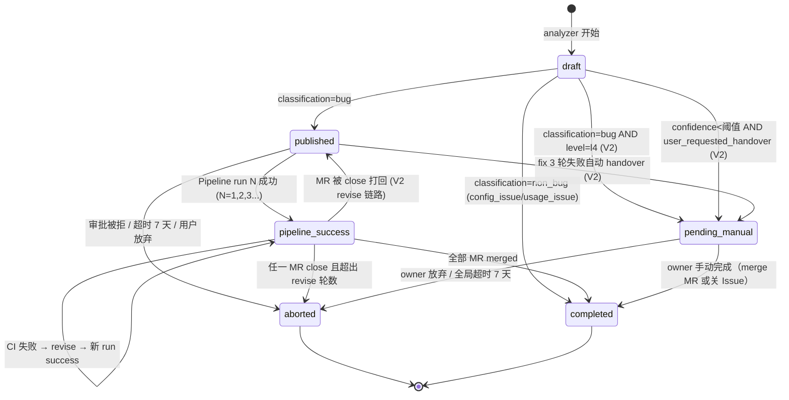
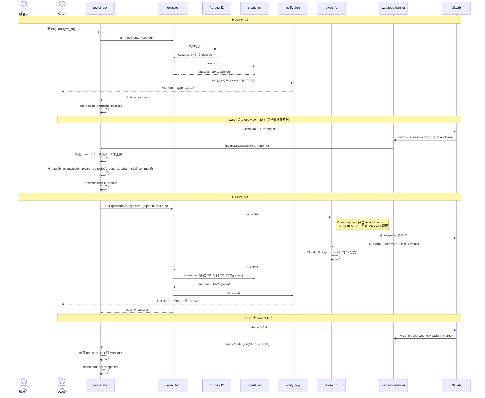
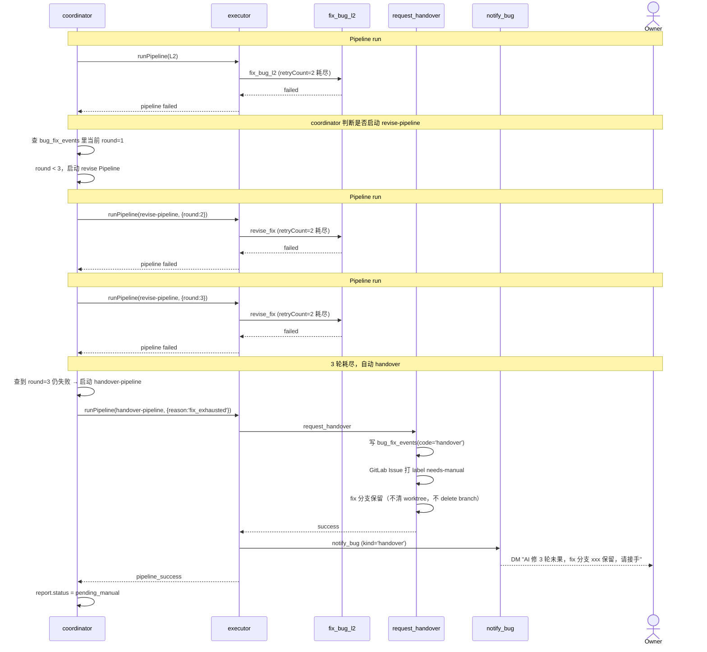
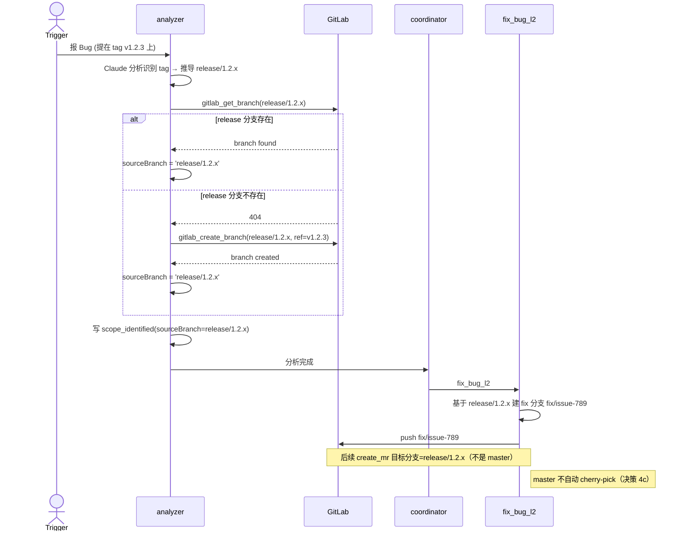

# Bug 分析修复工作流 V2 — 设计文档

> **定位**：本文档是 [V1 spec（2026-04-17-bug-fix-workflow-orchestration-design.md）](./2026-04-17-bug-fix-workflow-orchestration-design.md) 的**增量设计**（delta），不替代 V1。V1 已落地的能力继续有效，V2 只描述新增和扩展点。引用 V1 内容使用 `V1-§X.Y` 格式，不复制。

---

## 1. 背景

V1 把 Bug 修复流程 capability 化后，形成了线性 Pipeline：

```
analyze → (approve_l3) → fix_bug_lN → create_mr → ai_review_mr → notify_bug
```

在 V1 上线前的产品形态 review 中，识别出线性流水线无法覆盖完整产品闭环所需的**多个回滚/重试点**：

| 缺口 | 完整产品需要 | V1 现状 |
|------|------------|---------|
| 审批打回 → 方案修正 | 回 analyze 做第二轮 | 只有 `retry_analysis` 决策，不带打回意见 |
| MR 被关闭 → 代码修订 | 回 fix 重改，复用 fix 分支 | 不支持，owner 只能自己改 |
| AI 修复失败后的转人工 | handover 一等公民机制 | 只有 `status=aborted` + 前端重试 |
| CI 失败驱动 | 自动触发 revise | 无，AI 不感知 CI 结果 |
| tag 版本 Bug | 自动建 release 分支后修复 | 不支持，直接失败 |
| 长时间 pending | 超时兜底（7 天） | 无超时，任务可能无限挂 |
| 备份 owner | 主失联时 fallback | backup_owner_user_id 字段已有但未启用 |
| 资源保护 | 任务前预检 | 无，有 worktree 泄漏风险 |

V2 把 Pipeline 从"**线性流水线**"升级为"**有限回滚的工作流**"：仍保持 `executor.ts` 零改动、仍以单条 Pipeline 为执行单元，但通过 **coordinator 编排多条 Pipeline 串联**实现工作流语义。

---

## 2. 目标

1. **闭环完整**：任何"AI 自动化失败"场景都有明确的下一步（人工接手 / 自动修订 / 终结），不让 Bug 静默"卡住"
2. **语义清晰**：Pipeline 仍是线性执行单元，"工作流"通过 **N 条 Pipeline run 组合**表达，而非改 executor 支持跳转
3. **零改动硬约束**：严益昌原创代码 6 文件继续零改动（`executor.ts` / `types.ts` / `approval-manager.ts` / `webhook-waiter.ts` / `test-runs` repo / `test-pipelines` repo）
4. **MVP 预留**：本次讨论的 FR33 handover MVP（A 方案）接口与 V2 完全对齐，V2 实施时只加法，无拆改
5. **可演进**：V2 设计中不出现的能力（知识库回流、异常告警系统、deploy_hotfix 等）预留接入位置，但本期不做

---

## 3. 17 项决策矩阵（spec 写作依据）

以下决策是 V2 spec 的**输入**，所有章节的设计必须与此对齐。决策过程见会话记录（2026-04-19）。

| # | 决策项 | 收敛答案 | 落地章节 |
|---|---|---|---|
| 1 | revise 轮次上限 | 3 轮（第 3 轮 revise 仍失败 → 自动 handover） | §9.2 revise_fix |
| 2 | tester 角色 | 不独立，仅可选 `notify_tester` stage | §9.4 notify_tester |
| 3a | 打回识别 | GitLab 原生 Accept(merge) / Close webhook | §12 CI & webhook 链路 |
| 3b | revise 路径 | 新增 `revise-pipeline` 独立 Pipeline 模板 | §10 revise-pipeline |
| 3c | revise 分支 | 复用原 fix 分支 `fix/issue-<iid>` | §9.2 revise_fix |
| 3d | Close 后 MR | 新建 MR，旧 MR 保留作历史 | §9.2 revise_fix |
| 4 | prod 流程 | 不区分（不做 environment 维度） | §22 本期不做 |
| 4c | tag 版本 Bug | 自动建 release 分支；**master 不同步** | §11 tag bug |
| 5 | 多 run 关联建模 | 新建 `bug_report_pipeline_runs` 表 | §8 schema-v12 |
| 6 | 前端多轮视图 | 单轮不分组 / 多轮分组 + 默认展开第一个 | §15 前端改动 |
| 7 | revise 上下文传递 | 只传 Issue URL + MR URL，Claude 用 MCP 工具主动查 | §9.2 + §16 MCP |
| 8 | CI 失败 | 自动触发 revise（等价于 owner close 打回） | §12 CI 链路 |
| 9 | 全局超时 | 7 天，可配（环境变量 `BUG_REPORTS_TIMEOUT_DAYS`） | §14 全局超时 |
| 10 | 重复 Bug | 不去重，各走各的 | §22 本期不做 |
| 11 | 备份 owner | 主备同时 DM + FCFS（首回答生效） | §13 备份 owner |
| 12 | 群命令集 | 仅保留 V1 的 `approve / reject / reanalyze`，不扩展 | §22 本期不做 |
| 13 | 阶段超时提醒 | 仅全局 7 天，不做分阶段提醒 | §22 本期不做 |
| 14 | 线上回滚 | 新报 bug，不与原 report 关联 | §22 本期不做 |
| 15 | 知识库回流 | V2 不做，留 Growth | §22 本期不做 |
| 16 | 异常防护 | 任务前资源预检（CPU/磁盘/内存） | §17 preflight_check |

---

## 4. 架构升级：从流水线到工作流

### 4.1 核心架构差异

**V1（流水线）：** 一个 Bug = 一条 Pipeline run = 一张线性 DAG

```
Bug #42
  └─ Pipeline run #1
      ├─ stage 1
      ├─ stage 2
      └─ ...
  状态：pipeline_success 或 aborted（终态）
```

**V2（工作流）：** 一个 Bug = N 条 Pipeline run 串联 = 工作流

```
Bug #42
  ├─ Pipeline run #1 (initial, round=1)      ← 首次修复
  │   └─ analyze → fix → create_mr → ai_review → notify
  │   成功 → pipeline_success
  │
  ├─ [owner close MR-1 with comment]          ← 打回事件
  │   写 bug_fix_events(code='revise_requested', round=2)
  │
  ├─ Pipeline run #2 (revise, round=2)         ← revise 第二轮
  │   └─ revise_fix → create_mr → ai_review → notify
  │   成功 → pipeline_success（MR-2 opened）
  │
  ├─ [owner Accept MR-2]                       ← 合并事件
  │   触发 notify_bug(kind='completed')
  │
  └─ 终态：completed
```

### 4.2 为什么"多 Pipeline 串联"而不改 executor

`src/pipeline/executor.ts` 是线性 stage 执行器，支持 `onFailure = stop / continue / retry`，**但不支持"回跳到前面 stage"**。要实现"审批打回回 analyze"或"MR 被 close 回 fix"两条路径：

| 方案 | 实现 | 可行性 |
|------|------|--------|
| 改 executor 加跳转能力 | 在 `executor.ts` 中引入 `stage.onReject / stage.goto` 字段和跳转循环 | ❌ 违反"严益昌原创代码零改动"硬约束 |
| **多 Pipeline 串联**（V2 选择） | 每次"打回"由 coordinator 启动一条**新 Pipeline**，同 `reportId` 关联；一条 Pipeline 内仍是线性 | ✅ 零改 executor，完全通过 coordinator + 新 Pipeline 模板实现 |

### 4.3 V2 的 Pipeline 编排原则

- **一个 Bug 实例**（`bug_analysis_reports` 一行）对应 **1..N 个 Pipeline run**（`test_runs` 多行）
- 关联通过新表 `bug_report_pipeline_runs` 显式记录 `(report_id, run_id, round, kind)`
- `bug_analysis_reports.pipeline_run_id` 继续存在，但语义退化为"**当前最新的 run**"的便捷引用（兼容 V1 前端）
- 每轮 Pipeline 开始时写 `bug_fix_events(code='pipeline_started', data={runId, kind, round})`，作为事件时间线的分组锚点

### 4.4 V2 Pipeline 模板清单

| Pipeline 名称 | kind | 触发方 | stages | 落地来源 |
|---|---|---|---|---|
| L1-配置类 | initial (V1 已有) | coordinator (level=l1) | fix_bug_l1 → create_mr → ai_review_mr → notify_bug | V1 |
| L2-代码缺陷 | initial (V1 已有) | coordinator (level=l2) | fix_bug_l2 → create_mr → ai_review_mr → notify_bug | V1 |
| L3-业务逻辑 | initial (V1 已有) | coordinator (level=l3) | approve_l3 → fix_bug_l3 → create_mr → ai_review_mr → notify_bug | V1 |
| L4-复杂问题 | initial (V1 已有) | coordinator (level=l4) | notify_bug（单 stage） | V1 |
| **revise-pipeline**（新） | revise | coordinator（响应 MR close / CI 失败 webhook） | revise_fix → create_mr → ai_review_mr → notify_bug | V2 §10 |
| **handover-pipeline**（新） | handover | coordinator（fix 3 轮失败 / L4 / 低信心） | request_handover → notify_bug | V2 §9.3 |

---

## 5. 完整状态机

### 5.1 Bug 修复实例生命周期（6 态，V1 5 态 + 新增 `pending_manual`）



### 5.2 状态含义与触发方（V2 新增说明）

| 状态 | 含义 | V2 新增触发方 |
|------|------|--------------|
| `draft` | analyzer 产出中 | （同 V1） |
| `published` | bug 分析完成，Pipeline 已启动或待启动 | （同 V1） |
| `pipeline_success` | 至少一轮 Pipeline run 跑完，MR 已建等人工合并 | **每轮 revise Pipeline 成功后仍回到此态**（不是 completed，因为仍在等 MR merge） |
| `pending_manual`（V2 新增） | AI 退出，等 owner 在 GitLab 或群里手动接手；**未结束** | fix 3 轮失败 / L4 创建 / 用户在前端点"转人工" / tag bug 无法自动 |
| `completed` | MR 已 merge（所有涉及 project），Bug 修复闭环 | **全部 MR merged** 才算 completed（决策 3：任一打回 → revise）|
| `aborted` | 彻底终止；前端"重试"按钮会启动新 report（新 Bug 实例，不复用） | 审批被拒 / 全局 7 天超时 / owner 关闭 Issue / 超过 revise 轮数上限 |

### 5.3 状态转换代码位置对照（V2 新增）

| 转换 | 代码位置 | 新/V1 |
|------|----------|--------|
| `draft` → `pending_manual` (L4) | `coordinator.handleAnalysisComplete` 内 level=l4 分支 | 新 |
| `published` → `pending_manual` (fix 3 轮失败) | `fix-runner.handleFixBug` 检测 round 字段，第 3 轮失败触发 request_handover | 新 |
| `pipeline_success` → `published` (revise) | `coordinator.handleMrClosed`（新 webhook handler）启动 revise-pipeline 前回写 status | 新 |
| `pending_manual` → `completed` | `issue-handler.handleMrMerged`（V1 已有）+ 校验 status in (pipeline_success, pending_manual) | 扩展 |
| `*` → `aborted` (超时) | 新 cron 任务 `src/agent/handover/timeout-scheduler.ts` 每小时扫一次 | 新 |

---

## 6. 关键时序图

### 6.1 L2 Bug + MR 被 owner close 打回 + revise 成功场景



### 6.2 fix 3 轮失败自动 handover 场景



### 6.3 tag 版本 Bug 自动建 release 分支场景



---

## 7. 数据模型 Delta

### 7.1 bug_fix_events 事件码（13 种，V1 9 种 + V2 新增 4 种）

| code | 新/V1 | 含义 | 典型写入方 | data 结构关键字段 |
|------|-------|------|------------|-------------------|
| `analysis` | V1 | analyzer 写入一次，记分析结果 | analyzer | classification, level, confidence |
| `scope_identified` | V1 | 每个涉及 project 写一条 | analyzer | sourceBranch, affectedModules, isPrimary |
| `create_issue` | V1 | GitLab Issue 创建成功 | analyzer | issueIid, issueUrl |
| `fix_attempt` | V1 | 每个 project 每轮修复 | fix-runner | branch, testPassed, attempt |
| `create_mr` | V1 | 每个 project MR 创建 | mr-handler | mrIid, mrUrl |
| `ai_review` | V1 | 每个 MR AI Review | reviewer | label, comment |
| `approval` | V1 | 审批决策 | approve-l3 | decision (approved/rejected/timeout/retry_analysis) |
| `notify` | V1 | 每个 DM 写一条 | notify-handler | kind, userId |
| `lifecycle_sync` | V1 | MR merge/close webhook 同步状态 | issue-handler | mrIid, action |
| **`pipeline_started`** | **V2** | 每条 Pipeline run 启动时写一条 | coordinator | runId, kind (initial/revise/handover), round |
| **`revise_requested`** | **V2** | MR close / CI fail 触发的打回事件 | webhook-handler | mrUrl, comment, triggerReason (owner_close/ci_failed) |
| **`revise_attempt`** | **V2** | 每个 project 每轮 revise（区别于 fix_attempt 方便统计） | revise-fix handler | branch, testPassed, round, sourceMrUrl |
| **`handover`** | **V2** | 转人工接手事件 | request_handover handler | reason, ownerIds, fixBranch, failedAt, attemptCount |

### 7.2 bug_analysis_reports.status（6 态，V1 5 态 + 新增 `pending_manual`）

```
draft → published → pipeline_success → completed
                  ↘ pending_manual → completed
         ↘ aborted              ↘ aborted
                           
非 bug 分类：draft → completed（直接）
```

### 7.3 新增关联表 `bug_report_pipeline_runs`

1:N 关联 bug report 与多次 Pipeline run，支持前端分组展示（决策 5、6）。

```sql
CREATE TABLE bug_report_pipeline_runs (
  id                SERIAL PRIMARY KEY,
  bug_report_id     INTEGER NOT NULL REFERENCES bug_analysis_reports(id),
  pipeline_run_id   INTEGER NOT NULL REFERENCES test_runs(id),
  round             INTEGER NOT NULL,              -- 1/2/3... 本 report 的第几轮
  kind              VARCHAR(20) NOT NULL,          -- 'initial' / 'revise' / 'handover'
  trigger_event_id  INTEGER REFERENCES bug_fix_events(id),  -- 触发本轮 run 的事件（revise_requested 等）
  created_at        TIMESTAMP NOT NULL DEFAULT NOW(),
  UNIQUE (bug_report_id, pipeline_run_id)
);

CREATE INDEX idx_bug_run_report ON bug_report_pipeline_runs(bug_report_id, round);
```

**查询示例**：

```sql
-- 获取某 Bug 的所有 Pipeline run（按时间顺序）
SELECT brpr.round, brpr.kind, tr.status, tr.created_at, tr.error_message
FROM bug_report_pipeline_runs brpr
JOIN test_runs tr ON tr.id = brpr.pipeline_run_id
WHERE brpr.bug_report_id = $1
ORDER BY brpr.round ASC;

-- 某 Bug 当前是第几轮
SELECT MAX(round) FROM bug_report_pipeline_runs WHERE bug_report_id = $1;
```

### 7.4 新增 capability（V2 3 个，V1 8 个 → V2 共 11 个）

| capability | 类型 | 归属 handler 文件 | 用途 |
|---|---|---|---|
| `revise_fix` | 新 | `src/agent/revise/revise-fix-handler.ts` | 基于 MR close comment / CI 失败日志，重修被打回的 project |
| `request_handover` | 新 | `src/agent/handover/request-handover-handler.ts` | 转人工接手统一入口（多触发源） |
| `notify_tester` | 新（可选） | `src/agent/notify/notify-tester-handler.ts` | MR merge 后通知配置的 tester 做验证（产品线可选接入） |

### 7.5 新增全局配置项

以下配置通过**环境变量**设定（不新建 system_config 表），默认值在 `src/config.ts` 用 Zod 校验；改值走 `deploy.sh restart` 生效。预期这些参数长期稳定（极低频改动），环境变量方式最轻量。

| 环境变量 | 默认值 | 含义 |
|----------|--------|------|
| `BUG_REPORTS_TIMEOUT_DAYS` | 7 | 全局 Bug 实例超时天数（超过 → aborted）（决策 9） |
| `REVISE_MAX_ROUNDS` | 3 | revise 轮次上限（超过 → handover）（决策 1） |
| `BUG_INFLIGHT_LIMIT` | 10 | preflight 检查的进行中 Bug 任务数上限（§17） |
| `WORKTREE_DIR` | /tmp/chatops-worktrees | worktree 根目录（preflight 磁盘检查依据）（§17） |

`src/config.ts` 追加：

```typescript
export const V2_CONFIG = {
  REVISE_MAX_ROUNDS: Number(process.env.REVISE_MAX_ROUNDS ?? 3),
  BUG_REPORTS_TIMEOUT_DAYS: Number(process.env.BUG_REPORTS_TIMEOUT_DAYS ?? 7),
  BUG_INFLIGHT_LIMIT: Number(process.env.BUG_INFLIGHT_LIMIT ?? 10),
  WORKTREE_DIR: process.env.WORKTREE_DIR ?? '/tmp/chatops-worktrees',
}
```

未来若需要"按产品线差异化配置"（如 PAM 3 轮 / 其他产品 5 轮），再演进到 `product_lines.config` JSONB 字段或独立配置表（列入 Growth，决策 H2）。

---

## 8. schema-v12.sql 完整 DDL / DML

```sql
-- schema-v12.sql: Pipeline V2 工作流化
-- 1. 新建 bug_report_pipeline_runs 关联表
-- 2. bug_analysis_reports 新增 pending_manual 状态（VARCHAR 不改 enum）
-- 3. bug_fix_events code 注释更新（加 4 个新 code）
-- 4. capabilities 新增 revise_fix / request_handover / notify_tester
-- 5. test_pipelines 新增 revise-pipeline / handover-pipeline 模板
-- 注：V2 运行时配置（REVISE_MAX_ROUNDS / BUG_REPORTS_TIMEOUT_DAYS 等）走环境变量，不在 DDL 里

BEGIN;

-- ============================================================
-- 1. bug_report_pipeline_runs 关联表
-- ============================================================
CREATE TABLE IF NOT EXISTS bug_report_pipeline_runs (
  id                SERIAL PRIMARY KEY,
  bug_report_id     INTEGER NOT NULL REFERENCES bug_analysis_reports(id),
  pipeline_run_id   INTEGER NOT NULL REFERENCES test_runs(id),
  round             INTEGER NOT NULL,
  kind              VARCHAR(20) NOT NULL CHECK (kind IN ('initial','revise','handover')),
  trigger_event_id  INTEGER REFERENCES bug_fix_events(id),
  created_at        TIMESTAMP NOT NULL DEFAULT NOW(),
  UNIQUE (bug_report_id, pipeline_run_id)
);

CREATE INDEX IF NOT EXISTS idx_bug_run_report
  ON bug_report_pipeline_runs(bug_report_id, round);

CREATE INDEX IF NOT EXISTS idx_bug_run_run
  ON bug_report_pipeline_runs(pipeline_run_id);

COMMENT ON TABLE bug_report_pipeline_runs
  IS 'V2: 一个 bug report 对 N 个 Pipeline run 的关联（initial + revise N 轮 + handover）';

-- ============================================================
-- 2. bug_analysis_reports 支持 pending_manual
-- ============================================================
-- status 字段是 VARCHAR(20)，无需 DDL 变更；业务层取值：
-- 'draft' | 'published' | 'pipeline_success' | 'pending_manual' | 'completed' | 'aborted'

-- ============================================================
-- 3. bug_fix_events code 白名单扩充（仅注释说明，代码校验层负责）
-- ============================================================
-- V2 合法 code：
--   analysis / scope_identified / create_issue / fix_attempt /
--   create_mr / ai_review / approval / notify / lifecycle_sync (V1 9 种)
--   pipeline_started / revise_requested / revise_attempt / handover (V2 4 种)

-- ============================================================
-- 4. capabilities 新增 3 条
-- ============================================================
INSERT INTO capabilities (key, display_name, description, category, tool_names, needs_approval, is_system, system_prompt)
VALUES
  ('revise_fix', 'revise 修订',
   '基于 MR close comment 或 CI 失败日志，对被打回的 project 做代码修订；复用原 fix 分支追加 commit',
   'action', '[]'::jsonb, false, true,
   '你是代码修订专家。用户报告 MR 被打回或 CI 失败，你需要读取打回意见/CI 日志，定位问题并修订代码。使用提供的 MCP 工具读 GitLab MR / Issue / comment / CI 日志。'),
  ('request_handover', '转人工接手',
   '把 Bug 转交 owner 人工处理：打 needs-manual label、保留 fix 分支、DM owner（附分支 URL 和失败摘要）',
   'action', '[]'::jsonb, false, true,
   ''),
  ('notify_tester', 'tester 验证通知',
   'MR merge 后通知 tester 验证；产品线可选接入（通过 pipeline stages 配置决定是否启用）',
   'action', '[]'::jsonb, false, true,
   '')
ON CONFLICT (key) DO UPDATE
  SET display_name = EXCLUDED.display_name,
      description = EXCLUDED.description,
      system_prompt = COALESCE(NULLIF(EXCLUDED.system_prompt, ''), capabilities.system_prompt);

-- ============================================================
-- 5. test_pipelines 新增 revise-pipeline 和 handover-pipeline 模板
--    （每个产品线一套；这里以 PAM 为例）
-- ============================================================

-- revise-pipeline: revise_fix → create_mr → ai_review_mr → notify_bug
INSERT INTO test_pipelines (product_line_id, name, description, stages, enabled, trigger_params, variables)
SELECT
  id AS product_line_id,
  'revise-pipeline' AS name,
  'Bug 修订 Pipeline：响应 MR close / CI 失败 / 用户打回，对被标记的 project 做代码修订' AS description,
  '[
    {
      "name": "revise 修订", "stageType": "capability", "capabilityKey": "revise_fix",
      "timeoutSeconds": 2400, "retryCount": 2, "onFailure": "stop",
      "targetRoles": [], "parallel": false,
      "capabilityParams": {"reportId": "{{triggerParams.reportId}}", "round": "{{triggerParams.round}}"}
    },
    {
      "name": "创建 MR", "stageType": "capability", "capabilityKey": "create_mr",
      "timeoutSeconds": 300, "retryCount": 1, "onFailure": "stop",
      "targetRoles": [], "parallel": false,
      "capabilityParams": {"reportId": "{{triggerParams.reportId}}", "mode": "revise"}
    },
    {
      "name": "AI Review", "stageType": "capability", "capabilityKey": "ai_review_mr",
      "timeoutSeconds": 600, "retryCount": 0, "onFailure": "continue",
      "targetRoles": [], "parallel": false,
      "capabilityParams": {"reportId": "{{triggerParams.reportId}}"}
    },
    {
      "name": "通知", "stageType": "capability", "capabilityKey": "notify_bug",
      "timeoutSeconds": 120, "retryCount": 2, "onFailure": "stop",
      "targetRoles": [], "parallel": false,
      "capabilityParams": {"reportId": "{{triggerParams.reportId}}"}
    }
  ]'::jsonb AS stages,
  true AS enabled,
  '{"reportId":null, "round":null}'::jsonb AS trigger_params,
  '{}'::jsonb AS variables
FROM product_lines
WHERE name = 'pam'
  AND NOT EXISTS (SELECT 1 FROM test_pipelines WHERE name = 'revise-pipeline' AND product_line_id = product_lines.id);

-- handover-pipeline: request_handover → notify_bug
INSERT INTO test_pipelines (product_line_id, name, description, stages, enabled, trigger_params, variables)
SELECT
  id AS product_line_id,
  'handover-pipeline' AS name,
  'Bug 转人工 Pipeline：fix 3 轮失败 / L4 / 用户主动请求 / tag 不可修时启动，DM owner 接手' AS description,
  '[
    {
      "name": "转人工", "stageType": "capability", "capabilityKey": "request_handover",
      "timeoutSeconds": 300, "retryCount": 1, "onFailure": "stop",
      "targetRoles": [], "parallel": false,
      "capabilityParams": {"reportId": "{{triggerParams.reportId}}", "reason": "{{triggerParams.reason}}"}
    },
    {
      "name": "通知", "stageType": "capability", "capabilityKey": "notify_bug",
      "timeoutSeconds": 120, "retryCount": 2, "onFailure": "stop",
      "targetRoles": [], "parallel": false,
      "capabilityParams": {"reportId": "{{triggerParams.reportId}}"}
    }
  ]'::jsonb AS stages,
  true AS enabled,
  '{"reportId":null, "reason":null}'::jsonb AS trigger_params,
  '{}'::jsonb AS variables
FROM product_lines
WHERE name = 'pam'
  AND NOT EXISTS (SELECT 1 FROM test_pipelines WHERE name = 'handover-pipeline' AND product_line_id = product_lines.id);

COMMIT;
```

---

## 9. Handler 详细设计

### 9.1 coordinator 扩展（关键：工作流编排核心）

新增 coordinator 职责：

1. **handleMrClosed(mrIid, reportId)**：响应 GitLab `merge_request` webhook action=close，启动 revise-pipeline
2. **handleCiFailed(mrIid, reportId, ciLogs)**：响应 GitLab `pipeline` webhook status=failed，启动 revise-pipeline
3. **checkAndTriggerHandover(reportId, reason)**：检查是否应 handover（3 轮耗尽、L4、低信心），启动 handover-pipeline
4. **writePipelineStarted(reportId, runId, kind, round)**：每次 runPipeline 前写入事件
5. **linkBugRun(reportId, runId, round, kind, triggerEventId)**：写入 bug_report_pipeline_runs 关联表

伪代码：

```typescript
// src/agent/coordinator.ts V2 扩展

import { getRunsCountByReport, linkBugRun } from '../db/repositories/bug-report-pipeline-runs.js'

async function startPipeline(
  pipelineName: string,
  reportId: number,
  kind: 'initial'|'revise'|'handover',
  triggerParams: Record<string, unknown>,
  triggerEventId?: number,
): Promise<number> {
  const round = (await getRunsCountByReport(reportId)) + 1
  const pipeline = await findPipelineByName(productLineId, pipelineName)
  
  const runId = await runPipeline(
    pipeline.id,
    {}, 'api', triggeredBy,
    onComplete,
    { ...triggerParams, reportId, round },
    `${kind}-round-${round}`,
  )
  
  // 写关联表 + pipeline_started 事件
  await linkBugRun(reportId, runId, round, kind, triggerEventId)
  await createEvent({
    reportId, code: 'pipeline_started',
    data: { runId, kind, round, pipelineName },
  })
  
  // 回写 bug_analysis_reports.pipeline_run_id（保持最新 run）
  await setPipelineRunId(reportId, runId)
  
  return runId
}

// MR close webhook 入口
export async function handleMrClosed(mrIid: number, reportId: number, closeComment: string) {
  const existingRevises = await findByReportCode(reportId, 'revise_requested')
  const currentRound = (await getRunsCountByReport(reportId))
  const maxRounds = V2_CONFIG.REVISE_MAX_ROUNDS
  
  if (currentRound >= maxRounds) {
    // 超过 revise 上限 → 转 handover
    await checkAndTriggerHandover(reportId, 'revise_exhausted')
    return
  }
  
  // 写 revise_requested 事件 + 启动 revise-pipeline
  const ev = await createEvent({
    reportId, code: 'revise_requested',
    data: { mrIid, comment: closeComment, triggerReason: 'owner_close' },
  })
  
  await updateReportStatus(reportId, 'published')
  await startPipeline('revise-pipeline', reportId, 'revise', { round: currentRound + 1 }, ev.id)
}

// Pipeline failed 时判断是否触发 handover
export async function checkAndTriggerHandover(reportId: number, reason: string) {
  // 幂等：若已存在 handover 事件则跳过
  const existing = await findByReportCode(reportId, 'handover')
  if (existing.some(e => e.status === 'success')) return
  
  await updateReportStatus(reportId, 'pending_manual')
  await startPipeline('handover-pipeline', reportId, 'handover', { reason })
}
```

### 9.2 revise_fix handler（V2 核心 capability）

**职责**：读取被打回的 project 的打回意见（MR close comment / CI 日志），用 Claude 重新修订代码，push 到原 fix 分支。

**接口契约**：

```typescript
interface ReviseFixInput {
  reportId: number     // from triggerParams
  round: number        // 第几轮 revise
}

interface ReviseFixOutput {
  success: boolean
  error?: 'no_revise_requested' | 'revise_failed' | 'missing_reportId'
  output?: string
}
```

**处理流程**：

```typescript
// src/agent/revise/revise-fix-handler.ts
export async function handleReviseFix(opts: TriggerOptions): Promise<TriggerResult> {
  const reportId = Number(opts.extraParams?.reportId)
  if (!reportId) return { success: false, error: 'missing_reportId' }
  
  const round = Number(opts.extraParams?.round ?? 1)
  const report = await getBugAnalysisReportById(reportId)
  
  // 找到当前轮未处理的 revise_requested（可能多 project 都被打回）
  const reviseRequests = await findByReportCode(reportId, 'revise_requested')
  const pending = reviseRequests.filter(r => 
    !reviseRequests.some(done => done.status === 'success' && done.data?.mrIid === r.data?.mrIid)
  )
  if (pending.length === 0) {
    return { success: false, error: 'no_revise_requested' }
  }
  
  const successes: string[] = []
  const failures: string[] = []
  
  for (const req of pending) {
    const projectPath = req.projectPath!
    const mrIid = (req.data as any).mrIid
    const mrUrl = `${GITLAB_HOST}/${projectPath}/-/merge_requests/${mrIid}`
    const issueUrl = report.issueUrl
    
    try {
      // 只传 URL，让 Claude 自己用 MCP 工具查（决策 7）
      const prompt = [
        `你需要修订之前的代码修复。`,
        `原 Bug Issue: ${issueUrl}`,
        `被打回的 MR: ${mrUrl}`,
        `打回原因（CI 失败 / MR 评论）请你用 gitlab_get_mr_comments + gitlab_get_ci_logs 自行查询`,
        `基于打回意见修订代码，push 到原 fix 分支 (fix/issue-${report.issueId})`,
      ].join('\n')
      
      const result = await runClaudeForRevise({
        projectPath,
        fixBranch: `fix/issue-${report.issueId}`,
        prompt,
        signal: opts.signal,
      })
      
      await createEvent({
        reportId, projectPath,
        code: 'revise_attempt',
        status: result.testPassed ? 'success' : 'failed',
        data: {
          branch: result.branch,
          testResult: result.testPassed,
          round,
          sourceMrUrl: mrUrl,
          ...(result.testPassed ? {} : { error: result.error }),
        },
      })
      
      if (result.testPassed) successes.push(projectPath)
      else failures.push(`${projectPath}: ${result.error}`)
    } catch (err) {
      failures.push(`${projectPath}: ${err.message}`)
    }
  }
  
  if (failures.length > 0) {
    return { success: false, error: 'revise_failed', output: failures.join('; ') }
  }
  return { success: true, output: `revised ${successes.length} projects` }
}
```

**与 fix-runner 的差异**：
- 只重修 `revise_requested` 里标记的 project，不是所有 `scope_identified`
- Claude prompt 只传 URL（决策 7），依赖 MCP 工具查上下文
- fix 分支复用（决策 3c），push 追加 commit
- 写 `revise_attempt` 事件而非 `fix_attempt`，便于区分统计

**create_mr 在 revise 模式下的行为**：
- 检测 `capabilityParams.mode === 'revise'`，对每个被 revise 的 project 新建 MR（决策 3d），旧 MR 保留 close 状态作历史
- 新 MR 的 description 里引用旧 MR URL："本 MR 修订自 {oldMrUrl}"

### 9.3 request_handover handler

**接口契约**（完整 V2 版本，本次 MVP 只实现 `fix_exhausted` / `l4_manual` / `user_requested` 三个 reason）：

```typescript
interface HandoverInput {
  reportId: number
  reason: 'fix_exhausted'           // fix-runner 3 轮失败（决策 1）
        | 'revise_exhausted'        // revise 3 轮失败
        | 'l4_manual'               // analyzer 判 L4
        | 'low_confidence'          // analyzer 置信度过低
        | 'user_requested'          // 触发人在前端点"转人工"
        | 'owner_label'             // owner 在 GitLab 打 needs-manual label
        | 'tag_unrevisable'         // tag bug 无法自动建 release 分支
  context?: {
    failedStage?: string
    comment?: string
    attemptCount?: number
  }
}
```

**处理流程**：

```typescript
export async function handleRequestHandover(opts: TriggerOptions): Promise<TriggerResult> {
  const reportId = Number(opts.extraParams?.reportId)
  const reason = opts.extraParams?.reason as HandoverInput['reason']
  
  if (!reportId) return { success: false, error: 'missing_reportId' }
  if (!reason) return { success: false, error: 'missing_reason' }
  
  // 幂等：若已 handover 过（success）直接跳过
  const existing = await findByReportCode(reportId, 'handover')
  if (existing.some(e => e.status === 'success')) {
    return { success: true, output: 'already handed over (idempotent)' }
  }
  
  const report = await getBugAnalysisReportById(reportId)
  const scopes = await findByReportCode(reportId, 'scope_identified')
  const ownerIds = await gatherProjectOwners(reportId, report.productLineId)
  const fixBranch = `fix/issue-${report.issueId}`
  
  // 1. GitLab Issue 打 needs-manual label
  await gitlabAddLabel(report.issueUrl, 'needs-manual')
  
  // 2. 写 handover 事件
  await createEvent({
    reportId,
    code: 'handover',
    data: {
      reason,
      ownerIds: [...ownerIds],
      fixBranch,
      failedAt: opts.extraParams?.context?.failedStage ?? null,
      attemptCount: opts.extraParams?.context?.attemptCount ?? null,
      comment: opts.extraParams?.context?.comment ?? null,
      nextAction: 'await_owner',
    },
  })
  
  // 3. 更新 status（coordinator 也会在 onComplete 里再确认一次）
  await updateReportStatus(reportId, 'pending_manual')
  
  return { success: true, output: `handover requested (${reason}) to ${ownerIds.size} owners` }
}
```

**说明**：request_handover 本身**不发 DM**，DM 由 handover-pipeline 的下一个 stage `notify_bug` 负责（buildMessage 加一个 kind='handover' 分支，消息模板按 reason 区分）。

### 9.4 notify_tester handler（可选接入）

**产品线可选启用**：通过在 Pipeline stages 里配置这个 stage（而非默认加入）。

**前置条件**：产品线有 `tester_user_ids` 配置（新增字段或复用 `module_owners.backup_owner_user_id`，决策 11 已定 backup 不升级场景下 backup 字段空闲可用于 tester 场景）。**V2 倾向新建字段 `product_line_testers`，避免语义混淆。**

```sql
CREATE TABLE IF NOT EXISTS product_line_testers (
  id              SERIAL PRIMARY KEY,
  product_line_id INTEGER NOT NULL REFERENCES product_lines(id),
  user_id         VARCHAR(100) NOT NULL,
  user_name       VARCHAR(100),
  created_at      TIMESTAMP NOT NULL DEFAULT NOW(),
  UNIQUE (product_line_id, user_id)
);
```

**处理**：MR merge 触发（通常挂在 L1/L2/L3 Pipeline 的 notify_bug 之后的可选 stage），读配置发 DM。

### 9.5 全局 handler 幂等约定扩展（V1 §Handler 幂等检查约定 + 本节）

| Handler | 幂等检查 | 依据事件 |
|---------|----------|---------|
| `revise_fix` | 同一 round 内的重试：按 (projectPath, round) 检查 revise_attempt（status=success 则跳过） | revise_attempt |
| `request_handover` | 整个 report 维度：handover 事件 status=success 已存在则跳过 | handover |
| `notify_tester` | 同一 MR 维度：避免 merge webhook 重发造成重复 DM | notify（kind='tester_notify'） |
| `create_mr` (revise 模式) | 同一 (projectPath, round) 已有 create_mr 事件 status=success 则跳过 | create_mr with data.round |

---

## 10. revise-pipeline 完整规格

### 10.1 触发源（决策 8 / 决策 3a / 决策 4c）

| 触发源 | 路径 | webhook/事件 | 传入参数 |
|--------|------|-------------|---------|
| owner close MR（带 comment） | GitLab `merge_request` hook action=close | 来自 GitLab | mrIid, closeComment |
| MR 的 CI 失败 | GitLab `pipeline` hook status=failed | 来自 GitLab | mrIid, ciLogsUrl |
| 用户在前端主动打回（如"我看 MR 还是不对"） | POST /admin/bug-reports/:id/revise | 前端按钮 | comment（用户手填） |
| tag bug 无 release 分支（fallback 不创建） | analyzer 判定，不启 revise 而是直接 handover | — | — |

### 10.2 Pipeline stages

```
revise-pipeline:
  ├─ revise 修订     (capability=revise_fix, timeout=2400s, retry=2, onFailure=stop)
  ├─ 创建 MR         (capability=create_mr, mode=revise, timeout=300s, retry=1, onFailure=stop)
  ├─ AI Review       (capability=ai_review_mr, timeout=600s, retry=0, onFailure=continue)
  └─ 通知            (capability=notify_bug, timeout=120s, retry=2, onFailure=stop)
```

### 10.3 关联到 Bug 实例

coordinator 启动 revise-pipeline 时：
1. 写 `bug_fix_events(code='pipeline_started', data={runId, kind:'revise', round:N})`
2. 写 `bug_report_pipeline_runs(report_id, run_id, round:N, kind:'revise', trigger_event_id=revise_requested 事件 id)`
3. `bug_analysis_reports.pipeline_run_id` 更新为新 run（"当前最新 run"语义）
4. `bug_analysis_reports.status` 从 `pipeline_success` 置回 `published`（避免用户在中间态看到假完成）

### 10.4 轮次校验（决策 1）

`coordinator.handleMrClosed` 在启动 revise-pipeline 前做硬校验：

```typescript
const currentRound = await getRunsCountByReport(reportId)  // 含所有 kind
const maxRevise = V2_CONFIG.REVISE_MAX_ROUNDS

// initial round 不算 revise。实际 revise 轮数 = currentRound - 1（因为第 1 轮是 initial）
const reviseCount = Math.max(0, currentRound - 1)
if (reviseCount >= maxRevise) {
  // 已达上限，转 handover
  await checkAndTriggerHandover(reportId, 'revise_exhausted')
  return
}
```

---

## 11. tag 版本 Bug 处理（决策 4c）

### 11.1 识别与分支推导

analyzer 在 `scope_identified` 阶段需识别 Bug 提在 tag 上的场景：

1. **输入**：Bug Issue 描述中的 "在 v1.2.3 上复现"、或 Issue 关联的 tag 引用、或 Claude 通过读代码仓库 tags 推断
2. **推导 release 分支名**：默认规则 `v1.2.3` → `release/1.2.x`，规则可通过产品线配置 `product_knowledge_repos.release_branch_pattern` 定制（新增字段）
3. **调 GitLab API 校验分支是否存在**：
   - 存在 → 直接设 `scope_identified.data.sourceBranch = 'release/1.2.x'`
   - 不存在 → 调 `POST /projects/:id/repository/branches` 从 tag ref 新建分支，然后 sourceBranch 同上

### 11.2 schema 扩展

```sql
ALTER TABLE product_knowledge_repos
  ADD COLUMN IF NOT EXISTS release_branch_pattern VARCHAR(100) DEFAULT 'release/{major}.{minor}.x';

-- 该字段用于从 tag 推导 release 分支名。token 含义：
--   {major} / {minor} / {patch} - tag 的语义化版本三段
-- 空字符串表示禁用自动建 release 分支，直接 handover
```

### 11.3 master 不同步的原因说明

决策 4c 明确 **master 不自动 cherry-pick**：

- master 通常已经独立演进，自动 cherry-pick 冲突率高
- 冲突后 cherry-pick 会失败，产生"看似成功其实需要人工"的假象
- 把 master 同步作为**后续人工决策**：在 notify_bug 的 DM 里提示 owner "本次修复在 release/1.2.x，是否需要 cherry-pick 到 master 请你判断"

### 11.4 无法自动建 release 分支的降级

若 release_branch_pattern 配置为空字符串、或 GitLab 建分支 API 失败：

- analyzer 写 `handover_needed` flag 到 `bug_analysis_reports.metadata`
- coordinator 直接走 handover-pipeline（不启 L1/L2/L3 Pipeline），reason='tag_unrevisable'

---

## 12. CI 失败触发 revise（决策 8）

### 12.1 GitLab pipeline webhook 接入

新增 webhook 监听，路由在 `src/adapters/gitlab/webhook.ts`：

```typescript
// 新增 POST /webhook/gitlab/pipeline 路由（或复用现有路由按 event type 分发）
if (payload.object_kind === 'pipeline' && payload.object_attributes?.status === 'failed') {
  const pipelineRef = payload.object_attributes.ref  // 分支名
  const pipelineId = payload.object_attributes.id
  
  // 查这个分支是否对应某个 fix 分支 (fix/issue-<iid>)
  const match = pipelineRef.match(/^fix\/issue-(\d+)$/)
  if (!match) return  // 不是 AI 创建的 fix 分支，忽略
  
  const issueIid = Number(match[1])
  const report = await findReportByIssueIid(issueIid, payload.project.id)
  if (!report) return
  
  // 找对应的 MR（可能有多个 MR 指向同分支，取最新 open 的）
  const mr = await findOpenMrByBranch(payload.project.id, pipelineRef)
  if (!mr) return
  
  // 幂等：若该 MR 已有 revise_requested 事件（CI 重跑不应触发二次 revise）
  const existing = await findByReportCode(report.id, 'revise_requested')
  if (existing.some(e => (e.data as any)?.mrIid === mr.iid && (e.data as any)?.triggerReason === 'ci_failed')) {
    return
  }
  
  await handleCiFailed(mr.iid, report.id, payload.object_attributes.web_url)
}
```

### 12.2 与 MR close 打回的等价处理

`handleCiFailed` 调用路径与 `handleMrClosed` 完全一致（路径相同的 revise-pipeline），区别只在触发源记录：

```typescript
export async function handleCiFailed(mrIid: number, reportId: number, ciLogsUrl: string) {
  const ev = await createEvent({
    reportId, code: 'revise_requested',
    data: { mrIid, ciLogsUrl, triggerReason: 'ci_failed', comment: `CI pipeline failed: ${ciLogsUrl}` },
  })
  await updateReportStatus(reportId, 'published')
  const round = (await getRunsCountByReport(reportId)) + 1
  const maxRounds = V2_CONFIG.REVISE_MAX_ROUNDS
  if (round - 1 >= maxRounds) {
    await checkAndTriggerHandover(reportId, 'revise_exhausted')
    return
  }
  await startPipeline('revise-pipeline', reportId, 'revise', { round }, ev.id)
}
```

Claude 在 `revise_fix` 里会根据 `revise_requested.data.ciLogsUrl`（非空）调 `gitlab_get_ci_logs` MCP 工具读失败日志（决策 7）。

### 12.3 CI 成功不做特殊处理

MR 的 CI 成功只是"必要不充分条件"，是否 merge 仍由 owner 决定。CI 成功 webhook 不触发任何流程动作。

---

## 13. 备份 owner 机制（决策 11：主备同时 DM + FCFS）

### 13.1 模型

- 每个 module 在 `module_owners` 表里有 `owner_user_id`（主）和 `backup_owner_user_id`（备）
- L3 审批 / handover 通知 / notify_bug 涉及 owner 的 DM 时，**主备同时 DM**
- 任何一方回复 `approve / reject / reanalyze` 命令或点击前端按钮 → 首回答生效，另一方再回复系统提示"已由 XXX 决策"后忽略

### 13.2 approve_l3 handler 扩展

```typescript
// src/agent/approval/approve-l3-handler.ts 扩展
const primaryOwner = await getPrimaryOwner(projectPath)
const backupOwner = await getBackupOwner(projectPath)

const approverIds = [primaryOwner]
if (backupOwner) approverIds.push(backupOwner)  // V2 新增

// 调 approval-manager 时把 approverIds 传入（多人可审批）
const result = await requestApproval({
  approverIds,       // V2 改为多人
  // ...
  decisionStrategy: 'first_come_first_served',  // V2 新增字段，若 approval-manager 不支持则由 handler 内部保证
})
```

### 13.3 approval-manager 零改动的实现方式

由于 `approval-manager.ts` 是严益昌原创代码，不能改。V2 用两种方式绕开：

**方式甲（推荐）**：approval-manager 现在的 `approverIds` 本来就是数组 `string[]`，只要传入 `[primary, backup]` 即可，原有 `tryHandleCommand` 会接受第一个匹配 approverIds 中的命令 → 天然 FCFS。零改动。

**方式乙**：若方式甲对命令去重有漏洞（例如主已 approve 但备又发 reject），在 approve-l3 handler 接收到 approval-manager 返回的 decision 后，**幂等检查** `bug_fix_events(code='approval')` 若已存在 success 则忽略后续 → 兜底。

### 13.4 DM 通知调整

`notify_bug` 的 `gatherProjectOwners` 在 V2 里返回 `{primary: string[], backup: string[]}`：

```typescript
function gatherProjectOwners(reportId, productLineId) {
  // V2 返回：
  return {
    primary: Set<string>,  // 主 owner 们（多 project 去重）
    backup: Set<string>,   // 备 owner 们（多 project 去重，且过滤掉已在 primary 里的）
  }
}
```

DM 时两个 set 都发，内容相同（备收到 FYI 副本，不做角色文案区分）。

---

## 14. 全局超时（决策 9）

### 14.1 超时机制

**cron-based 定时扫描**：新建 `src/agent/handover/timeout-scheduler.ts`，每小时跑一次。

```typescript
// 伪代码
export function startTimeoutScheduler() {
  cron.schedule('7 * * * *', async () => {  // 每小时第 7 分钟（不与 analyzer 并发碰撞）
    const timeoutDays = V2_CONFIG.BUG_REPORTS_TIMEOUT_DAYS
    const cutoff = new Date(Date.now() - timeoutDays * 86400_000)
    
    // 查所有未到终态 + 创建时间超过 cutoff 的 report
    const expired = await findReportsNotCompletedBefore(cutoff)
    
    for (const r of expired) {
      // 幂等：若已是 completed/aborted 跳过
      if (r.status === 'completed' || r.status === 'aborted') continue
      
      await updateReportStatus(r.id, 'aborted')
      await createEvent({
        reportId: r.id,
        code: 'handover',  // 复用 handover 事件码，data 里标 reason
        status: 'success',
        data: { reason: 'global_timeout', daysElapsed: timeoutDays },
      })
      
      // DM admin（可选）
      console.warn(`[timeout-scheduler] report ${r.id} timed out after ${timeoutDays} days → aborted`)
    }
  })
}
```

### 14.2 可配置

`BUG_REPORTS_TIMEOUT_DAYS` 是环境变量（见 §7.5），改值走 `deploy.sh restart` 生效。值为 0 表示禁用超时（cron 会跳过扫描）。

### 14.3 不做分阶段超时（决策 13）

V2 明确只做"全局超时"。不做 pending_manual 阶段超时、不做 awaiting_approval 阶段超时、不做定时提醒。未来 Growth 阶段可扩展。

---

## 15. 前端改动

### 15.1 BugRunsPage 多轮分组视图（决策 6）

**交互逻辑**：

```typescript
// web/src/pages/BugRunsPage.tsx 伪代码
function BugDetail({ report }) {
  const runs = useBugPipelineRuns(report.id)  // 新 API: GET /admin/bug-reports/:id/runs
  
  if (runs.length <= 1) {
    // 单轮：不分组，事件平铺（V1 行为）
    return <EventTimelineFlat events={events} />
  }
  
  // 多轮：Collapse 分组，默认展开第一个
  return (
    <Collapse defaultActiveKey={['round-1']}>
      {runs.map(run => (
        <Collapse.Panel
          key={`round-${run.round}`}
          header={
            <PanelHeader
              round={run.round}
              kind={run.kind}
              status={run.status}
              startedAt={run.createdAt}
            />
          }
        >
          <EventTimelineFlat
            events={events.filter(e => e.pipeline_run_id === run.pipelineRunId)}
          />
          <Button>跳转到执行记录 Run #{run.pipelineRunId}</Button>
        </Collapse.Panel>
      ))}
    </Collapse>
  )
}
```

**Panel 头样式**：

```
┌─ [Round 1] initial · pipeline_success · 10:00-10:15 · 15m ─── [查看 Run 详情]
├─ [Round 2] revise  · pipeline_success · 10:20-10:35 · 15m ─── [查看 Run 详情]
└─ [Round 3] revise  · running          · 10:40-...   · ..m ─── [查看 Run 详情]
```

### 15.2 新增"转人工"按钮（用户主动 handover）

- 在 BugRunsPage 的单 Bug 视图上新增一个 `[转人工处理]` 按钮
- 点击后弹确认框 → 调 POST /admin/bug-reports/:id/handover（body 可选 comment）
- 后端调 `coordinator.checkAndTriggerHandover(reportId, 'user_requested')`
- 按钮显示条件：`status in (published, pipeline_success)`，其他状态隐藏

### 15.3 新增"转修订"按钮（用户主动 revise）

- 展示条件：`status === 'pipeline_success'` 且 revise 轮次未到 3 轮上限
- 点击后弹出文本框让用户输入"为什么要重修"→ 调 POST /admin/bug-reports/:id/revise
- 后端调 `coordinator.handleMrClosed` 类似链路，但 triggerReason='user_requested'

### 15.4 状态 Tag 扩展

新增 `pending_manual` 状态 Tag（配色：warning 橙色，区别于 aborted 红）：

```typescript
const statusColors: Record<string, string> = {
  draft: 'default',
  published: 'processing',
  pipeline_success: 'success',
  pending_manual: 'warning',   // V2 新增
  completed: 'success',
  aborted: 'error',
}
```

同步更新 `STATUS_OPTIONS` 筛选器。

---

## 16. MCP 工具补齐（决策 7 前置）

### 16.1 必须新增的 GitLab 读取类 MCP 工具

`revise_fix` 依赖 Claude 能主动查 GitLab，必须先补齐以下 MCP 工具（放在 `src/agent/tools/gitlab-*.ts`）：

| 工具 | 参数 | 返回 | 用途 |
|------|------|------|------|
| `gitlab_get_issue` | `{projectPath, issueIid}` | Issue body + comments | Claude 查原 Issue 描述和历史 comments（上一轮的 retry_analysis comment 等） |
| `gitlab_get_mr` | `{projectPath, mrIid}` | MR body + state + commits + diff | Claude 查 MR 全貌 |
| `gitlab_get_mr_comments` | `{projectPath, mrIid}` | MR 讨论的 comments 列表 | Claude 查被 close 时 owner 留的打回意见 |
| `gitlab_get_ci_logs` | `{projectPath, pipelineId}` 或 `{ciLogsUrl}` | CI 失败日志（trace） | Claude 查 CI 为什么挂 |
| `gitlab_get_branch`（附带） | `{projectPath, branchName}` | branch 是否存在 + last commit | tag bug 处理时用 |
| `gitlab_create_branch`（附带） | `{projectPath, branchName, ref}` | created | tag bug 场景从 tag 新建 release 分支 |

### 16.2 权限隔离

这些工具属于 `revise_fix` / `analyzer` capability 的工具集，**修复 Agent 继承读权限**，但不允许 GitLab 写操作（不能改 Issue、不能 delete 分支）—— 延续 V1 MCP 层权限隔离约束（CLAUDE.md §Key Patterns）。

### 16.3 工具自注册

按 CLAUDE.md 的"Tool 自注册"约定，新建工具文件 + 在 `server.ts` / `mcp-server.ts` 追加 import + `DEFAULT_TOOL_ROLES` 追加角色配置。

---

## 17. preflight_check 模块（决策 16）

### 17.1 定位

在 coordinator 启动任何新 Pipeline 前执行轻量资源预检，发现严重异常时**拒绝启动**并 DM admin，避免雪崩。

### 17.2 检查项

```typescript
// src/agent/preflight/check.ts
export interface PreflightResult {
  ok: boolean
  reason?: string     // 'disk_low' | 'memory_low' | 'too_many_inflight' | 'worktree_leak'
  metrics?: Record<string, number>
}

export async function runPreflight(): Promise<PreflightResult> {
  // 1. 磁盘可用空间（worktree 目录所在盘）
  const { available } = await getDiskUsage(config.WORKTREE_DIR)
  if (available < 5 * 1024 * 1024 * 1024) {  // < 5 GB
    return { ok: false, reason: 'disk_low', metrics: { availableBytes: available } }
  }
  
  // 2. 内存
  const { free } = getMemoryUsage()
  if (free < 2 * 1024 * 1024 * 1024) {  // < 2 GB
    return { ok: false, reason: 'memory_low', metrics: { freeBytes: free } }
  }
  
  // 3. 正在进行中的 Bug 任务数（避免过载）
  const inflight = await countInflightReports()  // status in (draft, published)
  const limit = V2_CONFIG.BUG_INFLIGHT_LIMIT
  if (inflight >= limit) {
    return { ok: false, reason: 'too_many_inflight', metrics: { inflight, limit } }
  }
  
  // 4. worktree 泄漏检测（磁盘上 worktree 目录数 vs DB 中记录的活跃 worktree 数）
  const leaked = await detectWorktreeLeak()
  if (leaked.length > 20) {
    return { ok: false, reason: 'worktree_leak', metrics: { leakedCount: leaked.length } }
  }
  
  return { ok: true }
}
```

### 17.3 集成点

`coordinator.handleAnalysisComplete` 入口 + `coordinator.startPipeline` 入口：

```typescript
export async function handleAnalysisComplete(reportId, level, classification, triggeredBy) {
  // V2 新增：preflight 检查
  const preflight = await runPreflight()
  if (!preflight.ok) {
    console.error(`[coordinator] preflight failed: ${preflight.reason}`, preflight.metrics)
    await dmAdmin(`[ChatOps 告警] Bug #${reportId} 启动前资源检查失败: ${preflight.reason}`)
    await updateReportStatus(reportId, 'aborted')
    return
  }
  // 原有逻辑继续
  // ...
}
```

### 17.4 运维可观测

- 每次 preflight 结果写日志（stdout，带 [preflight] 前缀，方便 grep）
- 不通过时的 metrics 也打印，便于排查

---

## 18. 验收标准（Given / When / Then）

### AC-V2-1：MR 被 close 打回 → revise → merged 场景

- **Given** 一个 L2 Bug 跑完首轮 Pipeline，MR-1 已创建、status=pipeline_success
- **When** owner 在 MR-1 上点 Close 并留 comment "空指针处理不对"
- **Then**：
  - GitLab `merge_request` webhook 被 ChatOps 接收，action=close
  - coordinator 写 `bug_fix_events(code='revise_requested', data.triggerReason='owner_close')`
  - 启动 revise-pipeline（kind=revise, round=2）
  - `bug_report_pipeline_runs` 新增一行关联
  - `bug_analysis_reports.status` 回到 `published`
- **When** revise_fix handler 执行
- **Then**：
  - Claude prompt 不包含 MR body 内容，只有 issue/mr URL（决策 7）
  - Claude 用 `gitlab_get_mr_comments` 查到打回意见
  - push 到同 fix 分支 `fix/issue-<iid>`，写 `revise_attempt(status=success, round=2)`
  - create_mr 新建 MR-2，旧 MR-1 保持 close（决策 3d）
- **When** owner 点 Accept MR-2
- **Then** `bug_analysis_reports.status = completed`

### AC-V2-2：fix 3 轮失败自动 handover

- **Given** 一个 L2 Bug，Pipeline retryCount=2 但全部失败
- **When** Pipeline run #1 failed
- **Then**：
  - coordinator 判断 revise 轮次 = 0，尚未耗尽
  - 启动 revise-pipeline（round=2），revise 再次 failed
  - 启动 revise-pipeline（round=3），revise 再次 failed
  - 达到 `REVISE_MAX_ROUNDS=3` 上限
  - coordinator 启动 handover-pipeline，reason='revise_exhausted'
- **Then**：
  - `bug_fix_events(code='handover', status=success, data.reason='revise_exhausted')`
  - `bug_analysis_reports.status = pending_manual`
  - GitLab Issue 打 label `needs-manual`
  - fix 分支保留（worktree 不清理，GitLab 分支不删）
  - DM 发给所有涉及 project 的 owner + backup owner，内容含 fix 分支 URL

### AC-V2-3：用户前端点"转人工"主动 handover

- **Given** status=pipeline_success 的 Bug（等 owner review 中）
- **When** 触发人在 BugRunsPage 点 `[转人工处理]`，弹窗确认
- **Then**：
  - POST /admin/bug-reports/:id/handover 被调用
  - coordinator.checkAndTriggerHandover(reportId, 'user_requested')
  - 启动 handover-pipeline
  - 后续行为同 AC-V2-2

### AC-V2-4：用户前端点"转修订"主动 revise

- **Given** status=pipeline_success 的 Bug（MR 已开，owner 未动）
- **When** 触发人在 BugRunsPage 点 `[转修订]`，填入 comment
- **Then**：
  - POST /admin/bug-reports/:id/revise 被调用
  - 写 `bug_fix_events(code='revise_requested', data.triggerReason='user_requested', comment=用户输入)`
  - 启动 revise-pipeline
  - revise_fix 的 Claude prompt 包含用户的 comment（因为不来自 GitLab，Claude 无法通过 MCP 查）

### AC-V2-5：CI 失败自动触发 revise

- **Given** L2 Bug 跑完首轮，MR-1 已创建，status=pipeline_success
- **When** MR-1 分支上的 GitLab CI pipeline 失败
- **Then**：
  - GitLab `pipeline` webhook 被 ChatOps 接收，status=failed
  - 识别 ref=fix/issue-<iid> 是 AI 创建的 fix 分支
  - 幂等：同一 MR 的 CI 重跑不触发多次 revise
  - 写 `bug_fix_events(code='revise_requested', data.triggerReason='ci_failed', data.ciLogsUrl=XXX)`
  - 启动 revise-pipeline（round=2）
  - revise_fix 用 `gitlab_get_ci_logs` 读失败日志后改代码

### AC-V2-6：tag 版本 Bug 自动建 release 分支

- **Given** 触发人报 Bug，描述"在 v1.2.3 上复现"
- **When** analyzer 开始分析
- **Then**：
  - Claude 识别出 tag，推导 release 分支名 `release/1.2.x`
  - 调 `gitlab_get_branch`，若不存在则调 `gitlab_create_branch(ref=v1.2.3)`
  - 写 `scope_identified.data.sourceBranch = 'release/1.2.x'`
- **When** fix_bug_lN 执行
- **Then** 基于 release/1.2.x 建 fix 分支，MR 目标分支 = release/1.2.x（不是 master）
- **When** MR merged
- **Then**：
  - `bug_analysis_reports.status = completed`
  - notify_bug DM 文案提示 "本次修复已合并到 release/1.2.x，是否需要 cherry-pick 到 master 请你判断"（master 不自动同步，决策 4c）

### AC-V2-7：主备 owner 同时 DM，FCFS 决策

- **Given** L3 Bug 进入审批阶段，模块主 owner=A、备 owner=B
- **When** approve_l3 handler 执行
- **Then** A 和 B 同时收到审批 DM（approval-manager 的 approverIds=[A, B]）
- **When** A 在群里回复 `approve #123`
- **Then** approval-manager 返回 decision=approved，写 `bug_fix_events(code='approval', status=success)`
- **When** B 随后回复 `reject #123`
- **Then**：
  - approval-manager 已完成决策，新命令被忽略或由 handler 层幂等拦截
  - 本轮决策结果仍为 approved
  - 不写第二条 approval 事件（幂等）

### AC-V2-8：全局 7 天超时

- **Given** 一个 Bug 实例 7 天前创建，status=pending_manual，owner 一直未接手
- **When** timeout-scheduler cron 执行
- **Then**：
  - 该 report 被识别为 expired
  - status 更新为 aborted
  - 写 `bug_fix_events(code='handover', status=success, data.reason='global_timeout')`
- **Given** 环境变量 `BUG_REPORTS_TIMEOUT_DAYS=0`
- **Then** cron 跳过所有 report，不做超时处理

### AC-V2-9：前端单轮不分组、多轮分组

- **Given** 一个 Bug 只跑了 1 轮 Pipeline
- **When** 用户打开 BugRunsPage 该 Bug 详情
- **Then** 事件平铺展示（不出现 Collapse）
- **Given** 一个 Bug 跑了 3 轮 Pipeline（initial + revise + revise）
- **When** 用户打开详情
- **Then**：
  - 显示 3 个 Collapse Panel
  - 第一个 Panel 默认展开，其余折叠
  - 每个 Panel 显示 round 号、kind、status、耗时
  - 点击"查看 Run 详情"跳转到 TestRunsPage 的 run 详情

### AC-V2-10：preflight 失败拦截启动

- **Given** worktree 目录所在磁盘可用空间 < 5GB
- **When** 新 Bug 进入 analyzer 分析完成，coordinator 准备启动 Pipeline
- **Then**：
  - preflight 返回 ok=false, reason='disk_low'
  - coordinator 不启动 Pipeline，report status = aborted
  - DM admin（或日志 WARN）带 metrics
  - 不写 pipeline_started 事件

---

## 19. 测试用例清单

### 19.1 单元测试（Vitest）

| 文件 | 职责 |
|------|------|
| `src/__tests__/unit/revise-fix.test.ts`（新） | revise_fix handler：轮次传递、MCP 调用、多 project 过滤、幂等 |
| `src/__tests__/unit/request-handover.test.ts`（新） | request_handover：多 reason 分支、幂等、DB 写入断言 |
| `src/__tests__/unit/coordinator-v2.test.ts`（新） | handleMrClosed / handleCiFailed / checkAndTriggerHandover，轮次校验 |
| `src/__tests__/unit/bug-report-pipeline-runs.test.ts`（新） | 关联表 CRUD + 查询 |
| `src/__tests__/unit/preflight-check.test.ts`（新） | 各失败场景模拟（磁盘 / 内存 / inflight / worktree 泄漏） |
| `src/__tests__/unit/notify-handler.test.ts`（扩展） | 新增 kind='handover' 分支文案；backup owner 同发 |
| `src/__tests__/unit/approve-l3-handler.test.ts`（扩展） | approverIds=[主, 备] + FCFS 幂等 |
| `src/__tests__/unit/timeout-scheduler.test.ts`（新） | cron 扫描逻辑 |

### 19.2 集成测试（Vitest + 真实 Postgres）

| 文件 | 职责 |
|------|------|
| `src/__tests__/integration/revise-pipeline-flow.test.ts`（新） | L2 → MR close → revise → MR merge → completed 完整链路 |
| `src/__tests__/integration/ci-failed-revise.test.ts`（新） | GitLab pipeline webhook → revise 触发 |
| `src/__tests__/integration/handover-flow.test.ts`（新） | fix 3 轮耗尽 → handover-pipeline → pending_manual |
| `src/__tests__/integration/tag-bug-flow.test.ts`（新） | analyzer 推导 release 分支 + 建分支 |
| `src/__tests__/integration/global-timeout.test.ts`（新） | 模拟时间过去 7 天，cron 触发 aborted |

### 19.3 E2E 测试（Playwright）

- `src/__tests__/mock-e2e/bug-v2-revise-flow.spec.ts`（新）：点击"转修订"按钮 + 查看多轮分组视图
- `src/__tests__/mock-e2e/bug-v2-handover-flow.spec.ts`（新）：点击"转人工处理"按钮 + 查看 pending_manual 状态

### 19.4 回归测试清单

V2 不能破坏 V1 已有能力，以下测试必须仍通过：
- 所有 V1 单测 / 集成测试 / e2e 测试（`pnpm test` 不倒退）
- V1 AC1-AC7 场景全部可跑通
- 前端 BugRunsPage 单轮场景的展现完全不变（决策 6 保证）

---

## 20. 实施步骤 DAG

```
阶段 A：数据层 + MCP 前置（可并行做）
  ├─ A1  schema-v12.sql 编写 + migrate.ts 追加
  ├─ A2  bug-report-pipeline-runs repository
  ├─ A3  src/config.ts 追加 V2_CONFIG（Zod 校验 4 个环境变量：REVISE_MAX_ROUNDS / BUG_REPORTS_TIMEOUT_DAYS / BUG_INFLIGHT_LIMIT / WORKTREE_DIR）
  └─ A4  新增 6 个 GitLab 读取类 MCP 工具（§16.1 表）

阶段 B：Handler 实现（A 完成后可并行）
  ├─ B1  revise-fix-handler.ts
  ├─ B2  request-handover-handler.ts
  ├─ B3  notify-tester-handler.ts（可选接入）
  └─ B4  coordinator.ts 扩展（handleMrClosed / handleCiFailed / checkAndTriggerHandover / startPipeline）

阶段 C：Webhook + cron
  ├─ C1  GitLab pipeline webhook 路由（pipeline event）
  ├─ C2  GitLab MR close/reopen webhook 扩展（复用现有 merge_request 路由）
  ├─ C3  timeout-scheduler cron
  └─ C4  preflight-check 模块

阶段 D：前端
  ├─ D1  BugRunsPage 多轮分组视图（Collapse）
  ├─ D2  新增"转人工" / "转修订"按钮
  ├─ D3  pending_manual 状态 Tag + Filter
  └─ D4  新 API：GET /admin/bug-reports/:id/runs / POST /handover / POST /revise

阶段 E：产品线接入扩展
  ├─ E1  seed.sql 新增 revise-pipeline / handover-pipeline 模板
  └─ E2  product_line_testers 表（可选，若要做 notify_tester）

阶段 F：测试
  ├─ F1  单测全部编写 + pass
  ├─ F2  集成测试全部编写 + pass
  └─ F3  E2E 测试

阶段 G：PRD 修订
  ├─ G1  FR33 拆分为 FR33a（request_handover 统一入口）+ FR33b（多触发源）
  ├─ G2  新增 FR56 revise-pipeline / FR57 tag bug
  ├─ G3  NFR-R3 更新（不再是"100% 自动降级 L3"，改为"100% 自动 handover 到 owner"）
  └─ G4  Journey 3 改写为"AI 放手 + owner 接手"，不提级别升级

阶段 H：上线与观察
  ├─ H1  灰度产品线：pam（已有）
  ├─ H2  观察 1-2 周 revise 实际触发率 / handover 转化率
  └─ H3  根据数据决定是否需要调整环境变量（REVISE_MAX_ROUNDS / BUG_REPORTS_TIMEOUT_DAYS 等）
```

---

## 21. 涉及文件清单

### 21.1 新建文件

| 路径 | 用途 |
|------|------|
| `src/agent/revise/revise-fix-handler.ts` | revise_fix capability handler |
| `src/agent/handover/request-handover-handler.ts` | request_handover capability handler |
| `src/agent/handover/timeout-scheduler.ts` | 全局 7 天超时 cron |
| `src/agent/notify/notify-tester-handler.ts` | notify_tester capability handler（可选） |
| `src/agent/preflight/check.ts` | preflight_check 模块 |
| `src/agent/tools/gitlab-get-issue.ts` | MCP 工具 |
| `src/agent/tools/gitlab-get-mr.ts` | MCP 工具 |
| `src/agent/tools/gitlab-get-mr-comments.ts` | MCP 工具 |
| `src/agent/tools/gitlab-get-ci-logs.ts` | MCP 工具 |
| `src/agent/tools/gitlab-get-branch.ts` | MCP 工具 |
| `src/agent/tools/gitlab-create-branch.ts` | MCP 工具 |
| `src/db/schema-v12.sql` | V2 迁移 DDL/DML |
| `src/db/repositories/bug-report-pipeline-runs.ts` | 新表 repository |
| `src/adapters/gitlab/pipeline-webhook.ts` | 新 webhook 路由（或扩展现有 webhook.ts） |

### 21.2 修改文件（hanff 自有模块）

| 路径 | 改动 |
|------|------|
| `src/agent/coordinator.ts` | 新增 handleMrClosed / handleCiFailed / checkAndTriggerHandover / startPipeline / writePipelineStarted |
| `src/agent/analysis/analyzer.ts` | tag 识别 + release 分支推导/创建；低信心场景 handover 触发 |
| `src/agent/mr/mr-handler.ts` | create_mr 支持 mode='revise'（新建 MR 而非复用） |
| `src/agent/notify/notify-handler.ts` | 新增 kind='handover'；backup owner 同发；notify_tester 接入 |
| `src/agent/approval/approve-l3-handler.ts` | approverIds 支持主+备；FCFS 幂等 |
| `src/agent/fix/fix-runner.ts` | 不改 retryCount 逻辑；failed 时由 coordinator 决定是否 handover，fix-runner 不主动触发 |
| `src/db/migrate.ts` | 追加 schema-v12.sql 执行 |
| `src/server.ts` | 注册新 capability handler + MCP 工具 + webhook 路由 + timeout-scheduler 启动 |
| `src/admin/routes/bug-analysis-reports.ts` | 新增 GET /:id/runs、POST /:id/handover、POST /:id/revise |
| `web/src/pages/BugRunsPage.tsx` | 多轮分组视图 + 新按钮 + pending_manual Tag |
| `web/src/api/bug-analysis-reports.ts` | 新 API 客户端方法 |

### 21.3 零改动文件（严益昌原创，硬约束）

- `src/pipeline/executor.ts`
- `src/pipeline/types.ts`
- `src/pipeline/approval-manager.ts`
- `src/pipeline/webhook-waiter.ts`
- `src/db/repositories/test-runs.ts`
- `src/db/repositories/test-pipelines.ts`

V2 所有改动通过**应用层编排**（coordinator + 新 Pipeline 模板 + 关联表）实现，不触碰这 6 个文件。

---

## 22. API 接口定义

### 22.1 POST /admin/bug-reports/:id/handover

触发人主动转人工。

```
Request body:
{
  "comment": "string (可选，转人工原因描述)"
}

Response 200:
{
  "success": true,
  "reportId": 42,
  "runId": 123,
  "message": "已触发人工接手，owner 将收到 DM"
}

Response 409:
{
  "success": false,
  "error": "already_handed_over",
  "message": "该 Bug 已处于 pending_manual 状态"
}
```

### 22.2 POST /admin/bug-reports/:id/revise

触发人主动转修订。

```
Request body:
{
  "comment": "string (必填，修订原因或补充意见)"
}

Response 200:
{
  "success": true,
  "reportId": 42,
  "runId": 124,
  "round": 2
}

Response 400:
{
  "success": false,
  "error": "invalid_status",
  "message": "仅 pipeline_success 状态允许主动修订"
}

Response 409:
{
  "success": false,
  "error": "revise_exhausted",
  "message": "revise 轮次已达上限（3 轮），请转人工"
}
```

### 22.3 GET /admin/bug-reports/:id/runs

查询某 Bug 的所有 Pipeline run 关联（给前端分组视图用）。

```
Response 200:
{
  "reportId": 42,
  "runs": [
    {
      "round": 1,
      "kind": "initial",
      "pipelineRunId": 100,
      "pipelineName": "L2-代码缺陷",
      "status": "success",
      "startedAt": "2026-04-19T10:00:00Z",
      "endedAt": "2026-04-19T10:15:00Z",
      "errorMessage": null
    },
    {
      "round": 2,
      "kind": "revise",
      "pipelineRunId": 101,
      "pipelineName": "revise-pipeline",
      "status": "success",
      "startedAt": "2026-04-19T10:20:00Z",
      "endedAt": "2026-04-19T10:35:00Z",
      "errorMessage": null,
      "triggerEventId": 567,
      "triggerReason": "owner_close"
    }
  ]
}
```

---

## 23. 错误码汇总

### 23.1 revise_fix handler

| error | 触发场景 | HTTP 语义 |
|-------|---------|----------|
| `missing_reportId` | triggerParams 未传 reportId | stage failed → pipeline stop |
| `no_revise_requested` | 未找到待处理的 revise_requested 事件 | 理论不应发生；stage failed |
| `revise_failed` | Claude 修改失败 / 测试未通过 | stage failed → onFailure=stop → Pipeline failed |
| `fix_branch_missing` | 原 fix 分支已被删除 | stage failed；运维介入 |

### 23.2 request_handover handler

| error | 触发场景 |
|-------|---------|
| `missing_reportId` | triggerParams 未传 reportId |
| `missing_reason` | triggerParams 未传 reason |
| `invalid_reason` | reason 不在白名单内 |
| `gitlab_label_failed` | 给 Issue 打 needs-manual label 失败（GitLab API 错） |

### 23.3 webhook 处理

| error | 触发场景 |
|-------|---------|
| `no_matching_report` | fix 分支找不到对应 report | log WARN，丢弃不处理 |
| `mr_not_found` | CI webhook 里的 ref 对应的 open MR 不存在 | log WARN，丢弃 |
| `duplicate_revise_request` | 同一 MR 短时内重复 CI 失败 | 幂等去重，不重复触发 |

### 23.4 preflight

| reason | 含义 |
|--------|------|
| `disk_low` | 可用空间 < 5GB |
| `memory_low` | 可用内存 < 2GB |
| `too_many_inflight` | 进行中 Bug 数 ≥ BUG_INFLIGHT_LIMIT (默认 10) |
| `worktree_leak` | worktree 目录数超过 20（疑似泄漏） |

### 23.5 全局 Pipeline 超时

| error | 含义 |
|-------|------|
| `global_timeout` | 超过 `BUG_REPORTS_TIMEOUT_DAYS` 天仍未到终态，cron 强制 aborted |

---

## 24. 安全设计

### 24.1 MCP 工具权限

V2 新增的 6 个 GitLab 读取类 MCP 工具只暴露给 analyzer / revise_fix 两个 capability：

- 修复 Agent CLI `--allowed-tools` 白名单里追加
- `DEFAULT_TOOL_ROLES` 里配置为 system-only
- 绝对不暴露给 IM 适配层（用户不能在群里 @bot 调用）

### 24.2 webhook 签名校验

- GitLab pipeline webhook 路由必须校验 `X-Gitlab-Token` header（与现有 merge_request webhook 一致）
- 未通过校验直接返回 401，不处理任何事件

### 24.3 revise 的代码注入防护

- Claude 读到的 MR comment 可能含恶意内容，prompt 中必须做 shell escape
- Claude CLI 本身的 `--allowed-tools` 限制确保 Claude 只能改代码、不能执行任意 shell（V1 已保证）

### 24.4 超时 cron 的并发安全

- 多实例部署时避免多个实例同时跑 cron：用 PostgreSQL 行锁（`SELECT ... FOR UPDATE SKIP LOCKED`）或 advisory lock
- 未做则确保 ChatOps 只部署 1 个实例（V2 MVP 阶段可接受）

---

## 25. 部署清单

### 25.1 上线前准备

- [ ] PostgreSQL 执行 `schema-v12.sql`（可 dry-run 一次 / 正式执行一次）
- [ ] 环境变量设置：在 deploy.sh / docker-compose.yml 追加 `REVISE_MAX_ROUNDS=3` / `BUG_REPORTS_TIMEOUT_DAYS=7` / `BUG_INFLIGHT_LIMIT=10` / `WORKTREE_DIR=/tmp/chatops-worktrees`（或保持默认即可，env 未设时 V2_CONFIG 自动回落到默认值）
- [ ] 给每个产品线执行 INSERT revise-pipeline / handover-pipeline（seed.sql 已覆盖 PAM，其他产品线需手动）
- [ ] MCP 工具新增文件部署 + 校验 Claude CLI 能调用
- [ ] GitLab webhook 配置里补新路由（若分路由）或确认现有路由能分发 pipeline event

### 25.2 配置变更

| 环境变量 | 默认 | 含义 |
|---------|------|------|
| `REVISE_MAX_ROUNDS` | 3 | revise 轮次上限（超过 → handover） |
| `BUG_REPORTS_TIMEOUT_DAYS` | 7 | 全局 Bug 实例超时天数（0=禁用） |
| `BUG_INFLIGHT_LIMIT` | 10 | preflight 的 inflight 上限 |
| `WORKTREE_DIR` | /tmp/chatops-worktrees | preflight 磁盘检查目录 |

全部由 `src/config.ts` 的 `V2_CONFIG` 统一读取；env 未设时回落到默认值。改值走 `deploy.sh restart`。

### 25.3 回滚方案

若 V2 有严重问题：
1. 禁用 revise-pipeline 和 handover-pipeline（`UPDATE test_pipelines SET enabled=false WHERE name IN ('revise-pipeline','handover-pipeline')`）
2. 还原 coordinator 里 MR close webhook 的路由（不调 handleMrClosed）
3. 前端隐藏"转人工" / "转修订"按钮（feature flag）
4. schema-v12 不回滚（只新增表，不破坏 V1）

---

## 26. 本期不做（V3 / Growth 待办）

按 17 项决策矩阵明确不做：

| 能力 | 归属里程碑 | 记录 |
|------|-----------|------|
| prod 环境特殊流程 | V3 / 按实际业务需求 | 决策 4 |
| Bug 去重 | Growth | 决策 10 |
| 扩展群命令集（abort/handover/status） | V3 | 决策 12 |
| 阶段超时分级提醒 | V3 | 决策 13 |
| 线上 MR revert 自动化 | V3 | 决策 14 |
| 人工接手 diff 回流知识库 | 进化闭环里程碑 3 | 决策 15 |

### 其他识别但 V2 不做的能力

- **多 project 冲突 bug**（两 Bug 同改一段代码） → V3
- **多语言/多栈支持**（Go/Node/Python） → Growth
- **产品线差异化流程**（pam 的 L1 = paf 的 L2） → Growth
- **完整 Bug 生命周期 workflow 引擎**（抽象状态机） → V4（若需要）
- **工作量归属/成本追踪** → 进化闭环 / Ops 专项
- **异常告警对接 Grafana** → Ops 专项
- **知识库 systemPrompt / few-shot 自我演化** → 进化闭环
- **定期复发监控** → 进化闭环

---

## 27. 本期 FR33 handover MVP 与 V2 的接口对齐

本期（2026-04-19 会话）约定做"handover MVP"（A 方案），是 V2 的**子集**，目标是：
1. 实现 request_handover capability（V2 定义的完整接口）
2. 仅接入 2 个触发源（`fix_exhausted` / `l4_manual`）
3. 实现 `pending_manual` 状态
4. 写 `bug_fix_events(code='handover')` 按 V2 data 结构
5. 前端加简单的 pending_manual Tag + "转人工"按钮
6. 不做：revise-pipeline、CI webhook、tag bug、备份 owner FCFS、preflight、全局超时、多轮分组视图、notify_tester

**关键对齐点**：MVP 实现的 `request_handover` 接口字段（reason 枚举、data 结构）必须与本 spec §9.3 完全一致，避免 V2 来时做拆改。

---

## 28. 版本历史

| 版本 | 日期 | 作者 | 变更 |
|------|------|------|------|
| 0.1 | 2026-04-19 | hanff / Claude | 初稿，基于 17 项决策矩阵整合 |

---

## 附：决策来源记录

所有设计决策来自 2026-04-19 与用户（hanff）的同步会话。会话过程覆盖 28 个产品维度问题 → 收敛为 17 项决策 → 生成本 spec。若 V2 实施中遇到未在本 spec 覆盖的技术决策，应回溯决策过程（会话记录）或与 hanff 对齐后再补入 spec。


